# Content Strategy: Trioangle Greenfield Custom Development Blog

> Derived from the **Greenfield ICP Framework** targeting funded startups (Seed/Series A) and established enterprises needing custom on-demand/marketplace platform development.
> **ICP Reference:** [[ICP - Service]]

---

## Strategy Overview

| Element | Detail |
|---------|--------|
| **Goal** | Generate qualified inbound leads for $10k–$120k+ custom dev and AI engineering engagements |
| **Primary Audience** | CTOs, VP Engineering, Technical Co-Founders, Heads of Digital, MENA CEOs/MDs, AI-forward platform operators |
| **Content Mix** | 60% Searchable (SEO) · 25% Shareable (Thought Leadership) · 15% Both *("Both" articles are counted within the 60%/25% split — the 15% reflects the overlap subset, not an additional category)* |
| **Publishing Cadence** | 3 posts/week (2 searchable + 1 shareable) |
| **Buyer Personas Served** | Scaling CTO · Founder-CTO · Enterprise Digital Buyer · MENA Relationship Buyer · AI-Forward Platform Operator |

---

## Part 1: Content Verticals

Seven verticals aligned to ICP pain points, buying triggers, and buyer personas.

| # | Vertical | ICP Alignment | Primary Persona |
|---|----------|--------------|-----------------|
| V1 | **Scalable Architecture & Tech Debt** | Pain Point 1 (Scalability Crisis) | Scaling CTO |
| V2 | **Choosing & Managing a Dev Partner** | Pain Points 2 & 3 (Ghosted Agency + IP Anxiety) | All Personas |
| V3 | **Building On-Demand & Marketplace Platforms** | Pain Point 6 (Missing Domain Expertise) | Scaling CTO + Founder-CTO |
| V4 | **Startup Technical Leadership** | Pain Point 4 (Speed vs. Quality) + Triggers | Founder-CTO |
| V5 | **Enterprise Digital Transformation** | Enterprise buyer needs + compliance | Enterprise Buyer |
| V6 | **MENA Market & Regional Platform Leadership** | Persona 4 — relationship-first trust, Vision 2030 mandates, Gulf cultural context | MENA Relationship Buyer |
| V7 | **Domain-Specific AI Engineering** | Pain Point 5 ("We know we need AI but don't know where to start") + AI-Era Positioning Rule | AI-Forward Platform Operator (Persona 5) |

---

## Part 2: Pillar Pages & Topic Clusters

### Pillar 1: Scaling Your Platform Architecture
> **Vertical:** V1 — Scalable Architecture & Tech Debt
> **Hub URL:** `/blog/scaling-platform-architecture-guide`
> **Target Keyword:** "how to scale a software platform"
> **Persona:** Scaling CTO
> **Type:** Searchable (Hub & Spoke)

#### Cluster 1.1: Diagnosing Tech Debt

| # | Article Title | Target Keyword | Stage | Type | Priority |
|---|--------------|----------------|-------|------|----------|
| 1 | How to Identify Technical Debt Before It Kills Your Startup | technical debt identification | Awareness | Searchable | 9.2 |
| 2 | The Real Cost of Cheap MVP Development: A Financial Breakdown | cost of cheap MVP development | Awareness | Both | 8.8 |
| 3 | 7 Warning Signs Your Platform Won't Survive Its Next Traffic Spike | platform scalability warning signs | Awareness | Searchable | 8.5 |
| 4 | Monolith vs. Microservices: When to Make the Switch | monolith to microservices migration | Consideration | Searchable | 8.3 |
| 5 | How We Rebuilt a Crashing Food Delivery Platform to Handle 100K Concurrent Users | platform rebuild case study | Decision | Shareable | 9.0 |
| 75 | Platform Post-Mortem: How We Diagnosed and Fixed a Mission-Critical Outage in 72 Hours | platform outage post-mortem | Awareness | Shareable | 9.1 |

#### Cluster 1.2: Architecture Best Practices

| # | Article Title | Target Keyword | Stage | Type | Priority |
|---|--------------|----------------|-------|------|----------|
| 6 | Multi-Tenant Architecture for Marketplace Platforms: The Complete Guide | multi-tenant architecture marketplace | Awareness | Searchable | 8.7 |
| 7 | Real-Time Tracking Architecture: How Ride-Hailing Apps Handle Millions of GPS Pings | real-time tracking architecture | Awareness | Both | 8.4 |
| 8 | Database Optimization for High-Volume On-Demand Platforms | database optimization on-demand apps | Consideration | Searchable | 7.9 |
| 9 | Redis Caching Strategies for Marketplace Applications | redis caching marketplace | Consideration | Searchable | 7.5 |
| 10 | Load Testing Your Platform Before Launch: A Step-by-Step Playbook | load testing before launch | Implementation | Searchable | 8.0 |

#### Cluster 1.3: Cloud & Infrastructure

| # | Article Title | Target Keyword | Stage | Type | Priority |
|---|--------------|----------------|-------|------|----------|
| 11 | AWS vs. GCP vs. Azure for On-Demand Platforms: Architecture Decision Guide | AWS vs GCP vs Azure on-demand apps | Consideration | Searchable | 8.1 |
| 12 | How to Cut Your AWS Bill by 40% Through Architecture Optimization | reduce AWS costs optimization | Consideration | Both | 8.6 |
| 13 | CI/CD Pipeline Setup for Marketplace Platforms: From Zero to Production | CI/CD pipeline marketplace app | Implementation | Searchable | 7.8 |

---

### Pillar 2: How to Choose (and Work With) a Custom Development Partner
> **Vertical:** V2 — Choosing & Managing a Dev Partner
> **Hub URL:** `/blog/choosing-custom-development-partner`
> **Target Keyword:** "how to choose a software development company"
> **Persona:** All Personas
> **Type:** Searchable (Hub & Spoke)

#### Cluster 2.1: Vendor Selection

| # | Article Title | Target Keyword | Stage | Type | Priority |
|---|--------------|----------------|-------|------|----------|
| 14 | The CTO's Checklist: 15 Questions to Ask Before Hiring a Development Agency | questions to ask development agency | Consideration | Searchable | 9.5 |
| 15 | Custom Development vs. White-Label Clone Scripts: Which Is Right for Your Business? | custom development vs white label | Consideration | Searchable | 9.0 |
| 16 | Boutique Agency vs. Large Consultancy vs. Freelancers: A Real-World Comparison | boutique agency vs consultancy | Consideration | Both | 8.7 |
| 17 | How to Evaluate Code Quality When You're Not Technical | evaluate code quality non-technical | Consideration | Searchable | 8.5 |
| 18 | Why Domain Expertise Matters More Than Generic Coding Skill | domain expertise software development | Awareness | Shareable | 8.3 |
| 81 | How to Read Clutch and G2 Reviews Without Being Misled: A Buyer's Guide to Evaluating Tech Partners | clutch software development reviews | Consideration | Searchable | 7.8 |

#### Cluster 2.2: Risk Mitigation & IP Protection

| # | Article Title | Target Keyword | Stage | Type | Priority |
|---|--------------|----------------|-------|------|----------|
| 19 | IP Ownership in Outsourced Development: What Founders Must Know | IP ownership outsourced development | Awareness | Searchable | 9.2 |
| 20 | How to Protect Yourself from Vendor Lock-In: An Engineering Leader's Guide | vendor lock-in prevention | Awareness | Searchable | 8.8 |
| 21 | The $60K Lesson: What Happens When Your Dev Agency Ghosts You (And How to Prevent It) | agency ghosting prevention | Awareness | Shareable | 9.0 |
| 22 | Contracts, Escrow, and GitHub Access: The Legal Framework for Custom Dev Engagements | software development contract checklist | Decision | Searchable | 8.0 |

#### Cluster 2.3: Working Together Effectively

| # | Article Title | Target Keyword | Stage | Type | Priority |
|---|--------------|----------------|-------|------|----------|
| 23 | What to Expect in a Discovery Sprint: Week-by-Week Breakdown | discovery sprint software development | Decision | Searchable | 8.6 |
| 24 | Agile Sprint Planning with an External Dev Team: Best Practices | sprint planning external team | Implementation | Searchable | 7.5 |
| 25 | How to Be a Great Product Owner When Working with an Agency | product owner agency collaboration | Implementation | Searchable | 7.3 |
| 79 | How to Salvage a Failed Dev Partnership: A Playbook for Paused or Stalled Engagements | salvage failed software project | Awareness | Both | 8.4 |

> [!NOTE] CTA — Article #79 (Vendor-Fatigue Context)
> This article targets prospects who have recently concluded a failed agency engagement. **Do not use a discovery call CTA.** End with a low-stakes, empathy-first offer: *"If you're rebuilding after a painful agency experience, we offer a free 45-minute architecture review — no commercial conversation, just a technical second opinion. No forms, no pitch. [Request directly →]"* Tone must be empathetic first, credibility second, never transactional.

---

### Pillar 3: Building On-Demand & Marketplace Platforms from Scratch
> **Vertical:** V3 — Building On-Demand & Marketplace Platforms
> **Hub URL:** `/blog/building-on-demand-marketplace-platforms`
> **Target Keyword:** "how to build an on-demand platform"
> **Persona:** Scaling CTO + Founder-CTO
> **Type:** Searchable (Hub & Spoke)

#### Cluster 3.1: Platform Architecture by Vertical

| # | Article Title | Target Keyword | Stage | Type | Priority |
|---|--------------|----------------|-------|------|----------|
| 26 | How to Build a Ride-Hailing Platform: Architecture, Features, and Pitfalls | build ride-hailing platform | Awareness | Searchable | 9.0 |
| 27 | Building a Multi-Vendor Food Delivery App: Technical Architecture Guide | build food delivery app architecture | Awareness | Searchable | 8.8 |
| 28 | Rental Marketplace Architecture: Handling Availability, Pricing, and Multi-Location Inventory | rental marketplace architecture | Awareness | Searchable | 8.2 |
| 29 | Super App Development: Combining Rides, Deliveries, and Payments in One Platform | super app development guide | Awareness | Both | 8.5 |
| 30 | On-Demand Home Services Platform Architecture: Booking, Dispatch, and Provider Management | on-demand home services platform | Awareness | Searchable | 8.1 |
| 61 | Fleet Management Platform Architecture: Real-Time Tracking, Route Optimization, and Driver Management | fleet management platform development | Awareness | Searchable | 8.4 |
| 62 | Building a TMS & Supply Chain Platform: Order Management, Carrier Integration, and Warehouse Logic | TMS supply chain platform development | Awareness | Searchable | 8.0 |
| 63 | Grocery & Pharmacy Delivery Platform Architecture: Slot Scheduling, Cold-Chain Logic, and Age Verification | grocery delivery app development | Awareness | Searchable | 8.3 |
| 64 | E-Commerce Marketplace Development: Multi-Seller Inventory, Search, and Seller Onboarding Architecture | e-commerce marketplace development | Awareness | Searchable | 8.6 |
| 65 | Dating App Architecture: Matching Algorithms, Safety & Moderation, and Subscription Monetization | dating app development architecture | Awareness | Searchable | 7.8 |
| 66 | Short Video & Social Entertainment Platform Architecture: Feed Ranking, Streaming, and Moderation at Scale | social entertainment app development | Awareness | Searchable | 7.9 |
| 67 | EdTech Platform Architecture: Live Classes, Course Marketplaces, and Learner Progress at Scale | edtech platform development guide | Awareness | Searchable | 7.7 |
| 74 | Classifieds Platform Architecture: Search, Moderation, and Trust & Safety | classified ads platform development | Awareness | Searchable | 8.2 |

> [!NOTE] Persona restriction — Article #62 (TMS & Supply Chain Platform)
> Primary persona is **Scaling CTO + Enterprise Buyer**, not Seed-stage Founder-CTOs. Brief accordingly and use the Scaling CTO CTA (Technical Architecture Review), not discovery call.

> [!NOTE] Product note — Article #66 (Short Video & Social Entertainment)
> WatchIt (Trioangle's YouTube-style long-video clone) is **not an active product** — do not cross-reference it anywhere in this article. Focus entirely on short-video and social entertainment architecture (TikTok/Reels-style platforms). If citing a Trioangle clone product in passing as an alternative-path reference, reference **PopTok** (TikTok clone) only. For dating platform architecture, see Article #65.

#### Cluster 3.2: Core Technical Components

| # | Article Title | Target Keyword | Stage | Type | Priority |
|---|--------------|----------------|-------|------|----------|
| 31 | Implementing Real-Time Driver Dispatch: FIFO, Proximity, and Competitive Algorithms Compared | driver dispatch algorithm comparison | Consideration | Searchable | 8.7 |
| 32 | Multi-Vendor Commission Flow Architecture: Splitting Payments at Scale | multi-vendor commission payment | Consideration | Searchable | 8.3 |
| 33 | Multi-Currency and Multi-Language Support: Engineering for Global Marketplace Launches | multi-currency multi-language platform | Consideration | Searchable | 8.0 |
| 34 | Payment Gateway Integration Strategy for Marketplace Platforms | payment gateway integration marketplace | Consideration | Searchable | 7.9 |
| 35 | Push Notification Architecture for On-Demand Apps: Delivery Guarantees at Scale | push notification architecture | Implementation | Searchable | 7.5 |
| 76 | Scaling Your Platform to a New Country: Architecture Decisions for Multi-Region Launches | platform expansion new country | Awareness | Both | 8.7 |

#### Cluster 3.3: Build vs. Buy Analysis

| # | Article Title | Target Keyword | Stage | Type | Priority |
|---|--------------|----------------|-------|------|----------|
| 36 | Build from Scratch vs. Customize a Clone Script: The 2026 Decision Framework | build vs buy app development 2026 | Consideration | Both | 9.3 | *(see editorial routing note below)* |
| 37 | When Does a Clone Script Stop Working? Signs You Need Custom Development | clone script limitations | Consideration | Searchable | 8.9 |

> [!NOTE] Editorial routing — #36
> This article evaluates custom development vs. clone scripts. It serves both the **Service ICP** (Scaling CTO / Founder-CTO weighing a greenfield build) and the **Product ICP** (buyers evaluating Trioangle's clone script products). When drafting, cover both paths explicitly: the custom-development case (link to Trioangle service offering) and the clone-script case (link to Trioangle product pages). Do not optimize for one ICP audience over the other — this article intentionally bridges both. Coordinate with the Product content calendar to avoid duplicate publishing on the same angle.
| 38 | The True Cost of Building a Custom On-Demand Platform (With Real Budgets) | cost of building on-demand app | Decision | Both | 9.1 |

---

### Pillar 4: Technical Leadership for Funded Startups
> **Vertical:** V4 — Startup Technical Leadership
> **Hub URL:** `/blog/technical-leadership-funded-startups`
> **Target Keyword:** "startup CTO guide"
> **Persona:** Founder-CTO + Scaling CTO
> **Type:** Shareable (Thought Leadership) + Searchable

> [!NOTE] Persona track split — Pillar 4
> This pillar serves two distinct tracks that overlap but differ in intent:
> - **Founder-CTO track** (Clusters 4.1 & 4.2): Non-technical or early-technical founders navigating post-funding execution without deep engineering background. Primary concern: speed, trust, knowing when to hire vs. outsource. These readers need accessible business-outcome framing.
> - **Scaling CTO track** (Clusters 4.1 & 4.3): Engineering leaders at funded startups who own technical decisions and need to satisfy investor due diligence, manage compliance, and balance speed vs. quality. Primary concern: architecture quality and audit readiness.
>
> Brief each article with its dominant track clearly stated. **Cluster 4.3 (Compliance & Security) is exclusively Scaling CTO** — do not target Founder-CTOs who lack engineering ownership of these decisions.

#### Cluster 4.1: Post-Funding Technical Execution

| # | Article Title | Target Keyword | Stage | Type | Priority |
|---|--------------|----------------|-------|------|----------|
| 39 | The First 90 Days After Raising a Seed Round: A Technical Playbook | post-seed round technical priorities | Awareness | Both | 9.0 |
| 40 | How to Pass Technical Due Diligence for Series A | technical due diligence Series A | Awareness | Searchable | 9.2 |
| 41 | Your Lead Engineer Just Quit: A Survival Guide for Startups | lead engineer quit startup | Awareness | Shareable | 8.8 |
| 42 | Speed vs. Quality: How to Ship Fast Without Burying Yourself in Tech Debt | speed vs quality software development | Awareness | Shareable | 8.5 |
| 43 | What Investors Actually Look For in Your Tech Stack | investors evaluate tech stack | Awareness | Both | 8.7 |
| 80 | Your Competitor Just Raised: How to Compress Your Engineering Roadmap Without Burning Out Your Team | competitor raised funding speed engineering | Awareness | Shareable | 8.6 |

#### Cluster 4.2: Building & Managing Engineering Teams

| # | Article Title | Target Keyword | Stage | Type | Priority |
|---|--------------|----------------|-------|------|----------|
| 44 | In-House Team vs. Dev Agency vs. Hybrid: Staffing Your Startup's Engineering | in-house vs outsourced development startup | Consideration | Searchable | 8.6 |
| 45 | How Non-Technical Founders Can Evaluate Engineering Quality | non-technical founder evaluate engineering | Awareness | Searchable | 8.4 |
| 46 | The "Technical Co-Founder" Problem: How to Build a Product Without One | build startup without technical co-founder | Awareness | Both | 9.0 |
| 47 | How to Work With an External Dev Team as a Non-Technical CEO | non-technical CEO work with developers | Consideration | Searchable | 8.2 |
| 77 | When to Hire Your First CTO or VP Engineering — and How to Evaluate Candidates | hire CTO VP Engineering startup | Awareness | Searchable | 8.9 |
| 78 | Senior Engineers vs. Junior Engineers: How to Staff Your Platform Development Team | senior vs junior engineers startup | Consideration | Searchable | 7.8 |

> [!NOTE] CTA Routing — Cluster 4.2 (Non-Technical Founder Articles)
> Articles #45, #46, #47, and #77 target non-technical founders and will attract readers across the full qualification spectrum — including pre-funded solo founders who do not meet the qualifying criteria (< $5k budget, no institutional capital). **Do not use a full Discovery Sprint booking CTA** in these articles. Use a qualification-first CTA instead: *"Not sure where you stand? Book a free 20-minute fit call — no commitment, no pitch. We'll tell you honestly whether we're the right partner for your stage."* Reserve the paid Discovery Sprint CTA for explicitly post-Seed articles where budget qualification is already implied by context (e.g., #39 — First 90 Days After Raising a Seed Round, #40 — Technical Due Diligence for Series A). Reference: *ICP — Service, Qualifying Criteria (Disqualifying).*

#### Cluster 4.3: Compliance & Security for Startups

| # | Article Title | Target Keyword | Stage | Type | Priority |
|---|--------------|----------------|-------|------|----------|
| 48 | SOC 2 Compliance for Startups: A Practical Engineering Guide | SOC 2 compliance startup guide | Awareness | Searchable | 8.0 |
| 49 | PCI-DSS for Marketplace Payments: What Your Engineering Team Needs to Know | PCI-DSS marketplace compliance | Awareness | Searchable | 7.8 |
| 50 | Security Audit Failed? How to Fix Critical Vulnerabilities on a Startup Timeline | fix security vulnerabilities startup | Awareness | Searchable | 8.3 |

> [!NOTE] CTA Routing — Cluster 4.3 (Compliance & Security Articles)
> Articles #48, #49, and #50 target the **Scaling CTO exclusively**. Do not use a Founder-CTO or generic discovery call CTA. End each article with: *"If you're scoping an audit-ready platform rebuild, book a Technical Architecture Review — we'll walk through your setup and flag the highest-risk compliance gaps. No commercial conversation before you're ready."* Reference: *Pillar 4 persona track split note; ICP — Service, Persona 1.*

---

### Pillar 5: Enterprise Digital Transformation with Custom Platforms
> **Vertical:** V5 — Enterprise Digital Transformation
> **Hub URL:** `/blog/enterprise-digital-transformation-custom-platforms`
> **Target Keyword:** "enterprise digital transformation platform"
> **Persona:** Enterprise Digital Buyer
> **Type:** Searchable + Shareable

> [!NOTE] CTA Rule — Pillar 5 (Enterprise Digital Buyer Articles)
> All Pillar 5 articles target the Enterprise Digital Buyer. End every article with: *"Request a Formal Proposal — startup engineering speed with enterprise-grade delivery: SLAs, documentation, security certifications. Up to 80% lower cost than Accenture. Average delivery: 16 weeks."* Both the cost and timeline anchors are required before every CTA. Reference: *ICP — Service, Persona 3; Part 3 CTA Strategy.*

#### Cluster 5.1: Making the Case for Digital

| # | Article Title | Target Keyword | Stage | Type | Priority |
|---|--------------|----------------|-------|------|----------|
| 51 | Why Large Consulting Firm Digital Transformations Fail (And What to Do Instead) | digital transformation failure reasons | Awareness | Shareable | 9.0 |
| 52 | Building the Business Case for a Custom Digital Platform: ROI Framework for Board Presentations | digital platform ROI business case | Awareness | Both | 8.7 |
| 53 | Legacy System Modernization: When to Migrate, When to Rebuild | legacy system modernization strategy | Consideration | Searchable | 8.5 |

#### Cluster 5.2: Industry-Specific Digital Platforms

| # | Article Title | Target Keyword | Stage | Type | Priority |
|---|--------------|----------------|-------|------|----------|
| 54 | Building Digital Logistics Platforms: Route Optimization, Fleet Tracking, and Real-Time Dispatch | digital logistics platform development | Awareness | Searchable | 8.2 |
| 55 | Custom Healthcare Marketplace Development: HIPAA Compliance and Patient Matching | healthcare marketplace development HIPAA | Awareness | Searchable | 8.0 |
| 56 | Hospitality Tech: Building Custom Booking and Operations Platforms | hospitality platform custom development | Awareness | Searchable | 7.8 |
| 57 | PropTech Platform Development: Multi-Listing, Virtual Tours, and Transaction Management | proptech platform development | Awareness | Searchable | 7.6 |

#### Cluster 5.3: Enterprise Procurement & Partnership

| # | Article Title | Target Keyword | Stage | Type | Priority |
|---|--------------|----------------|-------|------|----------|
| 58 | How to Write an RFP for Custom Software Development That Gets Great Responses | RFP custom software development | Decision | Searchable | 8.5 |
| 59 | Boutique Agency vs. Accenture: A Real Cost and Timeline Comparison for Enterprise Projects | boutique agency vs Accenture | Consideration | Both | 8.8 |
| 60 | Change Management for New Digital Platforms: Getting Your Team to Actually Use It | change management digital platform | Implementation | Searchable | 7.5 |

---

### Pillar 6: Building for the MENA Market
> **Vertical:** V6 — MENA Market & Regional Platform Leadership
> **Hub URL:** `/blog/platform-development-mena-market`
> **Target Keyword:** "platform development UAE Saudi Arabia"
> **Persona:** MENA Relationship Buyer
> **Type:** Shareable (Thought Leadership) + Searchable

#### Cluster 6.1: MENA Market Entry & Platform Context

| # | Article Title | Target Keyword | Stage | Type | Priority |
|---|--------------|----------------|-------|------|----------|
| 68 | Building Platforms for the MENA Market: Technical, Cultural, and Regulatory Considerations | platform development MENA market | Awareness | Shareable | 8.5 |
| 69 | UAE Vision 2030 Digital Mandates: What Platform Founders Need to Build Right Now | UAE Vision 2030 digital platform | Awareness | Both | 8.2 |
| 70 | Why Western Agencies Fail in the Gulf — and What to Look for in a Regional Tech Partner | software development agency UAE | Awareness | Shareable | 8.0 |
| 71 | Arabic Localization for Platforms: RTL Support, Multi-Currency, and Cultural UX Considerations | Arabic localization mobile app | Consideration | Searchable | 7.8 |

> [!NOTE] MENA CTA — relationship-first (Cluster 6.1)
> All articles in this cluster must end with a soft, relationship-first CTA. **Do not use form-based CTAs** (e.g., "Book a discovery call," "Start your project," "Fill out our brief"). Instead use: *"If you're building in the Gulf and want to talk shop — connect with us on LinkedIn or reach out directly. We're happy to share references from clients in similar markets."* Tone must be respectful and reputation-aware. Never transactional.

#### Cluster 6.2: Regional Trust & Partnership

| # | Article Title | Target Keyword | Stage | Type | Priority |
|---|--------------|----------------|-------|------|----------|
| 72 | How to Evaluate a Tech Partner Without a Formal RFP: A MENA Founder's Playbook | tech partner evaluation Gulf startup | Consideration | Shareable | 8.3 |
| 73 | Platform Development in Dubai vs. Singapore vs. London: Cost, Speed, and Expertise Compared | custom development Dubai Singapore | Consideration | Searchable | 7.6 |

> [!NOTE] MENA CTA — relationship-first (Cluster 6.2)
> All articles in this cluster must end with a soft, relationship-first CTA. **Do not use form-based CTAs.** Instead use: *"If you're evaluating partners in or for the Gulf market — reach out directly via LinkedIn or WhatsApp. We'll share named client references from your region, no pitch deck required."* Tone must be personal and direct. Never transactional.

---

### Pillar 7: Domain-Specific AI Engineering for Platform Businesses
> **Vertical:** V7 — Domain-Specific AI Engineering
> **Hub URL:** `/blog/ai-engineering-platform-businesses`
> **Target Keyword:** "AI engineering for marketplace platforms"
> **Persona:** AI-Forward Platform Operator (Persona 5)
> **Type:** Both (Searchable + Shareable)

> [!IMPORTANT] AI-Era Positioning Rule (Global to Pillar 7)
> **Never position on "we build faster with AI." Position on domain expertise, certainty of delivery, and risk reduction.** Every Pillar 7 article must reinforce that Trioangle sells *domain-specific AI features shipped into production* — not AI consulting, not LLM demos, not "AI-assisted development speed." Reference: *ICP — Service, AI-Era Positioning Rule.*

#### Cluster 7.1: AI Strategy for Platform Operators

| # | Article Title | Target Keyword | Stage | Type | Priority |
|---|--------------|----------------|-------|------|----------|
| 82 | Which AI Features Actually Move Marketplace Metrics (And Which Are Hype) | AI features marketplace platform | Awareness | Shareable | 9.0 |
| 83 | The AI Readiness Audit: How to Evaluate Your Platform's Highest-ROI AI Use Cases | AI readiness audit platform | Awareness | Both | 8.7 |
| 84 | Why Generic AI Consultants Fail Platform Businesses — and What to Look For Instead | AI consultant vs AI engineering platform | Awareness | Shareable | 8.6 |

#### Cluster 7.2: AI Feature Deep-Dives by Vertical

| # | Article Title | Target Keyword | Stage | Type | Priority |
|---|--------------|----------------|-------|------|----------|
| 85 | AI-Powered Dynamic Pricing for Ride-Hailing: Architecture, Models, and Rollout Strategy | AI dynamic pricing ride-hailing | Consideration | Searchable | 9.1 |
| 86 | Intelligent Dispatch: How AI Is Replacing Rule-Based Matching in On-Demand Platforms | AI dispatch optimization | Consideration | Searchable | 8.9 |
| 87 | Marketplace Fraud Detection with AI: Patterns, Models, and Production Integration | AI marketplace fraud detection | Consideration | Searchable | 8.8 |
| 88 | Demand Forecasting for Logistics and Delivery Platforms: From Historical Data to Live Models | AI demand forecasting logistics | Consideration | Searchable | 8.5 |
| 89 | Conversational Booking Interfaces: When LLM-Powered Chat Beats Forms (And When It Doesn't) | AI conversational booking | Consideration | Both | 8.3 |

#### Cluster 7.3: Production AI Integration & Risk

| # | Article Title | Target Keyword | Stage | Type | Priority |
|---|--------------|----------------|-------|------|----------|
| 90 | How to Add AI Features to a Live Platform Without Breaking Stability | AI integration existing platform | Decision | Searchable | 8.8 |
| 91 | AI Service Isolation: Architecture Patterns for Fallback-Safe Machine Learning in Production | AI fallback architecture production | Decision | Searchable | 8.2 |
| 92 | GitHub Copilot vs. AI Feature Engineering: Why Your Internal Team Still Needs a Delivery Partner | Copilot vs AI engineering agency | Consideration | Shareable | 8.4 |

> [!NOTE] Pillar 7 CTA — AI-Forward Platform Operator
> All Pillar 7 articles must end with one of two CTAs depending on stage:
> - **Awareness / early Consideration (#82, #83, #84, #92):** *"Book a free 1-hour AI Readiness Audit — we'll walk through your platform and identify the 2–3 AI features that would actually move your core metrics. No strategy deck, no pitch, just an engineering conversation."*
> - **Late Consideration / Decision (#85–#91):** *"Scoping a specific AI feature build? Book a technical AI feature scoping call — we'll tell you honestly whether it's a build, a buy, or a bad idea. We've already shipped this in your vertical."*
>
> **Never use:** "Transform your business with AI," "AI strategy consultation," "Book a demo of our AI platform." These trigger the exact "AI vendor who oversells LLM demos" skepticism that Persona 5 is hardened against. Reference: *ICP — Service, Persona 5; AI-Era Positioning Rule.*

---

## Part 2b: Priority Topics (All Articles by Score)

All 81 articles sorted by priority score descending. Use this table for editorial planning, sprint scheduling, and quick-win identification. Score = Customer Impact (40%) + Content-Market Fit (30%) + Search Potential (20%) + Resource Efficiency (10%).

| # | Title | Cluster | Persona | Stage | Type | Score |
|---|-------|---------|---------|-------|------|-------|
| 14 | The CTO's Checklist: 15 Questions to Ask Before Hiring a Dev Agency | 2.1 | All | Consideration | Searchable | 9.5 |
| 36 | Build from Scratch vs. Customize a Clone Script: The 2026 Decision Framework | 3.3 | CTO+Founder | Consideration | Both | 9.3 |
| 1 | How to Identify Technical Debt Before It Kills Your Startup | 1.1 | CTO | Awareness | Searchable | 9.2 |
| 19 | IP Ownership in Outsourced Development: What Founders Must Know | 2.2 | CTO+Founder | Awareness | Searchable | 9.2 |
| 40 | How to Pass Technical Due Diligence for Series A | 4.1 | CTO+Founder | Awareness | Searchable | 9.2 |
| 38 | The True Cost of Building a Custom On-Demand Platform (With Real Budgets) | 3.3 | CTO+Founder | Decision | Both | 9.1 |
| 75 | Platform Post-Mortem: How We Diagnosed and Fixed a Mission-Critical Outage in 72 Hours | 1.1 | CTO | Awareness | Shareable | 9.1 |
| 5 | How We Rebuilt a Crashing Food Delivery Platform to Handle 100K Concurrent Users | 1.1 | CTO | Decision | Shareable | 9.0 |
| 15 | Custom Development vs. White-Label Clone Scripts: Which Is Right for Your Business? | 2.1 | All | Consideration | Searchable | 9.0 |
| 21 | The $60K Lesson: What Happens When Your Dev Agency Ghosts You (And How to Prevent It) | 2.2 | All | Awareness | Shareable | 9.0 |
| 26 | How to Build a Ride-Hailing Platform: Architecture, Features, and Pitfalls | 3.1 | CTO+Founder | Awareness | Searchable | 9.0 |
| 39 | The First 90 Days After Raising a Seed Round: A Technical Playbook | 4.1 | Founder+CTO | Awareness | Both | 9.0 |
| 46 | The "Technical Co-Founder" Problem: How to Build a Product Without One | 4.2 | Founder | Awareness | Both | 9.0 |
| 51 | Why Large Consulting Firm Digital Transformations Fail (And What to Do Instead) | 5.1 | Enterprise | Awareness | Shareable | 9.0 |
| 37 | When Does a Clone Script Stop Working? Signs You Need Custom Development | 3.3 | CTO+Founder | Consideration | Searchable | 8.9 |
| 77 | When to Hire Your First CTO or VP Engineering — and How to Evaluate Candidates | 4.2 | Founder | Awareness | Searchable | 8.9 |
| 41 | Your Lead Engineer Just Quit: A Survival Guide for Startups | 4.1 | CTO+Founder | Awareness | Shareable | 8.8 |
| 2 | The Real Cost of Cheap MVP Development: A Financial Breakdown | 1.1 | CTO | Awareness | Both | 8.8 |
| 20 | How to Protect Yourself from Vendor Lock-In: An Engineering Leader's Guide | 2.2 | CTO+Founder | Awareness | Searchable | 8.8 |
| 27 | Building a Multi-Vendor Food Delivery App: Technical Architecture Guide | 3.1 | CTO+Founder | Awareness | Searchable | 8.8 |
| 59 | Boutique Agency vs. Accenture: A Real Cost and Timeline Comparison for Enterprise Projects | 5.3 | Enterprise | Consideration | Both | 8.8 |
| 6 | Multi-Tenant Architecture for Marketplace Platforms: The Complete Guide | 1.2 | CTO | Awareness | Searchable | 8.7 |
| 16 | Boutique Agency vs. Large Consultancy vs. Freelancers: A Real-World Comparison | 2.1 | All | Consideration | Both | 8.7 |
| 31 | Implementing Real-Time Driver Dispatch: FIFO, Proximity, and Competitive Algorithms Compared | 3.2 | CTO | Consideration | Searchable | 8.7 |
| 43 | What Investors Actually Look For in Your Tech Stack | 4.1 | CTO+Founder | Awareness | Both | 8.7 |
| 52 | Building the Business Case for a Custom Digital Platform: ROI Framework for Board Presentations | 5.1 | Enterprise | Awareness | Both | 8.7 |
| 76 | Scaling Your Platform to a New Country: Architecture Decisions for Multi-Region Launches | 3.2 | CTO | Awareness | Both | 8.7 |
| 12 | How to Cut Your AWS Bill by 40% Through Architecture Optimization | 1.3 | CTO | Consideration | Both | 8.6 |
| 23 | What to Expect in a Discovery Sprint: Week-by-Week Breakdown | 2.3 | All | Decision | Searchable | 8.6 |
| 44 | In-House Team vs. Dev Agency vs. Hybrid: Staffing Your Startup's Engineering | 4.2 | CTO+Founder | Consideration | Searchable | 8.6 |
| 64 | E-Commerce Marketplace Development: Multi-Seller Inventory, Search, and Seller Onboarding Architecture | 3.1 | CTO+Founder | Awareness | Searchable | 8.6 |
| 80 | Your Competitor Just Raised: How to Compress Your Engineering Roadmap Without Burning Out Your Team | 4.1 | CTO+Founder | Awareness | Shareable | 8.6 |
| 3 | 7 Warning Signs Your Platform Won't Survive Its Next Traffic Spike | 1.1 | CTO | Awareness | Searchable | 8.5 |
| 17 | How to Evaluate Code Quality When You're Not Technical | 2.1 | All | Consideration | Searchable | 8.5 |
| 29 | Super App Development: Combining Rides, Deliveries, and Payments in One Platform | 3.1 | CTO+Founder | Awareness | Both | 8.5 |
| 42 | Speed vs. Quality: How to Ship Fast Without Burying Yourself in Tech Debt | 4.1 | CTO | Awareness | Shareable | 8.5 |
| 53 | Legacy System Modernization: When to Migrate, When to Rebuild | 5.1 | Enterprise | Consideration | Searchable | 8.5 |
| 58 | How to Write an RFP for Custom Software Development That Gets Great Responses | 5.3 | Enterprise | Decision | Searchable | 8.5 |
| 68 | Building Platforms for the MENA Market: Technical, Cultural, and Regulatory Considerations | 6.1 | MENA | Awareness | Shareable | 8.5 |
| 7 | Real-Time Tracking Architecture: How Ride-Hailing Apps Handle Millions of GPS Pings | 1.2 | CTO | Awareness | Both | 8.4 |
| 45 | How Non-Technical Founders Can Evaluate Engineering Quality | 4.2 | Founder | Awareness | Searchable | 8.4 |
| 61 | Fleet Management Platform Architecture: Real-Time Tracking, Route Optimization, and Driver Management | 3.1 | CTO+Founder | Awareness | Searchable | 8.4 |
| 79 | How to Salvage a Failed Dev Partnership: A Playbook for Paused or Stalled Engagements | 2.3 | All | Awareness | Both | 8.4 |
| 4 | Monolith vs. Microservices: When to Make the Switch | 1.1 | CTO | Consideration | Searchable | 8.3 |
| 18 | Why Domain Expertise Matters More Than Generic Coding Skill | 2.1 | All | Awareness | Shareable | 8.3 |
| 32 | Multi-Vendor Commission Flow Architecture: Splitting Payments at Scale | 3.2 | CTO | Consideration | Searchable | 8.3 |
| 50 | Security Audit Failed? How to Fix Critical Vulnerabilities on a Startup Timeline | 4.3 | Scaling CTO | Awareness | Searchable | 8.3 |
| 63 | Grocery & Pharmacy Delivery Platform Architecture: Slot Scheduling, Cold-Chain Logic, and Age Verification | 3.1 | CTO+Founder | Awareness | Searchable | 8.3 |
| 72 | How to Evaluate a Tech Partner Without a Formal RFP: A MENA Founder's Playbook | 6.2 | MENA | Consideration | Shareable | 8.3 |
| 28 | Rental Marketplace Architecture: Handling Availability, Pricing, and Multi-Location Inventory | 3.1 | CTO+Founder | Awareness | Searchable | 8.2 |
| 47 | How to Work With an External Dev Team as a Non-Technical CEO | 4.2 | Founder | Consideration | Searchable | 8.2 |
| 54 | Building Digital Logistics Platforms: Route Optimization, Fleet Tracking, and Real-Time Dispatch | 5.2 | Enterprise | Awareness | Searchable | 8.2 |
| 69 | UAE Vision 2030 Digital Mandates: What Platform Founders Need to Build Right Now | 6.1 | MENA | Awareness | Both | 8.2 |
| 74 | Classifieds Platform Architecture: Search, Moderation, and Trust & Safety | 3.1 | CTO+Founder | Awareness | Searchable | 8.2 |
| 11 | AWS vs. GCP vs. Azure for On-Demand Platforms: Architecture Decision Guide | 1.3 | CTO | Consideration | Searchable | 8.1 |
| 30 | On-Demand Home Services Platform Architecture: Booking, Dispatch, and Provider Management | 3.1 | CTO+Founder | Awareness | Searchable | 8.1 |
| 10 | Load Testing Your Platform Before Launch: A Step-by-Step Playbook | 1.2 | CTO | Implementation | Searchable | 8.0 |
| 22 | Contracts, Escrow, and GitHub Access: The Legal Framework for Custom Dev Engagements | 2.2 | All | Decision | Searchable | 8.0 |
| 33 | Multi-Currency and Multi-Language Support: Engineering for Global Marketplace Launches | 3.2 | CTO | Consideration | Searchable | 8.0 |
| 48 | SOC 2 Compliance for Startups: A Practical Engineering Guide | 4.3 | Scaling CTO | Awareness | Searchable | 8.0 |
| 55 | Custom Healthcare Marketplace Development: HIPAA Compliance and Patient Matching | 5.2 | Enterprise | Awareness | Searchable | 8.0 |
| 62 | Building a TMS & Supply Chain Platform: Order Management, Carrier Integration, and Warehouse Logic | 3.1 | Scaling CTO + Enterprise | Awareness | Searchable | 8.0 |
| 70 | Why Western Agencies Fail in the Gulf — and What to Look for in a Regional Tech Partner | 6.1 | MENA | Awareness | Shareable | 8.0 |
| 8 | Database Optimization for High-Volume On-Demand Platforms | 1.2 | CTO | Consideration | Searchable | 7.9 |
| 34 | Payment Gateway Integration Strategy for Marketplace Platforms | 3.2 | CTO | Consideration | Searchable | 7.9 |
| 66 | Short Video & Social Entertainment Platform Architecture: Feed Ranking, Streaming, and Moderation at Scale | 3.1 | CTO+Founder | Awareness | Searchable | 7.9 |
| 13 | CI/CD Pipeline Setup for Marketplace Platforms: From Zero to Production | 1.3 | CTO | Implementation | Searchable | 7.8 |
| 49 | PCI-DSS for Marketplace Payments: What Your Engineering Team Needs to Know | 4.3 | Scaling CTO | Awareness | Searchable | 7.8 |
| 56 | Hospitality Tech: Building Custom Booking and Operations Platforms | 5.2 | Enterprise | Awareness | Searchable | 7.8 |
| 65 | Dating App Architecture: Matching Algorithms, Safety & Moderation, and Subscription Monetization | 3.1 | CTO+Founder | Awareness | Searchable | 7.8 |
| 71 | Arabic Localization for Platforms: RTL Support, Multi-Currency, and Cultural UX Considerations | 6.1 | MENA | Consideration | Searchable | 7.8 |
| 78 | Senior Engineers vs. Junior Engineers: How to Staff Your Platform Development Team | 4.2 | CTO+Founder | Consideration | Searchable | 7.8 |
| 67 | EdTech Platform Architecture: Live Classes, Course Marketplaces, and Learner Progress at Scale | 3.1 | CTO+Founder | Awareness | Searchable | 7.7 |
| 57 | PropTech Platform Development: Multi-Listing, Virtual Tours, and Transaction Management | 5.2 | Enterprise | Awareness | Searchable | 7.6 |
| 73 | Platform Development in Dubai vs. Singapore vs. London: Cost, Speed, and Expertise Compared | 6.2 | MENA | Consideration | Searchable | 7.6 |
| 9 | Redis Caching Strategies for Marketplace Applications | 1.2 | CTO | Consideration | Searchable | 7.5 |
| 24 | Agile Sprint Planning with an External Dev Team: Best Practices | 2.3 | All | Implementation | Searchable | 7.5 |
| 35 | Push Notification Architecture for On-Demand Apps: Delivery Guarantees at Scale | 3.2 | CTO | Implementation | Searchable | 7.5 |
| 60 | Change Management for New Digital Platforms: Getting Your Team to Actually Use It | 5.3 | Enterprise | Implementation | Searchable | 7.5 |
| 25 | How to Be a Great Product Owner When Working with an Agency | 2.3 | All | Implementation | Searchable | 7.3 |
| 81 | How to Read Clutch and G2 Reviews Without Being Misled: A Buyer's Guide to Evaluating Tech Partners | 2.1 | All | Consideration | Searchable | 7.8 |

> [!NOTE] Priority Table — Item 81 (Sort Position)
> Article #81 scores **7.8** — it would sort alongside items #8, #34, #65, #66, #71, #78 in the ranked list above. Appended sequentially to preserve reference numbers used throughout this document. Treat as equivalent to same-scored items when sprint-scheduling.

---

## Part 3: Buyer Journey Mapping

### Content by Funnel Stage × Persona

```
                 ┌─────────────┐
    AWARENESS    │ Pain-focused │  "My platform is crashing"
                 │ educational  │  "We just raised — now what?"
                 └──────┬──────┘
                        │
                 ┌──────▼──────┐
  CONSIDERATION  │  Comparison  │  "Build vs buy?" "Agency vs in-house?"
                 │  evaluative  │  "How do we pick a dev partner?"
                 └──────┬──────┘
                        │
                 ┌──────▼──────┐
    DECISION     │ Trust-build  │  Case studies, discovery sprint info,
                 │  proof-based │  pricing transparency, contracts
                 └──────┬──────┘
                        │
                 ┌──────▼──────┐
 IMPLEMENTATION  │ Enablement   │  Sprint planning guides, product
                 │  how-to      │  owner playbooks, CI/CD setup
                 └─────────────┘
```

### Persona-Specific CTA Strategy

| Persona | Primary CTA | Secondary CTA | Content Tone |
|---------|------------|--------------|--------------|
| **Scaling CTO** | "Book a Technical Architecture Review" | "Download: Architecture Audit Checklist" | Deep technical, data-driven, peer-level |
| **Founder-CTO** | **Seed-stage articles** (#45, #46, #47, #77): *"Book a free 20-minute fit call — no commitment, no pitch"* · **Post-Seed articles** (#39, #40, #43): *"Book a Paid Discovery Sprint"* | "Download: Non-Technical Founder's Guide to Hiring a Dev Team" | Accessible, empathetic, business-outcome focused |
| **Enterprise Buyer** | "Request a Formal Proposal" — CTA hook: *"Up to 80% lower cost than Accenture. Average delivery: 16 weeks."* | "Download: Enterprise Digital Platform ROI Calculator" | Professional, ROI-focused, compliance-aware |
| **MENA Relationship Buyer** | "Connect with us on LinkedIn or WhatsApp — no forms, no pitch decks" | "View MENA client references" | Relationship-first, respectful, reputation-aware — never transactional |
| **AI-Forward Platform Operator** | **Awareness (#82, #83, #84, #92):** *"Book a free 1-hour AI Readiness Audit — no strategy deck, no pitch"* · **Decision (#85–#91):** *"Book a technical AI feature scoping call — we'll tell you honestly: build, buy, or bad idea"* | "Download: AI Readiness Audit Framework (vertical-specific)" | Engineer-to-engineer, skeptical-of-hype, domain-proof-first. Never use "AI transformation" or "strategy" language. Always ground in shipped production outcomes in their vertical. |

> [!NOTE] Budget Overlap Zone — $30k–$40k (Persona 1 ↔ Persona 2)
> The ICP budget ranges overlap: Founder-CTO (Persona 2) typical budget is **$10k–$40k**; Scaling CTO (Persona 1) is **$30k–$80k**. For prospects appearing in the $30k–$40k overlap zone, apply the ICP qualification shortcut: **default to Persona 2 motion (free 20-minute fit call, not Discovery Sprint booking)** unless explicit post-Series A funding context is confirmed. Do not assume a technically sophisticated reader has a Scaling CTO budget. Upgrade to Discovery Sprint CTA only when a recent funding announcement or post-Seed article context makes the budget qualifier unambiguous. Reference: *ICP — Service, Budget & Persona Tiering; Qualifying Criteria.*

---

## Part 3b: Persona-to-Content Mapping

Maps each ICP persona to the articles most relevant at each funnel stage. Use this for editorial prioritization, LinkedIn ABM article selection, and email nurture sequencing.

### Persona 1: Scaling CTO
*Funded startup or growth-stage company. Owns engineering decisions. Pain: platform architecture failing under load, tech debt from a fast-built MVP, managing a dev partner or evaluating one.*

| Funnel Stage | Articles |
|-------------|----------|
| **Awareness** | #1 (tech debt identification), #2 (cost of cheap MVP), #3 (platform warning signs), #75 (outage post-mortem), #6 (multi-tenant architecture), #7 (real-time tracking), #19 (IP ownership), #20 (vendor lock-in), #42 (speed vs quality), #43 (what investors look for in tech stack †), #48 (SOC 2 compliance), #50 (security audit failed), #76 (scaling to new country), #80 (competitor raised — engineering urgency †) |
| **Consideration** | #4 (monolith vs microservices), #11 (AWS vs GCP vs Azure), #12 (cut AWS bill), #31 (dispatch algorithms), #33 (multi-currency), #16 (boutique vs consultancy), #81 (how to read Clutch/G2 reviews) |
| **Decision** | #5 (platform rebuild case study), #22 (contracts & escrow), #23 (discovery sprint) |
| **Implementation** | #10 (load testing), #13 (CI/CD pipeline), #24 (agile sprint planning), #9 (Redis caching), #35 (push notification architecture) |

> **Writer Brief — Scaling CTO:** Write peer-to-peer. This reader is technically deep (often ex-FAANG) and has been burned by agencies before. Lead with architecture specifics, real numbers, and named tradeoffs. **Do say:** "dedicated senior engineers, CI/CD pipelines, full GitHub access from Day 1." **Don't say:** anything implying templates, pre-made solutions, or junior involvement. CTA should link to a technical architecture review — not a generic discovery call.

**Primary lead magnet:** Architecture Audit Checklist → "Book a Technical Architecture Review"

---

### Persona 2: Founder-CTO
*Non-technical or early-technical founder. Post-seed/Series A. Pain: no technical background, previously burned by ghosting agency, worried about IP and vendor lock-in, needs to hire or outsource without getting taken advantage of.*

| Funnel Stage | Articles |
|-------------|----------|
| **Awareness** | #46 (no technical co-founder), #45 (evaluate engineering quality), #21 ($60K ghosting lesson), #19 (IP ownership), #20 (vendor lock-in), #41 (lead engineer quit), #39 (first 90 days post-seed †), #40 (tech due diligence †), #43 (what investors look for in tech stack †), #77 (when to hire CTO/VP Eng), #79 (salvage failed engagement), #80 (competitor raised — engineering urgency †) |
| **Consideration** | #15 (custom vs white label), #36 (build vs buy), #17 (evaluate code quality non-technical), #44 (in-house vs agency vs hybrid), #47 (work with external team as non-technical CEO), #78 (senior vs junior engineers), #81 (how to read Clutch/G2 reviews) |
| **Decision** | #38 (true cost of building), #23 (discovery sprint), #22 (contracts & escrow) |
| **Implementation** | #24 (agile sprint planning), #25 (great product owner) |

*† Post-Seed CTA applies to these articles — use "Book a Paid Discovery Sprint," not the "20-minute fit call." See Part 3, Persona-Specific CTA Strategy.*

> **Writer Brief — Founder-CTO:** Write accessibly — this reader is not deeply technical. Lead with business outcomes, investor confidence, and timeline certainty, not architecture diagrams. Acknowledge the emotional weight of building without a technical co-founder. **Do say:** "We act as your technical co-founder — translating business goals into engineering execution." **Don't say:** "We need detailed technical requirements before we can quote." CTA should feel like a conversation, not a form-fill.

**Primary lead magnets (stage-split):**
- **Seed-stage articles** (#45, #46, #47, #77) → Non-Technical Founder's Guide to Hiring a Dev Team → **"Book a free 20-minute fit call"** *(qualification-first — do not route to Discovery Sprint booking before budget is confirmed)*
- **Post-Seed articles** (#39, #40, #43) → Tech Due Diligence Preparation Kit → **"Book a Paid Discovery Sprint"** *(budget implied by funding context)*

---

### Persona 3: Enterprise Digital Buyer
*Director/VP/Head of Digital at an established enterprise. Pain: large consulting firm failures, legacy system drag, procurement complexity, compliance requirements, board justification.*

| Funnel Stage | Articles |
|-------------|----------|
| **Awareness** | #51 (why consulting firms fail), #52 (business case for digital platform), #54 (digital logistics platforms), #55 (healthcare HIPAA), #56 (hospitality tech), #57 (PropTech) |
| **Consideration** | #59 (boutique vs Accenture), #53 (legacy migration), #48 (SOC 2 compliance) ‡, #81 (how to read Clutch/G2 reviews) |
| **Decision** | #58 (how to write an RFP), #38 (true cost of building), #23 (discovery sprint), #22 (contracts) |
| **Implementation** | #60 (change management for new platforms), #13 (CI/CD), #49 (PCI-DSS) |

*‡ Article #48 (SOC 2 Compliance) is Scaling CTO-exclusive (Cluster 4.3 — see Pillar 4 persona track restriction note). Enterprise readers may arrive via compliance concerns but the article framing and CTA must remain CTO-oriented. Use: **Technical Architecture Review CTA** — not Formal Proposal. A cross-link to the Enterprise ROI Calculator is acceptable as a secondary resource only — not the primary CTA.*

> **Writer Brief — Enterprise Digital Buyer:** Write professionally. This reader has lived through failed consulting-firm engagements and needs board-level ROI justification. Lead with cost and timeline comparisons; include compliance credibility signals. **Do say:** "We combine startup engineering speed with enterprise-grade delivery: SLAs, documentation, security certifications." **Don't say:** "We're a scrappy startup team." Always reference the 80% cost advantage vs. large consultancies and the 16-week average delivery benchmark before the CTA.

**Primary lead magnet:** Enterprise Digital Platform ROI Calculator → "Request a Formal Proposal"

---

### Persona 4: MENA Relationship Buyer
*CEO, MD, or founder in UAE/KSA/Gulf. Pain: needs a tech partner who understands Gulf culture and compliance (Vision 2030), has been burned by Western agencies who don't understand regional context, evaluates via trust and reputation not RFPs.*

| Funnel Stage | Articles |
|-------------|----------|
| **Awareness** | #68 (building for MENA market), #70 (why Western agencies fail in Gulf), #69 (UAE Vision 2030 mandates) |
| **Consideration** | #72 (evaluate tech partner without formal RFP), #71 (Arabic localization), #73 (Dubai vs Singapore vs London) |
| **Decision** | *Content-driven conversion unlikely — use relationship channels (LinkedIn DM, WhatsApp, named references). Ensure Cluster 6 articles end with relationship-first CTA (see MENA CTA notes).* |
| **Implementation** | *No dedicated articles yet. Revisit at Month 6 review. Add MENA implementation content if Cluster 6 generates qualified inbound leads progressing to engagement. Likely topics: onboarding a remote tech partner for a UAE project, Arabic localisation handoff process, post-launch support SLAs for Gulf clients.* |

> **Writer Brief — MENA Relationship Buyer:** Write respectfully and personally. This reader evaluates partners through trust, reputation, and referral networks — not content marketing. Avoid all transactional language. Reference UAE Vision 2030 and Gulf-market context naturally. **Do say:** "We have delivered platforms for clients in [UAE/KSA/Qatar] and can share references in your network." **Don't say:** anything with forms, response SLAs, or pricing tables. End every article with the relationship-first CTA only — see MENA CTA notes above, no exceptions.

**Primary lead magnet:** MENA Platform Partner Reference Pack (PDF — delivered via LinkedIn DM or WhatsApp, no form) → "Connect directly — no pitch deck"

---

### Persona 5: AI-Forward Platform Operator
*CTO / CPO / Head of Product running a live, working platform (ride-hailing, logistics, marketplace, home services). Not a broken MVP. Internal engineers exist but have no ML/AI experience. Pain: knows competitors are shipping AI features (dynamic pricing, intelligent dispatch, demand forecasting, fraud detection) and is falling behind; board asks about AI roadmap every meeting; skeptical of generic AI vendors who "learn the domain" for 3 months before writing code.*

| Funnel Stage | Articles |
|-------------|----------|
| **Awareness** | #82 (AI features that move marketplace metrics), #83 (AI Readiness Audit), #84 (why generic AI consultants fail platforms), #92 (Copilot vs AI feature engineering) |
| **Consideration** | #85 (AI dynamic pricing for ride-hailing), #86 (intelligent dispatch), #87 (marketplace fraud detection), #88 (demand forecasting for logistics), #89 (conversational booking interfaces) |
| **Decision** | #90 (adding AI to a live platform without breaking it), #91 (AI service isolation / fallback architecture) |
| **Implementation** | *No dedicated articles yet. Cluster 7.3 covers the decision + integration phase. Add post-launch AI monitoring and model drift content at Month 9 review if Pillar 7 generates qualified leads through delivery.* |

> **Writer Brief — AI-Forward Platform Operator:** Write engineer-to-engineer. This reader has sat through too many "AI transformation" pitches and can smell vapor at 100 feet. Every claim must be grounded in a shipped production outcome in their exact vertical — dispatch latency improvement percentages, fraud detection precision/recall, demand forecast MAPE, pricing elasticity measured in real driver revenue. **Do say:** "We've already built AI-powered [feature] into platforms in your exact vertical. We plug into your existing codebase — we're not rebuilding anything, we're adding the intelligence layer on top." **Don't say:** "AI transformation," "train a custom LLM," "strategy engagement," "digital AI future." Never promise the AI will outperform rule-based baselines without citing the A/B test that proved it. CTA must be engineering-oriented, not sales-oriented — see Pillar 7 CTA note.

**Primary lead magnet:** AI Readiness Audit Framework (vertical-specific PDF — 6 versions: ride-hailing, logistics/fleet, marketplace, home services, delivery, super app) → "Book a free 1-hour AI Readiness Audit"

---

## Part 4: Keyword Strategy by Buyer Stage

### Awareness Stage Keywords

| Keyword | Volume Est. | Difficulty | Cluster | Persona |
|---------|------------|------------|---------|---------|
| technical debt identification | Medium | Low | 1.1 | CTO |
| what is a discovery sprint | Low | Low | 2.3 | Founder |
| platform scalability problems | Medium | Low | 1.1 | CTO |
| digital transformation failure | Medium | Medium | 5.1 | Enterprise |
| startup without technical co-founder | Medium | Low | 4.2 | Founder |
| how to pass technical due diligence | Low | Low | 4.1 | CTO + Founder |
| platform outage post-mortem recovery | Low | Low | 1.1 | CTO |
| hire CTO VP Engineering startup | Low | Low | 4.2 | Founder |
| salvage failed software project | Low | Low | 2.3 | All |
| competitor raised funding engineering speed | Low | Low | 4.1 | CTO + Founder |

### Consideration Stage Keywords

| Keyword | Volume Est. | Difficulty | Cluster | Persona |
|---------|------------|------------|---------|---------|
| custom development vs white label | Medium | Medium | 2.1 | All |
| build vs buy app development | High | High | 3.3 | CTO + Founder |
| questions to ask development agency | Medium | Medium | 2.1 | All |
| boutique agency vs Accenture | Low | Low | 5.3 | Enterprise |
| in-house vs outsourced development | High | High | 4.2 | CTO + Founder |
| monolith to microservices migration | Medium | Medium | 1.1 | CTO |
| clone script limitations | Low | Low | 3.3 | CTO + Founder |
| senior vs junior engineers platform development | Low | Low | 4.2 | CTO + Founder |
| clutch software development reviews | Low | Low | 2.1 | All |

### Decision Stage Keywords

| Keyword | Volume Est. | Difficulty | Cluster | Persona |
|---------|------------|------------|---------|---------|
| software development contract checklist | Low | Low | 2.2 | All |
| IP ownership outsourced development | Low | Low | 2.2 | CTO + Founder |
| discovery sprint software development | Low | Low | 2.3 | All |
| RFP custom software development | Medium | Medium | 5.3 | Enterprise |
| cost of building on-demand app | High | Medium | 3.3 | CTO + Founder |

### Vertical-Specific Keywords (High Commercial Intent)

These are bottom-of-funnel searches from buyers actively evaluating a build. Map each to its Cluster 3.1 article and link to the Pillar 3 hub.

| Keyword | Volume Est. | Difficulty | Article | ICP Vertical |
|---------|------------|------------|---------|--------------|
| build ride-hailing app | High | High | #26 | Ride-Hailing & Transport |
| ride-hailing platform development cost | Medium | Medium | #26 | Ride-Hailing & Transport |
| food delivery app development | High | High | #27 | Delivery & Logistics |
| build food delivery app like UberEats | Medium | Medium | #27 | Delivery & Logistics |
| grocery delivery app development | Medium | Medium | #63 | Delivery & Logistics |
| fleet management software development | Medium | Medium | #61 | Logistics & Fleet Management |
| TMS platform development | Low | Low | #62 | Logistics & Fleet Management |
| rental marketplace development | Medium | Medium | #28 | Travel & Hospitality |
| e-commerce marketplace development | High | High | #64 | Commerce & Marketplaces |
| classified ads platform development | Low | Low | #74 | Commerce & Marketplaces |
| home services app development | Medium | Low | #30 | On-Demand Home Services |
| dating app development company | Medium | Medium | #65 | Social & Entertainment |
| short video app development | Medium | Medium | #66 | Social & Entertainment |
| edtech platform development | Medium | Low | #67 | Education & E-Learning |
| super app development | Medium | Medium | #29 | Multi-Service / Super Apps |
| Gojek-like app development | Low | Low | #29 | Multi-Service / Super Apps |
| multi-region platform architecture | Low | Low | #76 | Global Expansion |
| platform development UAE | Low | Low | #68 | MENA |
| custom software development Dubai | Low | Low | #73 | MENA |

---

## Part 5: 90-Day Content Roadmap

> [!NOTE] Publishing vs. Outbound Distribution — Trigger Activation
> All 81 articles are published to the blog on schedule for SEO indexing. **However, the following timing-sensitive articles should be withheld from outbound ABM sequences** (LinkedIn DM, VC referral outreach) until a matching ICP trigger event is detected for a specific prospect:
> - **#39** (First 90 Days Post-Seed) → Send only after a Seed funding announcement
> - **#40** (Technical Due Diligence for Series A) → Send only after a Series A close or visible pre-raise signal
> - **#41** (Lead Engineer Just Quit) → Send only after a relevant LinkedIn departure is detected
> - **#43** (What Investors Look For in Your Tech Stack) → Send only after a funding announcement
> - **#77** (When to Hire Your First CTO/VP Engineering) → Send only when a "CTO" or "VP Engineering" job posting is detected
> - **#80** (Your Competitor Just Raised) → Send only when a direct competitor of the prospect announces a public funding round
>
> Cold distribution of these articles without the matching trigger significantly reduces relevance and response rates. In the monthly roadmap tables below, these articles are marked **†** — publish to the blog on schedule; withhold from outbound ABM until the matching trigger is confirmed. Reference: *ICP — Service, Engagement Timing — Advance vs. Pause.*

### Month 1: Foundation (Weeks 1–4)
**Focus:** High-priority awareness + consideration content. Establish topical authority.

| Week | Published | Title | Cluster | Persona | Stage |
|------|-----------|-------|---------|---------|-------|
| W1 | Mon | The Real Cost of Cheap MVP Development: A Financial Breakdown (#2) | 1.1 | CTO | Awareness |
| W1 | Wed | The CTO's Checklist: 15 Questions to Ask Before Hiring a Dev Agency (#14) | 2.1 | All | Consideration |
| W1 | Fri | The $60K Lesson: When Your Dev Agency Ghosts You (#21) | 2.2 | All | Awareness |
| W2 | Mon | Build from Scratch vs. Customize a Clone Script: 2026 Decision Framework (#36) | 3.3 | CTO+Founder | Consideration |
| W2 | Wed | How to Pass Technical Due Diligence for Series A (#40 †) | 4.1 | CTO+Founder | Awareness |
| W2 | Fri | Why Large Consulting Firm Digital Transformations Fail (#51) | 5.1 | Enterprise | Awareness |
| W3 | Mon | How to Identify Technical Debt Before It Kills Your Startup (#1) | 1.1 | CTO | Awareness |
| W3 | Wed | IP Ownership in Outsourced Development: What Founders Must Know (#19) | 2.2 | CTO+Founder | Awareness |
| W3 | Fri | The "Technical Co-Founder" Problem: Build Without One (#46) | 4.2 | Founder | Awareness |
| W4 | Mon | Custom Development vs. White-Label Clone Scripts (#15) | 2.1 | All | Consideration |
| W4 | Wed | The First 90 Days After Raising a Seed Round: A Technical Playbook (#39 †) | 4.1 | Founder+CTO | Awareness |
| W4 | Fri | Building the Business Case for a Custom Digital Platform (#52) | 5.1 | Enterprise | Awareness |

**Month 1 Deliverables:**
- [ ] 12 blog posts published
- [ ] 6 pillar hub pages created (draft, linking to published posts)
- [ ] Lead magnets: "Architecture Audit Checklist" + "Non-Technical Founder's Hiring Guide"
- [ ] Internal linking structure established between published posts

---

### Month 2: Depth (Weeks 5–8)
**Focus:** Technical depth content + case studies. Build domain authority proof. Introduce highest-priority vertical articles.

| Week | Published | Title | Cluster | Persona | Stage |
|------|-----------|-------|---------|---------|-------|
| W5 | Mon | How to Build a Ride-Hailing Platform: Architecture Guide (#26) | 3.1 | CTO+Founder | Awareness |
| W5 | Wed | When Does a Clone Script Stop Working? (#37) | 3.3 | CTO+Founder | Consideration |
| W5 | Fri | Speed vs. Quality: Ship Fast Without Burying in Tech Debt (#42) | 4.1 | CTO | Awareness |
| W6 | Mon | How We Rebuilt a Crashing Platform to Handle 100K Users (#5) | 1.1 | CTO | Decision |
| W6 | Wed | Multi-Tenant Architecture for Marketplace Platforms (#6) | 1.2 | CTO | Awareness |
| W6 | Fri | Boutique Agency vs. Accenture: Real Cost Comparison (#59) | 5.3 | Enterprise | Consideration |
| W7 | Mon | Real-Time Tracking Architecture: Handling Millions of GPS Pings (#7) | 1.2 | CTO | Awareness |
| W7 | Wed | E-Commerce Marketplace Development: Multi-Seller Inventory and Seller Onboarding (#64) | 3.1 | CTO+Founder | Awareness |
| W7 | Fri | The True Cost of Building a Custom On-Demand Platform (#38) | 3.3 | CTO+Founder | Decision |
| W8 | Mon | Fleet Management Platform Architecture: Real-Time Tracking and Route Optimization (#61) | 3.1 | CTO+Founder | Awareness |
| W8 | Wed | Your Lead Engineer Just Quit: A Survival Guide for Startups (#41 †) | 4.1 | CTO+Founder | Awareness |
| W8 | Fri | Building Platforms for the MENA Market (#68) | 6.1 | MENA Buyer | Awareness |

**Month 2 Deliverables:**
- [ ] 12 more blog posts (24 total) — including 3 vertical-specific articles (#26 ride-hailing, #64 e-commerce, #61 fleet) + MENA awareness opener (#68, starts the relationship-building runway); food delivery (#27) and home services (#30) publish in Month 3
- [ ] 1 case study published (#5 — food delivery platform rebuild, Scaling CTO persona). Enterprise case study is a standalone production piece outside the 80-article SEO plan — coordinate separately with the delivery team using the editorial quality standard in Part 10.
- [ ] Lead magnet: "Enterprise ROI Calculator"
- [ ] All 6 pillar hubs fully interlinked

---

### Month 3: Conversion (Weeks 9–12)
**Focus:** Decision and consideration-stage content to convert traffic built in Months 1–2. Restore high-priority displaced articles. Introduce food delivery vertical (separated from ride-hailing/case study cluster in Month 2) and home services (#30, moved from Month 2 W8 as part of MENA-sequencing swap).

| Week | Published | Title | Cluster | Persona | Stage |
|------|-----------|-------|---------|---------|-------|
| W9 | Mon | What to Expect in a Discovery Sprint (#23) | 2.3 | All | Decision |
| W9 | Wed | Driver Dispatch Algorithms: FIFO, Proximity, and Competitive Compared (#31) | 3.2 | CTO | Consideration |
| W9 | Fri | What Investors Actually Look For in Your Tech Stack (#43 †) | 4.1 | CTO+Founder | Awareness |
| W10 | Mon | Building a Multi-Vendor Food Delivery App (#27) | 3.1 | CTO+Founder | Awareness |
| W10 | Wed | How to Write an RFP That Gets Great Responses (#58) | 5.3 | Enterprise | Decision |
| W10 | Fri | How Non-Technical Founders Can Evaluate Engineering Quality (#45) | 4.2 | Founder | Awareness |
| W11 | Mon | Multi-Vendor Commission Flow Architecture (#32) | 3.2 | CTO | Consideration |
| W11 | Wed | Contracts, Escrow, and GitHub Access (#22) | 2.2 | All | Decision |
| W11 | Fri | How to Cut Your AWS Bill by 40% Through Architecture Optimization (#12) | 1.3 | CTO | Consideration |
| W12 | Mon | In-House Team vs. Dev Agency vs. Hybrid: Staffing Your Engineering (#44) | 4.2 | CTO+Founder | Consideration |
| W12 | Wed | How to Work With an External Dev Team as a Non-Technical CEO (#47) | 4.2 | Founder | Consideration |
| W12 | Fri | On-Demand Home Services Platform Architecture (#30) | 3.1 | CTO+Founder | Awareness |

> **Month 4–6 roadmap follows below.** All remaining 44 articles are scheduled across Months 4–7.

**Month 3 Deliverables:**
- [ ] 12 more blog posts (36 total)
- [ ] 5 of 9 ICP verticals covered in schedule by end of Month 3 (ride-hailing, e-commerce, fleet, home services, food delivery); remaining 4 verticals scheduled Month 4+
- [ ] All decision-stage content published with conversion CTAs
- [ ] Retargeting pixel audiences built from pillar page visitors
- [ ] Vertical-specific keyword targeting live for covered verticals

---

### Month 4: Trust & Expansion (Weeks 13–16)
**Focus:** Highest-priority unscheduled articles — outage proof content, vendor trust, competitive urgency, new verticals (Super App). Enterprise modernization content.

| Week | Published | Title | Cluster | Persona | Stage |
|------|-----------|-------|---------|---------|-------|
| W13 | Mon | Platform Post-Mortem: How We Diagnosed and Fixed a Mission-Critical Outage in 72 Hours (#75) | 1.1 | CTO | Awareness |
| W13 | Wed | When to Hire Your First CTO or VP Engineering — and How to Evaluate Candidates (#77 †) | 4.2 | Founder | Awareness |
| W13 | Fri | How to Protect Yourself from Vendor Lock-In: An Engineering Leader's Guide (#20) | 2.2 | CTO+Founder | Awareness |
| W14 | Mon | Boutique Agency vs. Large Consultancy vs. Freelancers: A Real-World Comparison (#16) | 2.1 | All | Consideration |
| W14 | Wed | Scaling Your Platform to a New Country: Architecture Decisions for Multi-Region Launches (#76) | 3.2 | CTO | Awareness |
| W14 | Fri | Your Competitor Just Raised: How to Compress Your Engineering Roadmap Without Burning Out Your Team (#80 †) | 4.1 | CTO+Founder | Awareness |
| W15 | Mon | 7 Warning Signs Your Platform Won't Survive Its Next Traffic Spike (#3) | 1.1 | CTO | Awareness |
| W15 | Wed | How to Evaluate Code Quality When You're Not Technical (#17) | 2.1 | All | Consideration |
| W15 | Fri | Super App Development: Combining Rides, Deliveries, and Payments in One Platform (#29) | 3.1 | CTO+Founder | Awareness |
| W16 | Mon | Legacy System Modernization: When to Migrate, When to Rebuild (#53) | 5.1 | Enterprise | Consideration |
| W16 | Wed | How to Salvage a Failed Dev Partnership: A Playbook for Paused or Stalled Engagements (#79) | 2.3 | All | Awareness |
| W16 | Fri | Monolith vs. Microservices: When to Make the Switch (#4) | 1.1 | CTO | Consideration |

**Month 4 Deliverables:**
- [ ] 12 more blog posts (48 total)
- [ ] Platform post-mortem live — highest Scaling CTO credibility signal
- [ ] Super App vertical published — 6 of 9 ICP verticals now covered (ride-hailing, e-commerce, fleet, home services, food delivery from Months 1–3; Super App added this month)
- [ ] All Pillar 2 vendor-trust articles published (#16, #17, #20 join #14, #15, #21, #22 from prior months)

---

### Month 5: Verticals & Compliance (Weeks 17–20)
**Focus:** Remaining platform verticals. Enterprise industry depth. Compliance track. MENA sequence completion.

| Week | Published | Title | Cluster | Persona | Stage |
|------|-----------|-------|---------|---------|-------|
| W17 | Mon | Security Audit Failed? How to Fix Critical Vulnerabilities on a Startup Timeline (#50) | 4.3 | Scaling CTO | Awareness |
| W17 | Wed | Why Domain Expertise Matters More Than Generic Coding Skill (#18) | 2.1 | All | Awareness |
| W17 | Fri | Grocery & Pharmacy Delivery Platform Architecture: Slot Scheduling, Cold-Chain Logic, and Age Verification (#63) | 3.1 | CTO+Founder | Awareness |
| W18 | Mon | How to Evaluate a Tech Partner Without a Formal RFP: A MENA Founder's Playbook (#72) | 6.2 | MENA | Consideration |
| W18 | Wed | Rental Marketplace Architecture: Handling Availability, Pricing, and Multi-Location Inventory (#28) | 3.1 | CTO+Founder | Awareness |
| W18 | Fri | Building Digital Logistics Platforms: Route Optimization, Fleet Tracking, and Real-Time Dispatch (#54) | 5.2 | Enterprise | Awareness |
| W19 | Mon | UAE Vision 2030 Digital Mandates: What Platform Founders Need to Build Right Now (#69) | 6.1 | MENA | Awareness |
| W19 | Wed | Classifieds Platform Architecture: Search, Moderation, and Trust & Safety (#74) | 3.1 | CTO+Founder | Awareness |
| W19 | Fri | AWS vs. GCP vs. Azure for On-Demand Platforms: Architecture Decision Guide (#11) | 1.3 | CTO | Consideration |
| W20 | Mon | Load Testing Your Platform Before Launch: A Step-by-Step Playbook (#10) | 1.2 | CTO | Implementation |
| W20 | Wed | Multi-Currency and Multi-Language Support: Engineering for Global Marketplace Launches (#33) | 3.2 | CTO | Consideration |
| W20 | Fri | SOC 2 Compliance for Startups: A Practical Engineering Guide (#48) | 4.3 | Scaling CTO | Awareness |

**Month 5 Deliverables:**
- [ ] 12 more blog posts (60 total)
- [ ] 7 of 9 ICP verticals covered in published content by end of Month 5 (Delivery/Food, Ride-Hailing, Logistics/Fleet, Travel/Hospitality, Commerce/Classifieds, Home Services, Super Apps); Social & Entertainment (#65 dating, #66 short video) completes in Month 6; EdTech (#67) scheduled Month 7+
- [ ] Compliance track begun — SOC 2 (#48) + Security Audit (#50); PCI-DSS (#49) in Month 6
- [ ] MENA sequence at 4 of 6 articles live (#68 from Month 2; #69, #72 this month; #70, #71 in Month 6; #73 in Month 7+)

---

### Month 6: Implementation Depth & Long-Tail Verticals (Weeks 21–24)
**Focus:** Implementation-stage articles. Remaining enterprise industry content. Long-tail verticals. Compliance completion. Full MENA Pillar 6 close.

| Week | Published | Title | Cluster | Persona | Stage |
|------|-----------|-------|---------|---------|-------|
| W21 | Mon | Custom Healthcare Marketplace Development: HIPAA Compliance and Patient Matching (#55) | 5.2 | Enterprise | Awareness |
| W21 | Wed | Building a TMS & Supply Chain Platform: Order Management, Carrier Integration, and Warehouse Logic (#62) | 3.1 | Scaling CTO + Enterprise | Awareness |
| W21 | Fri | Why Western Agencies Fail in the Gulf — and What to Look for in a Regional Tech Partner (#70) | 6.1 | MENA | Awareness |
| W22 | Mon | Database Optimization for High-Volume On-Demand Platforms (#8) | 1.2 | CTO | Consideration |
| W22 | Wed | Payment Gateway Integration Strategy for Marketplace Platforms (#34) | 3.2 | CTO | Consideration |
| W22 | Fri | Short Video & Social Entertainment Platform Architecture: Feed Ranking, Streaming, and Moderation at Scale (#66) | 3.1 | CTO+Founder | Awareness |
| W23 | Mon | CI/CD Pipeline Setup for Marketplace Platforms: From Zero to Production (#13) | 1.3 | CTO | Implementation |
| W23 | Wed | PCI-DSS for Marketplace Payments: What Your Engineering Team Needs to Know (#49) | 4.3 | Scaling CTO | Awareness |
| W23 | Fri | Hospitality Tech: Building Custom Booking and Operations Platforms (#56) | 5.2 | Enterprise | Awareness |
| W24 | Mon | Dating App Architecture: Matching Algorithms, Safety & Moderation, and Subscription Monetization (#65) | 3.1 | CTO+Founder | Awareness |
| W24 | Wed | Arabic Localization for Platforms: RTL Support, Multi-Currency, and Cultural UX Considerations (#71) | 6.1 | MENA | Consideration |
| W24 | Fri | Senior Engineers vs. Junior Engineers: How to Staff Your Platform Development Team (#78) | 4.2 | CTO+Founder | Consideration |

**Month 6 Deliverables:**
- [ ] 12 more blog posts (72 total)
- [ ] 8 of 9 ICP verticals covered: Social & Entertainment completes with #65 (dating) and #66 (short video); EdTech (#67) scheduled Month 7+
- [ ] All Enterprise industry articles published — Cluster 5.2 complete
- [ ] Full compliance track live: SOC 2 (#48), PCI-DSS (#49), Security Audit (#50)
- [ ] MENA Pillar 6 at 5 of 6 articles published: #68–#72 live; #73 (Dubai vs. Singapore vs. London) scheduled Month 7+
- [ ] All Pillar 1 tech depth and Cluster 3.2 core components live

---

### Month 7+: Ongoing & Long-Tail (Scheduled across Q3)
Remaining long-tail articles plus the full Pillar 7 (AI Engineering) rollout. Publish at 1–2/week alongside content refreshes and reactive pieces. Pillar 7 launches as a coherent cluster over Months 7–9 — sequence: strategy articles (#82–#84) first, then vertical feature deep-dives (#85–#88), then integration/risk (#90, #91), then the Copilot comparison (#92) and conversational booking (#89) as fillers.

| # | Title | Cluster | Score |
|---|-------|---------|-------|
| 85 | AI-Powered Dynamic Pricing for Ride-Hailing: Architecture, Models, and Rollout Strategy | 7.2 | 9.1 |
| 82 | Which AI Features Actually Move Marketplace Metrics (And Which Are Hype) | 7.1 | 9.0 |
| 86 | Intelligent Dispatch: How AI Is Replacing Rule-Based Matching in On-Demand Platforms | 7.2 | 8.9 |
| 87 | Marketplace Fraud Detection with AI: Patterns, Models, and Production Integration | 7.2 | 8.8 |
| 90 | How to Add AI Features to a Live Platform Without Breaking Stability | 7.3 | 8.8 |
| 83 | The AI Readiness Audit: How to Evaluate Your Platform's Highest-ROI AI Use Cases | 7.1 | 8.7 |
| 84 | Why Generic AI Consultants Fail Platform Businesses — and What to Look For Instead | 7.1 | 8.6 |
| 88 | Demand Forecasting for Logistics and Delivery Platforms: From Historical Data to Live Models | 7.2 | 8.5 |
| 92 | GitHub Copilot vs. AI Feature Engineering: Why Your Internal Team Still Needs a Delivery Partner | 7.3 | 8.4 |
| 89 | Conversational Booking Interfaces: When LLM-Powered Chat Beats Forms (And When It Doesn't) | 7.2 | 8.3 |
| 91 | AI Service Isolation: Architecture Patterns for Fallback-Safe Machine Learning in Production | 7.3 | 8.2 |
| 81 | How to Read Clutch and G2 Reviews Without Being Misled: A Buyer's Guide to Evaluating Tech Partners | 2.1 | 7.8 |
| 67 | EdTech Platform Architecture: Live Classes, Course Marketplaces, and Learner Progress at Scale | 3.1 | 7.7 |
| 57 | PropTech Platform Development: Multi-Listing, Virtual Tours, and Transaction Management | 5.2 | 7.6 |
| 73 | Platform Development in Dubai vs. Singapore vs. London: Cost, Speed, and Expertise Compared | 6.2 | 7.6 |
| 9 | Redis Caching Strategies for Marketplace Applications | 1.2 | 7.5 |
| 24 | Agile Sprint Planning with an External Dev Team: Best Practices | 2.3 | 7.5 |
| 35 | Push Notification Architecture for On-Demand Apps: Delivery Guarantees at Scale | 3.2 | 7.5 |
| 60 | Change Management for New Digital Platforms: Getting Your Team to Actually Use It | 5.3 | 7.5 |
| 25 | How to Be a Great Product Owner When Working with an Agency | 2.3 | 7.3 |

---

## Part 6: Internal Linking Architecture

```mermaid
graph TD
    HP["Homepage/Services Page"] --> P1["Pillar 1: Scaling Architecture"]
    HP --> P2["Pillar 2: Choosing a Dev Partner"]
    HP --> P3["Pillar 3: Building On-Demand Platforms"]
    HP --> P4["Pillar 4: Startup Technical Leadership"]
    HP --> P5["Pillar 5: Enterprise Digital Transformation"]
    HP --> P6["Pillar 6: MENA Market & Regional Platforms"]
    HP --> P7["Pillar 7: Domain-Specific AI Engineering"]

    P1 --> C11["Cluster 1.1: Tech Debt"]
    P1 --> C12["Cluster 1.2: Architecture"]
    P1 --> C13["Cluster 1.3: Cloud/Infra"]

    P2 --> C21["Cluster 2.1: Vendor Selection"]
    P2 --> C22["Cluster 2.2: Risk & IP"]
    P2 --> C23["Cluster 2.3: Working Together"]

    P3 --> C31["Cluster 3.1: By Vertical"]
    P3 --> C32["Cluster 3.2: Core Components"]
    P3 --> C33["Cluster 3.3: Build vs Buy"]

    P4 --> C41["Cluster 4.1: Post-Funding Execution"]
    P4 --> C42["Cluster 4.2: Team Building"]
    P4 --> C43["Cluster 4.3: Compliance"]

    P5 --> C51["Cluster 5.1: Making the Case"]
    P5 --> C52["Cluster 5.2: Industry-Specific"]
    P5 --> C53["Cluster 5.3: Procurement"]

    P6 --> C61["Cluster 6.1: MENA Market Entry"]
    P6 --> C62["Cluster 6.2: Regional Trust & Partnership"]

    P7 --> C71["Cluster 7.1: AI Strategy for Platform Operators"]
    P7 --> C72["Cluster 7.2: AI Feature Deep-Dives by Vertical"]
    P7 --> C73["Cluster 7.3: Production AI Integration & Risk"]

    C33 -.->|"cross-link"| C21
    C11 -.->|"cross-link"| C41
    C22 -.->|"cross-link"| C53
    C12 -.->|"cross-link"| C31
    C53 -.->|"cross-link"| C62
    C52 -.->|"cross-link"| C61
    C41 -.->|"cross-link"| C42
    C72 -.->|"cross-link"| C31
    C73 -.->|"cross-link"| C12
    C71 -.->|"cross-link"| C41
```



### Cross-Linking Rules
1. Every cluster post links back to its **pillar hub** page
2. Every pillar hub links to **all cluster posts** within it
3. **Decision-stage** posts link to the Discovery Sprint page (CTA)
4. **Build vs. Buy** posts (#36, #37) cross-link to the **Product ICP** clone script pages
5. **Case studies** link to the relevant technical cluster they demonstrate
6. **Cross-vertical technical articles** must link to every applicable vertical article in Cluster 3.1:
   - #31 (Dispatch algorithms) → links to #26 (ride-hailing), #27 (food delivery), #63 (grocery), #30 (home services), #61 (fleet)
   - #32 (Multi-vendor commission) → links to #27 (food delivery), #28 (rental), #64 (e-commerce), #29 (super app), #74 (classifieds)
   - #7 (Real-time tracking) → links to #26 (ride-hailing), #61 (fleet), #63 (grocery), #29 (super app)
   - #34 (Payment gateway) → links to #64 (e-commerce), #27 (food delivery), #28 (rental), #65 (dating)
7. Every **vertical article** (#26–#30, #61–#67, #74) links back to the relevant Cluster 3.2 core component articles. For #74 (Classifieds Platform): cross-link to #32 (multi-vendor commission flow) and #34 (payment gateway integration). MENA articles (#68–#73) are excluded — Cluster 3.2 components are not relevant to Pillar 6 content.
8. **Cluster 5.2 ↔ Cluster 3.1 paired articles**: enterprise-pillar vertical articles cross-link to their startup/CTO counterpart — readers arriving via enterprise SEO should reach the technical depth articles: #54 (Digital Logistics) ↔ #61/#62 (Fleet/TMS); #56 (Hospitality Tech) ↔ #28 (Rental Marketplace); #57 (PropTech) ↔ #28 (Rental Marketplace) *(both share property inventory, availability-engine, and pricing-calendar architecture)*.
9. **Pillar 7 ↔ Cluster 3.1 vertical paired articles**: each Cluster 7.2 AI feature article must cross-link to the base platform architecture article for the same vertical — readers need the foundational system before the AI layer: #85 (AI Dynamic Pricing Ride-Hailing) ↔ #26 (Ride-Hailing Architecture); #86 (Intelligent Dispatch) ↔ #26, #27, #30, #61 (Ride-Hailing, Food Delivery, Home Services, Fleet); #87 (Marketplace Fraud Detection) ↔ #64, #28, #74 (E-Commerce, Rental, Classifieds); #88 (Demand Forecasting for Logistics) ↔ #61, #62, #63 (Fleet, TMS, Grocery); #89 (Conversational Booking) ↔ #30, #28, #56 (Home Services, Rental, Hospitality). Also: Cluster 7.3 articles (#90, #91) cross-link to Cluster 1.2 architecture articles (#6, #7) since AI isolation patterns are a subset of scalable architecture.

---

## Part 7: Distribution Channels

| Channel | Content Type | Frequency | Persona Match |
|---------|-------------|-----------|---------------|
| **LinkedIn (Organic)** | Thought leadership snippets from shareable posts | 5×/week | All |
| **LinkedIn (ABM)** | 3-step sequence: **Step 1** — connect + comment on 3 posts before messaging. **Step 2** — DM with a specific Cluster 3.1 vertical article matched to their platform type (#26 ride-hailing, #27 food delivery, #28 rental, #29 super app, #30 home services, #61 fleet, #62 TMS, #63 grocery, #64 e-commerce, #65 dating, #66 short video, #67 edtech, #74 classifieds) — or a Cluster 3.2 core component article (#31–#35, #76) if they are already live and scaling. Match article to company vertical precisely; never send a generic capabilities link. **Step 3** — soft meeting ask referencing a specific engineering challenge they're likely facing based on their stage and vertical. Never send a capabilities deck in the first message. | 10-15/week | CTO + Founder |
| **HackerNews** | Technical deep-dives (Clusters 1.2, 3.2) | 2×/month | Scaling CTO |
| **Email Newsletter** | Weekly digest: 1 feature post + 2 links. **Segment into 2 lists:** (1) *Technical* — CTO/Founder subscribers receive Cluster 1/3/4 content; (2) *Business* — Enterprise/MENA subscribers receive Cluster 5/6 content. | Weekly | All subscribers (segmented) |
| **CTO Craft / Rands Leadership Slack** | Relevant post shares with context | 2–3×/month | Scaling CTO |
| **Clutch.co / G2 (Inbound)** | Earn 50+ verified reviews tagged across all 9 verticals; link every review to a written case study (problem → architecture → outcome metric); respond publicly to every review with specifics, not templates. When a Clutch lead arrives, respond within 2 hours with a vertical-specific reference — not a capabilities deck. | Ongoing (primary channel) | All — especially Enterprise |
| **VC & Accelerator Network (Referral)** | 3-step active sequence: (1) Map 10–15 target VCs investing in platform businesses at Seed/Series A across US, UK, UAE, Singapore — research for Trioangle vertical matches. (2) Warm intro meeting with VC portfolio support team; bring 2–3 anonymized case studies. (3) Quarterly 3-bullet engineering insight to portfolio team — not a pitch, a reason to remember Trioangle when a portfolio company asks for a dev partner. For MENA: prioritize Hub71, DIFC Innovation Hub, Flat6Labs, STV via warm introductions. | Quarterly touchpoint per VC | CTO + Founder + MENA Buyer |
| **WhatsApp / Direct MENA Outreach** | Warm introductions via shared Gulf connections before any message; brief, personal, relationship-first. Reference UAE/KSA clients by name. Never send a discovery form link — offer a direct call or WhatsApp conversation. | As opportunities arise | MENA Relationship Buyer |
| **Reddit r/ExperiencedDevs** | Technical architecture posts with genuine discussion | 2×/month | CTO |
| **Cold Email (Apollo/ZoomInfo)** | 3-step trigger-based sequence: **Email 1** — value hook referencing a specific engineering challenge common at their vertical and stage (no deck, no ask). **Email 2** — share the most relevant Cluster 3.1 vertical article matched to their platform type (ride-hailing, food delivery, fleet, e-commerce, etc.) with one line of context. **Email 3** — soft ask for a 20-minute peer call, no pitch deck. **Trigger condition:** confirmed Seed/Series A funding announcement within the last 30 days. Never cold-email without a verified funding trigger or warm signal. | 10–20/week (batched by funding announcements) | Scaling CTO + Founder-CTO |
| **Newsletter Pitch (Lenny's / The Pragmatic Engineer / ByteByteGo)** | Quarterly pitch of 1–2 shareable articles to newsletter editors or guest-post programs. **ByteByteGo + The Pragmatic Engineer (Gergely Orosz):** pitch Pillar 1 deep-dives and Cluster 3.2 architecture breakdowns; frame as systems design insight, not promotional. **Lenny's Newsletter:** pitch Pillar 4 thought leadership (startup CTO guidance, non-technical founder challenges). Never pitch searchable/SEO articles — shareable-format only. These readers are the exact Scaling CTO persona; a feature or mention converts at very high intent. | 1–2 pitches/quarter | Scaling CTO |
| **Industry Events & Conferences** | Repurpose 2–3 shareable Pillar 1 and Pillar 4 articles into conference talk abstracts/proposals. Priority events: **Home Delivery World** (logistics/food delivery, Cluster 3.1), **SaaStr Annual** (Enterprise Buyer + Scaling CTO), **TechCrunch Disrupt** (funded startups, Founder-CTO), **PropTech conferences** (Cluster 5.2), **AI Engineer World's Fair** (Pillar 7, Persona 5). Speaking slots deliver more Scaling CTO and AI-Forward credibility than sponsorships — prioritise accordingly. | 2–4 events/year | Scaling CTO + Enterprise + AI-Forward |
| **AI Search (ChatGPT, Perplexity, Gemini)** | Optimize Pillar 7 articles and high-intent vertical articles (#85–#91) for LLM search summaries: clear H2/H3 structure, direct-answer opening paragraphs, named-entity stats (vertical + metric + outcome), and schema markup. Target queries like "AI for ride-hailing dispatch," "marketplace fraud detection AI," "dynamic pricing for logistics." Persona 5 and Scaling CTO increasingly research via LLM search before Google. Reference: *ICP — Service, Channel Strategy (AI Search row).* | Ongoing | Scaling CTO + AI-Forward |
| **AI Engineering Communities** | Share Pillar 7 articles in Latent Space Discord, AI Engineer World's Fair community, AI-focused LinkedIn groups, r/MachineLearning. Frame as domain-specific AI implementation insights — never generic AI takes. Respond to platform-AI questions with genuine engineering answers, not product pitches. | 2×/month | AI-Forward Platform Operator |

> [!NOTE] LinkedIn ABM & Cold Email — Outbound Suppression Rules
> Before triggering any ABM or cold email sequence, verify the prospect is not in a pause state. **Suppress all outreach** for prospects exhibiting these signals:
> - **Mid-fundraise / pre-close** → Hold until 2 weeks post-close announcement
> - **Internal engineering hiring spree** → Resume only when open engineering postings stall or close without a hire
> - **Post-acquisition integration** → Hold for 90 days post-announcement; re-evaluate after new leadership direction is confirmed
> - **Enterprise Q1 / Q3 budget freeze** → Shift to content engagement only (like/comment on posts, share relevant articles); no direct outreach or ask
> - **Vendor fatigue (recently concluded a failed agency engagement)** → Do not trigger standard ABM sequence. Route to empathy-first content (#79) and offer a no-pitch architecture review only — never a discovery sprint booking
> - **Price-shopping signals (loss-reason match)** → If the prospect leads with "what's your hourly rate?" before any scope discussion, do not route to ABM; the ICP loss-reason table flags this as high-probability "undercut on price" loss. Respond with domain-proof content (#18, #85–#87) and only escalate to sales contact if they engage with the domain-specificity angle.
> - **Copilot/AI-tool self-serve posture** → If the prospect says "we're trying Copilot/Cursor internally first," do not push the Discovery Sprint. Route to #92 (Copilot vs AI Feature Engineering) and offer the AI Readiness Audit as the low-friction entry point.
>
> Reference: *ICP — Service, Engagement Timing — Advance vs. Pause; Loss Reasons — Why Deals Die.*

---

## Part 8: Lead Magnets & Conversion Assets

| Asset | Format | Pillar Alignment | Persona | Funnel Gate |
|-------|--------|------------------|---------|-------------|
| Architecture Audit Checklist | PDF | Pillar 1 | Scaling CTO | Email gate |
| Non-Technical Founder's Guide to Hiring a Dev Team | PDF (12pp) | Pillar 2 | Founder-CTO | Email gate |
| Enterprise Digital Platform ROI Calculator | Interactive spreadsheet | Pillar 5 | Enterprise | Email gate |
| Discovery Sprint Sample Deliverable | PDF deck | Pillar 2 | All | Sales handoff |
| Build vs. Buy Decision Matrix | Interactive tool | Pillar 3 | CTO + Founder | Ungated (retarget) |
| Tech Due Diligence Preparation Kit | PDF bundle | Pillar 4 | CTO + Founder (post-Seed) | Email gate → Sales handoff for post-Series A prospects |
| MENA Platform Partner Reference Pack | PDF — named UAE/KSA client references, Arabic-language capability overview, Vision 2030 vertical alignment | Pillar 6 | MENA Relationship Buyer | Direct share (no form — delivered via LinkedIn DM or WhatsApp) |
| Vertical Platform Scope Template | PDF (one-page per vertical: ride-hailing, food delivery, fleet, e-commerce, home services, super app) | Pillar 3, Cluster 3.1 | Scaling CTO + Founder-CTO | Email gate — offer inside Cluster 3.1 vertical articles as "download the scope template for this platform type" |
| Clutch Case Study Template | Google Doc template | Pillar 2 + Cluster 3.1 | All | Internal (sales/delivery team use — for producing Clutch-format case studies mapping problem → architecture decision → outcome metric; link from every 5-star Clutch review) |
| AI Readiness Audit Framework (vertical-specific) | PDF (6 versions — ride-hailing, logistics/fleet, marketplace, home services, delivery, super app) | Pillar 7 | AI-Forward Platform Operator | Email gate → "Book a free 1-hour AI Readiness Audit" (Persona 5 primary conversion path) |

---

## Part 9: Success Metrics & KPIs

### Traffic Metrics (Monthly)
| Metric | Month 1 Target | Month 3 Target | Month 6 Target |
|--------|---------------|---------------|---------------|
| Organic sessions from blog | 500 | 2,500 | 8,000 |
| Blog pages indexed | 15 | 40 | 65 |
| Avg. time on page | > 3 min | > 3.5 min | > 4 min |
| Bounce rate (blog) | < 70% | < 65% | < 60% |

### Engagement Metrics
| Metric | Month 1 | Month 3 | Month 6 |
|--------|---------|---------|---------|
| Email subscribers from blog | 50 | 250 | 800 |
| Lead magnet downloads | 20 | 100 | 350 |
| LinkedIn shares per post | 5 | 15 | 30 |
| Client NPS (rolling, from post-launch surveys) | — | — | 60+ |

### Revenue Metrics
| Metric | Month 1 | Month 3 | Month 6 |
|--------|---------|---------|---------|
| Discovery Sprint bookings from blog | 0 | 2 | 5 |
| Qualified leads attributed to content | 2 | 8 | 20 |
| Pipeline value from content leads | $0 | $80k | $300k |

> [!NOTE] Conversion event split
> "Discovery Sprint bookings" tracks **paid Discovery Sprint purchases** (Persona 2 — Founder-CTO, post-Seed only). Track separately: **Technical Architecture Review calls** (Persona 1 — Scaling CTO; consultation, no upfront fee) and **Formal Proposal requests** (Persona 3 — Enterprise; $50k–$120k pipeline). These are distinct conversion events with different revenue timing and should not be aggregated into a single row.

### Channel Metrics
| Metric | Month 1 | Month 3 | Month 6 |
|---|---|---|---|
| LinkedIn ABM: connection acceptance rate | — | > 30% | > 35% |
| LinkedIn ABM: Step 2 DM reply rate | — | > 15% | > 20% |
| Cold email: reply rate | — | > 8% | > 12% |
| Cold email: meeting booked rate | — | > 3% | > 5% |
| Clutch.co: verified reviews (cumulative) | 5 | 20 | 50 |
| VC/Accelerator: active partner relationships | 0 | 3 | 8 |

### MENA Channel Metrics
| Metric | Month 3 Target | Month 6 Target |
|--------|---------------|----------------|
| Pillar 6 organic sessions (articles #68–#73) | 100 | 500 |
| MENA Reference Pack direct shares (LinkedIn DM / WhatsApp) | 5 | 20 |
| LinkedIn/WhatsApp introductions from MENA content engagement | 2 | 8 |
| MENA qualified leads attributed to content or referral | 0 | 3 |
| MENA pipeline value | $0 | $120k |

---

## Part 10: Editorial Guidelines

### Voice & Tone

**Global principles (all pillars):**
- **Honest and specific** — no vague claims; use numbers, architecture diagrams, and real examples
- **Anti-sales** — teach first, sell never; let trust build through competence
- **Structural trust, not verbal trust (Trust & IP Positioning Rule)** — Never defend trust with promises ("we're transparent," "we communicate well," "we're senior"). Defend it with verifiable structural guarantees: Day-1 GitHub access, contractual IP transfer, 48-hour silence → 5% contract credit, pre-contract engineer introduction, Discovery Sprint escape hatch. Every Pillar 2 article and every Decision-stage CTA block must reference at least one structural guarantee — never an adjective. Reference: *ICP — Service, Trust & IP Positioning Rule.*
- **AI-Era Positioning Rule (applies to all AI-adjacent content)** — Never position on "we build faster with AI." Position on domain expertise, certainty of delivery, and risk reduction. Applies to Pillar 7 and to any mention of AI in Pillars 1, 3, 4, or 5. Reference: *ICP — Service, AI-Era Positioning Rule.*

**Persona-specific tone:**

| Pillar / Cluster | Dominant Persona | Tone |
|---|---|---|
| Pillars 1, 3 (Clusters 1.x, 3.x) | Scaling CTO | Peer-level technical authority — write like a senior engineer to another senior engineer. Lead with architecture specifics, named tradeoffs, and real numbers. No softening language. |
| Cluster 4.1 post-Seed articles (#39, #40, #43) | Scaling CTO + Founder-CTO | Urgent and practical — funding pressure is real. Frame around investor expectations and timeline certainty. |
| Cluster 4.2 non-technical articles (#45, #46, #47, #77) | Founder-CTO | Accessible and empathetic — no jargon. Lead with business outcomes. Acknowledge the emotional weight of building without deep technical expertise. |
| Pillar 2 (vendor trust) | All | Empathetic to past pain — acknowledge ghosting, IP anxiety, and budget losses before offering guidance. Never position Trioangle early. |
| Pillar 5 (enterprise) | Enterprise Buyer | Professional and ROI-driven — board-level language, compliance credibility signals, cost and timeline benchmarks before every CTA. |
| Pillar 6 (MENA) | MENA Relationship Buyer | Respectful, personal, reputation-aware — no transactional language anywhere. Reference Gulf market context and Vision 2030 naturally. Never use forms, SLA tables, or pricing references in body copy. |
| Pillar 7 (AI Engineering) | AI-Forward Platform Operator | Engineer-to-engineer, skeptical-of-hype. Every claim anchored in a shipped production outcome with a named metric (dispatch latency %, fraud detection precision/recall, pricing elasticity). Never use "AI transformation," "strategy," or "train a custom LLM" language. Benchmark against rule-based baselines with real A/B tests, not vibes. |

### Content Quality Standards
- Every searchable post: 1,800–3,000 words, 1 featured image, 2+ internal links, 1+ external citation
- Every shareable post: 1,200–2,000 words, strong narrative hook, quotable insight in first 200 words
- Every case study: Challenge → Approach → Architecture Decisions → Results — required data points: time-to-launch (weeks), post-launch uptime (%), infrastructure cost before vs. after, feature velocity (features/sprint), and whether the client returned for Phase 2. These map directly to Trioangle's proof library metrics (Phase 2 return rate, 14-week avg. launch, 99.7% uptime, cost vs. in-house, sprint velocity, NPS).
- Every post includes: author byline (real person), publication date, "Last updated" timestamp
- Every **Decision or Consideration stage** article must include at least one proof library metric in the conclusion paragraph — immediately before the CTA. Required pool: 14-week avg. launch, 99.7% uptime in first 6 months, Phase 2 return rate, sprint velocity (features/sprint), cost vs. in-house comparison, Client NPS (60+), API response SLA (<200ms at P99 load). Use the API P99 metric specifically in Scaling CTO-targeted architecture articles; use NPS in trust-building articles for Founder-CTO and Enterprise Buyer. Do not end a Decision-stage article without a credibility data point. Reference: *ICP — Service, Diversified Social Proof.*

### Proof Signal Mapping by Article

Maps each ICP proof metric to the articles where it is most credibility-relevant. Writers must include the mapped signal(s) in the conclusion paragraph of Decision and Consideration-stage articles. Reference: *ICP — Service, Diversified Social Proof.*

| ICP Proof Metric | Primary Articles (include in conclusion) |
|---|---|
| **14-week avg. MVP delivery** | #23 (Discovery Sprint), #38 (True Cost), #39 (First 90 Days Post-Seed), #40 (Tech Due Diligence), #5 (Platform Rebuild Case Study) |
| **99.7% uptime first 6 months post-launch** | #5 (Platform Rebuild), #75 (Outage Post-Mortem), #10 (Load Testing), #50 (Security Audit Failed), #48 (SOC 2 Compliance) |
| **Phase 2 return rate** | #18 (Domain Expertise), #21 ($60K Lesson), #79 (Salvage Failed Engagement), #72 (MENA Tech Partner Evaluation) |
| **Cost vs. in-house comparison** | #2 (Cost of Cheap MVP), #38 (True Cost of Building), #44 (In-House vs. Agency), #52 (Enterprise ROI Business Case), #59 (Boutique vs. Accenture) |
| **Sprint velocity (features per sprint)** | #42 (Speed vs. Quality), #23 (Discovery Sprint), #80 (Competitor Raised), #24 (Agile Sprint Planning) |
| **100% IP transfer on final payment** | #19 (IP Ownership), #20 (Vendor Lock-In), #22 (Contracts & Escrow), #14 (CTO Checklist) |
| **Client NPS (target 60+)** | #18 (Domain Expertise), #21 ($60K Lesson), #14 (CTO Checklist), #79 (Salvage Failed Engagement), #72 (MENA Tech Partner Evaluation) |
| **API response SLA (<200ms at P99 load)** | #10 (Load Testing), #6 (Multi-Tenant Architecture), #1 (Tech Debt Identification), #3 (Platform Warning Signs), #76 (Scaling to New Country) |
| **AI feature production outcomes (dispatch latency, fraud precision/recall, driver revenue lift, demand forecast MAPE)** | #85 (Dynamic Pricing Ride-Hailing), #86 (Intelligent Dispatch), #87 (Fraud Detection), #88 (Demand Forecasting), #90 (Adding AI to Live Platform). Required format: "[metric] improved by [X]% in A/B test against rule-based baseline, measured over [N] weeks in production." Never cite without the A/B test framing. |

### Objection Handler Mapping by Article Cluster

Maps ICP objection handlers to the articles where writers should surface the relevant response language naturally — embedded into the body or conclusion, not as a Q&A block. Reference: *ICP — Service, Objection Handling.*

| ICP Objection | Primary Articles | Response Anchor to Embed |
|---|---|---|
| **Code quality / team seniority** | #14, #17, #45, #78 | Dedicated senior architect on every PR; CI/CD + full GitHub access from Day 1; meet the actual team before signing |
| **IP ownership** | #19, #20, #22 | 100% IP transfer on final payment, written into contract; GitHub organisation transfer protocol |
| **Communication & abandonment risk** | #21, #23, #79 | Dedicated PM per timezone; 48-hour silence = 5% contract credit |
| **Budget / ROI justification** | #2, #38, #52, #59 | Investment recovery in 6–9 months; cost vs. in-house model; up to 80% below Accenture billing rates |
| **Technical risk / architecture quality** | #1, #3, #10, #48, #50 | 3× peak load simulation before launch; performance SLA in contract; no-cost fix if SLA is missed |
| **Timeline realism** | #23, #38, #39 | Paid Discovery Sprint first → guaranteed delivery timeline post-scoping; no surprises |
| **Vendor comparison** | #14, #16, #59, #81 | 800+ platforms across 9 verticals since 2015 *(self-reported — pending internal audit per ICP Validation Warning; do not cite in high-stakes RFP responses without verifying the figure)*; ask any competitor their domain delivery count in your exact vertical |
| **AI coding tools / "we'll use Copilot internally"** | #84, #92, #82 | AI coding tools help engineers type faster — they don't give domain expertise in ML/AI system design or vertical-specific production integration. Use Copilot for productivity; use a domain-specific AI engineering partner for AI features that ship. |
| **"Can't we just use ChatGPT / an AI SaaS tool?"** | #83, #85, #86, #87 | Generic AI tools don't know your dispatch logic, driver supply curves, or marketplace commission structure. The value is in the integration layer and domain-specific tuning, not the model itself. |
| **AI platform stability risk** | #90, #91 | AI features run as isolated services with fallback logic to rule-based defaults. Below-threshold model performance triggers automatic revert. AI as enhancement layer, not dependency. |

### Production Workflow
1. **Brief** → Topic, keyword, persona, CTA, outline (Content Strategist)
2. **Draft** → First draft by subject matter expert or technical writer
3. **Technical Review** → Senior engineer validates accuracy
4. **Editorial Review** → Copy editor for clarity, tone, SEO elements
5. **Internal Linking Review** → Verify: (a) pillar hub backlink present, (b) all cross-links from Part 6 Rule 6 are in place, (c) decision-stage articles link to the Discovery Sprint page, (d) proof signal from Part 10 mapping table is embedded before the CTA, (e) **for † articles**: confirm the matching trigger event (funding announcement, engineering job posting, outage, key departure — see Part 5 trigger-activation note) has been verified for each specific prospect before scheduling outbound ABM or cold email — do not distribute without a confirmed signal
6. **Publish** → Add schema markup, internal links, CTA blocks
7. **Distribute** → Push to LinkedIn, email, relevant communities

---

> **Next steps:** Prioritize the Month 1 roadmap. Start with the 3 highest-priority articles (#14, #36, #2) and the "Architecture Audit Checklist" lead magnet to capture early traffic while building topical authority.
