# Content Strategy: Trioangle AI Engineering & Custom Development Blog

> Derived from the **Service ICP Framework (AI-First, Established Operators Only)** targeting platform businesses with $1M+ ARR and 12+ months operational history that need to embed AI features into their already-running platform — and, secondarily, need custom web/mobile rebuilds.
> **ICP Reference:** [[ICP - Service]]

---

## Strategy Overview

| Element | Detail |
|---------|--------|
| **Goal** | Generate qualified inbound leads for $15k–$120k+ AI feature builds (primary) and $10k–$120k+ custom dev engagements (secondary) — all targeting established platform operators only |
| **Primary Audience** | AI-Forward Platform Operators (P5 — direct primary). Inbound conversion for Scaling CTOs (P1) and Non-Technical Founder-Operators (P2). Channel-partner enablement only for Enterprise Digital Buyers (P3) and MENA Relationship Buyers (P4). |
| **Content Mix** | 60% Searchable (SEO) · 25% Shareable (Thought Leadership) · 15% Both *("Both" articles are counted within the 60%/25% split — the 15% reflects the overlap subset, not an additional category)* |
| **Publishing Cadence** | 3 posts/week (2 searchable + 1 shareable) |
| **Buyer Personas Served** | 🎯 **Direct primary:** AI-Forward Platform Operator (P5). 🪶 **Inbound only:** Scaling CTO (P1), Non-Technical Founder-Operator (P2). 🤝 **Channel-partner enablement only:** Enterprise Digital Buyer (P3), MENA Relationship Buyer (P4). |

> [!IMPORTANT] Service Line Priority — AI First, Custom Dev Second
> Per [[ICP - Service]], the two service lines are not equally weighted:
> - 🥇 **PRIMARY — Domain-Specific AI Engineering embedded into existing platforms.** Pillar 7 is the lead motion. Every editorial decision (sprint scheduling, lead-magnet ordering, CTA defaults) anchors here first.
> - 🥈 **SECONDARY — Web & Mobile Custom Development.** Pillars 1–6 still publish for SEO topical authority and inbound conversion, but they do not lead the outbound or pitch motion. Custom-dev work surfaces *after* an AI engagement establishes the relationship.
>
> **Editorial implication:** Pillar 7 articles publish in Months 1–3 alongside Pillar 2 (trust). Pillars 1, 3, 4 fill the SEO long-tail. Pillars 5 and 6 publish as channel-partner enablement assets, not direct-outbound conversion content.

> [!IMPORTANT] Existing-Operator Filter — Mandatory for Every Article Brief
> Per [[ICP - Service]] Qualifying Criteria, **freshly-funded pre-traction startups are out of scope**. Every article in this strategy must implicitly target a reader running a platform with **$1M+ ARR and 12+ months of operational history** — or an established offline business with proven revenue.
>
> **Briefing rule:** Before writing, confirm the implied reader is an *established operator*. If the article framing assumes "you just raised a Seed round" or "you're building an MVP" → the angle belongs in Product ICP content (clone scripts), not Service. Reframe or reroute.
>
> **Trigger update:** The "†" timing-sensitive trigger system (Part 5) has been retired for Seed/Series A funding announcements. Replacement triggers — Series C+ growth round, expansion announcement, public outage, key engineering departure, AI-feature-gap-vs-vertical-competitor — are documented inline. Reference: *ICP — Service, Engagement Timing — Advance vs. Pause.*

> [!IMPORTANT] AI Proof-Point Caveat — Do Not Conflate Counts
> Per [[ICP - Service]] Proof-Point Caveat: the "800+ platforms since 2015" stat counts **platform deliveries, not AI feature deliveries**. The AI Engineering service line launched in 2026; AI delivery count is far smaller and tracked separately.
>
> **Editorial rule:** In any AI-context article (Pillar 7 or AI mentions in Pillars 1–5), do **not** cite 800+ as an AI delivery count. Anchor instead on *"domain knowledge from 800+ platform engagements applied to the AI integration layer."* Avoid phrasings like "we've built AI features in 800+ platforms" — that conflates the two and misrepresents the AI track record.

---

## Part 1: Content Verticals

Seven verticals aligned to ICP pain points, buying triggers, and buyer personas. Verticals are listed in **Service Line Priority order**: AI Engineering (V1) leads; custom-dev verticals follow.

| # | Vertical | Service Line | ICP Alignment | Primary Persona |
|---|----------|------|--------------|-----------------|
| **V1** | 🥇 **Domain-Specific AI Engineering for Existing Platforms** | **PRIMARY** | Pain Point 5 ("We know we need AI but don't know where to start") + AI-Era Positioning Rule | AI-Forward Platform Operator (P5) — direct primary |
| V2 | **Platform Operator Tech Strategy & Established-Operator Leadership** | Secondary | Pain Point 1 (Scalability) + Pain Point 4 (Speed vs Quality) + Existing-Operator triggers (Series C+, expansion, outage, AI gap) | Scaling CTO (P1 — inbound) + Non-Technical Founder-Operator (P2 — inbound) |
| V3 | **Choosing & Managing a Dev/AI Partner** | Both | Pain Points 2 & 3 (Ghosted Agency + IP Anxiety) | All Personas |
| V4 | **Building On-Demand & Marketplace Platforms** | Secondary | Pain Point 6 (Missing Domain Expertise) | Scaling CTO + Founder-Operator (inbound) |
| V5 | **Scalable Architecture & Tech Debt for Established Operators** | Secondary | Pain Point 1 (Scalability Crisis) at production scale | Scaling CTO (P1 — inbound) |
| V6 | **Enterprise Digital Transformation (Channel-Partner Enablement)** | Secondary | Enterprise buyer needs + compliance — content drives partner conversations, not direct outbound | Channel partners → Enterprise Buyer (P3) |
| V7 | **MENA Market & Regional Platform Leadership (Channel-Partner Enablement)** | Secondary | Persona 4 — relationship-first trust, Vision 2030 mandates, Gulf cultural context — content supports channel partners and warm referrals only | Channel partners → MENA Relationship Buyer (P4) |

> [!NOTE] Pillar Numbering Stability
> Pillar numbers in Part 2 below are preserved (Pillar 1 = Scaling Architecture, …, Pillar 7 = AI Engineering) to keep article reference numbers stable across the document. The vertical priority above tells writers and editors *which pillar leads*; the pillar numbers tell them *where the article lives in the URL/IA*. **Pillar 7 (AI Engineering) is the primary content motion regardless of its numerical position.**

---

## Part 2: Pillar Pages & Topic Clusters

### Pillar 1: Scaling Your Platform Architecture
> **Vertical:** V1 — Scalable Architecture & Tech Debt
> **Hub URL:** `/blog/scaling-platform-architecture-guide`
> **Target Keyword:** "how to scale a software platform"
> **Persona:** Scaling CTO
> **Type:** Searchable (Hub & Spoke)

#### Cluster 1.1: Diagnosing Tech Debt

| # | Article Title | Target Keyword | Stage | Type | Priority |
|---|--------------|----------------|-------|------|----------|
| 1 | How to Identify Technical Debt Before It Kills Your Startup | technical debt identification | Awareness | Searchable | 9.2 |
| 2 | The Real Cost of Cheap MVP Development: A Financial Breakdown | cost of cheap MVP development | Awareness | Both | 8.8 |
| 3 | 7 Warning Signs Your Platform Won't Survive Its Next Traffic Spike | platform scalability warning signs | Awareness | Searchable | 8.5 |
| 4 | Monolith vs. Microservices: When to Make the Switch | monolith to microservices migration | Consideration | Searchable | 8.3 |
| 5 | How We Rebuilt a Crashing Food Delivery Platform to Handle 100K Concurrent Users | platform rebuild case study | Decision | Shareable | 9.0 |
| 75 | Platform Post-Mortem: How We Diagnosed and Fixed a Mission-Critical Outage in 72 Hours | platform outage post-mortem | Awareness | Shareable | 9.1 |

#### Cluster 1.2: Architecture Best Practices

| # | Article Title | Target Keyword | Stage | Type | Priority |
|---|--------------|----------------|-------|------|----------|
| 6 | Multi-Tenant Architecture for Marketplace Platforms: The Complete Guide | multi-tenant architecture marketplace | Awareness | Searchable | 8.7 |
| 7 | Real-Time Tracking Architecture: How Ride-Hailing Apps Handle Millions of GPS Pings | real-time tracking architecture | Awareness | Both | 8.4 |
| 8 | Database Optimization for High-Volume On-Demand Platforms | database optimization on-demand apps | Consideration | Searchable | 7.9 |
| 9 | Redis Caching Strategies for Marketplace Applications | redis caching marketplace | Consideration | Searchable | 7.5 |
| 10 | Load Testing Your Platform Before Launch: A Step-by-Step Playbook | load testing before launch | Implementation | Searchable | 8.0 |

#### Cluster 1.3: Cloud & Infrastructure

| # | Article Title | Target Keyword | Stage | Type | Priority |
|---|--------------|----------------|-------|------|----------|
| 11 | AWS vs. GCP vs. Azure for On-Demand Platforms: Architecture Decision Guide | AWS vs GCP vs Azure on-demand apps | Consideration | Searchable | 8.1 |
| 12 | How to Cut Your AWS Bill by 40% Through Architecture Optimization | reduce AWS costs optimization | Consideration | Both | 8.6 |
| 13 | CI/CD Pipeline Setup for Marketplace Platforms: From Zero to Production | CI/CD pipeline marketplace app | Implementation | Searchable | 7.8 |

---

### Pillar 2: How to Choose (and Work With) a Custom Development Partner
> **Vertical:** V2 — Choosing & Managing a Dev Partner
> **Hub URL:** `/blog/choosing-custom-development-partner`
> **Target Keyword:** "how to choose a software development company"
> **Persona:** All Personas
> **Type:** Searchable (Hub & Spoke)

#### Cluster 2.1: Vendor Selection

| # | Article Title | Target Keyword | Stage | Type | Priority |
|---|--------------|----------------|-------|------|----------|
| 14 | The CTO's Checklist: 15 Questions to Ask Before Hiring a Development Agency | questions to ask development agency | Consideration | Searchable | 9.5 |
| 15 | Custom Development vs. White-Label Clone Scripts: Which Is Right for Your Business? | custom development vs white label | Consideration | Searchable | 9.0 |
| 16 | Boutique Agency vs. Large Consultancy vs. Freelancers: A Real-World Comparison | boutique agency vs consultancy | Consideration | Both | 8.7 |
| 17 | How to Evaluate Code Quality When You're Not Technical | evaluate code quality non-technical | Consideration | Searchable | 8.5 |
| 18 | Why Domain Expertise Matters More Than Generic Coding Skill | domain expertise software development | Awareness | Shareable | 8.3 |
| 81 | How to Read Clutch and G2 Reviews Without Being Misled: A Buyer's Guide to Evaluating Tech Partners | clutch software development reviews | Consideration | Searchable | 7.8 |

#### Cluster 2.2: Risk Mitigation & IP Protection

| # | Article Title | Target Keyword | Stage | Type | Priority |
|---|--------------|----------------|-------|------|----------|
| 19 | IP Ownership in Outsourced Development: What Founders Must Know | IP ownership outsourced development | Awareness | Searchable | 9.2 |
| 20 | How to Protect Yourself from Vendor Lock-In: An Engineering Leader's Guide | vendor lock-in prevention | Awareness | Searchable | 8.8 |
| 21 | The $60K Lesson: What Happens When Your Dev Agency Ghosts You (And How to Prevent It) | agency ghosting prevention | Awareness | Shareable | 9.0 |
| 22 | Contracts, Escrow, and GitHub Access: The Legal Framework for Custom Dev Engagements | software development contract checklist | Decision | Searchable | 8.0 |

#### Cluster 2.3: Working Together Effectively

| # | Article Title | Target Keyword | Stage | Type | Priority |
|---|--------------|----------------|-------|------|----------|
| 23 | What to Expect in a Discovery Sprint: Week-by-Week Breakdown | discovery sprint software development | Decision | Searchable | 8.6 |
| 24 | Agile Sprint Planning with an External Dev Team: Best Practices | sprint planning external team | Implementation | Searchable | 7.5 |
| 25 | How to Be a Great Product Owner When Working with an Agency | product owner agency collaboration | Implementation | Searchable | 7.3 |
| 79 | How to Salvage a Failed Dev Partnership: A Playbook for Paused or Stalled Engagements | salvage failed software project | Awareness | Both | 8.4 |

> [!NOTE] CTA — Article #79 (Vendor-Fatigue Context)
> This article targets prospects who have recently concluded a failed agency engagement. **Do not use a discovery call CTA.** End with a low-stakes, empathy-first offer: *"If you're rebuilding after a painful agency experience, we offer a free 45-minute architecture review — no commercial conversation, just a technical second opinion. No forms, no pitch. [Request directly →]"* Tone must be empathetic first, credibility second, never transactional.

---

### Pillar 3: Building On-Demand & Marketplace Platforms from Scratch
> **Vertical:** V3 — Building On-Demand & Marketplace Platforms
> **Hub URL:** `/blog/building-on-demand-marketplace-platforms`
> **Target Keyword:** "how to build an on-demand platform"
> **Persona:** Scaling CTO + Founder-CTO
> **Type:** Searchable (Hub & Spoke)

#### Cluster 3.1: Platform Architecture by Vertical

| # | Article Title | Target Keyword | Stage | Type | Priority |
|---|--------------|----------------|-------|------|----------|
| 26 | How to Build a Ride-Hailing Platform: Architecture, Features, and Pitfalls | build ride-hailing platform | Awareness | Searchable | 9.0 |
| 27 | Building a Multi-Vendor Food Delivery App: Technical Architecture Guide | build food delivery app architecture | Awareness | Searchable | 8.8 |
| 28 | Rental Marketplace Architecture: Handling Availability, Pricing, and Multi-Location Inventory | rental marketplace architecture | Awareness | Searchable | 8.2 |
| 29 | Super App Development: Combining Rides, Deliveries, and Payments in One Platform | super app development guide | Awareness | Both | 8.5 |
| 30 | On-Demand Home Services Platform Architecture: Booking, Dispatch, and Provider Management | on-demand home services platform | Awareness | Searchable | 8.1 |
| 61 | Fleet Management Platform Architecture: Real-Time Tracking, Route Optimization, and Driver Management | fleet management platform development | Awareness | Searchable | 8.4 |
| 62 | Building a TMS & Supply Chain Platform: Order Management, Carrier Integration, and Warehouse Logic | TMS supply chain platform development | Awareness | Searchable | 8.0 |
| 63 | Grocery & Pharmacy Delivery Platform Architecture: Slot Scheduling, Cold-Chain Logic, and Age Verification | grocery delivery app development | Awareness | Searchable | 8.3 |
| 64 | E-Commerce Marketplace Development: Multi-Seller Inventory, Search, and Seller Onboarding Architecture | e-commerce marketplace development | Awareness | Searchable | 8.6 |
| 65 | Dating App Architecture: Matching Algorithms, Safety & Moderation, and Subscription Monetization | dating app development architecture | Awareness | Searchable | 7.8 |
| 66 | Short Video & Social Entertainment Platform Architecture: Feed Ranking, Streaming, and Moderation at Scale | social entertainment app development | Awareness | Searchable | 7.9 |
| 67 | EdTech Platform Architecture: Live Classes, Course Marketplaces, and Learner Progress at Scale | edtech platform development guide | Awareness | Searchable | 7.7 |
| 74 | Classifieds Platform Architecture: Search, Moderation, and Trust & Safety | classified ads platform development | Awareness | Searchable | 8.2 |

> [!NOTE] Persona restriction — Article #62 (TMS & Supply Chain Platform)
> Primary persona is **Scaling CTO + Enterprise Buyer**, not Seed-stage Founder-CTOs. Brief accordingly and use the Scaling CTO CTA (Technical Architecture Review), not discovery call.

> [!NOTE] Product note — Article #66 (Short Video & Social Entertainment)
> WatchIt (Trioangle's YouTube-style long-video clone) is **not an active product** — do not cross-reference it anywhere in this article. Focus entirely on short-video and social entertainment architecture (TikTok/Reels-style platforms). If citing a Trioangle clone product in passing as an alternative-path reference, reference **PopTok** (TikTok clone) only. For dating platform architecture, see Article #65.

#### Cluster 3.2: Core Technical Components

| # | Article Title | Target Keyword | Stage | Type | Priority |
|---|--------------|----------------|-------|------|----------|
| 31 | Implementing Real-Time Driver Dispatch: FIFO, Proximity, and Competitive Algorithms Compared | driver dispatch algorithm comparison | Consideration | Searchable | 8.7 |
| 32 | Multi-Vendor Commission Flow Architecture: Splitting Payments at Scale | multi-vendor commission payment | Consideration | Searchable | 8.3 |
| 33 | Multi-Currency and Multi-Language Support: Engineering for Global Marketplace Launches | multi-currency multi-language platform | Consideration | Searchable | 8.0 |
| 34 | Payment Gateway Integration Strategy for Marketplace Platforms | payment gateway integration marketplace | Consideration | Searchable | 7.9 |
| 35 | Push Notification Architecture for On-Demand Apps: Delivery Guarantees at Scale | push notification architecture | Implementation | Searchable | 7.5 |
| 76 | Scaling Your Platform to a New Country: Architecture Decisions for Multi-Region Launches | platform expansion new country | Awareness | Both | 8.7 |

#### Cluster 3.3: Build vs. Buy Analysis

| # | Article Title | Target Keyword | Stage | Type | Priority |
|---|--------------|----------------|-------|------|----------|
| 36 | Build from Scratch vs. Customize a Clone Script: The 2026 Decision Framework | build vs buy app development 2026 | Consideration | Both | 9.3 | *(see editorial routing note below)* |
| 37 | When Does a Clone Script Stop Working? Signs You Need Custom Development | clone script limitations | Consideration | Searchable | 8.9 |

> [!NOTE] Editorial routing — #36
> This article evaluates custom development vs. clone scripts. It serves both the **Service ICP** (Scaling CTO / Founder-CTO weighing a greenfield build) and the **Product ICP** (buyers evaluating Trioangle's clone script products). When drafting, cover both paths explicitly: the custom-development case (link to Trioangle service offering) and the clone-script case (link to Trioangle product pages). Do not optimize for one ICP audience over the other — this article intentionally bridges both. Coordinate with the Product content calendar to avoid duplicate publishing on the same angle.
| 38 | The True Cost of Building a Custom On-Demand Platform (With Real Budgets) | cost of building on-demand app | Decision | Both | 9.1 |

---

### Pillar 4: Technical Leadership for Established Platform Operators
> **Vertical:** V2 — Platform Operator Tech Strategy
> **Hub URL:** `/blog/technical-leadership-platform-operators`
> **Target Keyword:** "platform operator CTO guide"
> **Persona:** Non-Technical Founder-Operator + Scaling CTO (both inbound-only)
> **Type:** Shareable (Thought Leadership) + Searchable

> [!IMPORTANT] Pillar 4 Reframing — Established Operators Only
> Pillar 4 was originally framed for *funded Seed/Series A startups*. Per the [[ICP - Service]] Existing-Operator Filter, that audience is now **out of scope** — pre-traction startups route to Product ICP. Pillar 4 has been reframed for **established operating businesses with $1M+ ARR and 12+ months of revenue traction**. Articles previously anchored on "post-Seed" or "Series A" have been retitled and reframed for *Series C+ growth rounds, acquisition due diligence, or board-mandated AI/scaling pressure on a working business*. Apply the Existing-Operator Filter (top of document) to every article brief in this pillar.

> [!NOTE] Persona track split — Pillar 4
> This pillar serves two distinct tracks that overlap but differ in intent:
> - **Non-Technical Founder-Operator track** (Clusters 4.1 & 4.2): Founders who own established operating businesses (12+ months revenue traction) where the original technical co-founder has left or never existed. Primary concern: rebuilding/extending the working platform, hiring tech leadership, evaluating partners. These readers need accessible business-outcome framing — they are *operators*, not freshly-funded MVP builders.
> - **Scaling CTO track** (Clusters 4.1 & 4.3): Engineering leaders at established platform businesses who own technical decisions and need to satisfy late-stage investor (Series C+) or acquisition-DD scrutiny, manage compliance, and balance speed vs. quality at production scale. Primary concern: architecture quality and audit readiness.
>
> Brief each article with its dominant track clearly stated. **Cluster 4.3 (Compliance & Security) is exclusively Scaling CTO** — do not target Founder-Operators who lack engineering ownership of these decisions.

#### Cluster 4.1: Established-Operator Technical Execution

| # | Article Title | Target Keyword | Stage | Type | Priority |
|---|--------------|----------------|-------|------|----------|
| 39 | Your First 90 Days After a Series C / Growth Round: A Technical Playbook for Established Operators | growth round technical priorities established operator | Awareness | Both | 9.0 |
| 40 | How to Pass Technical Due Diligence for an Acquisition or Late-Stage Round | technical due diligence acquisition late-stage | Awareness | Searchable | 9.2 |
| 41 | Your Lead Engineer Just Quit: A Survival Guide for Established Platform Operators | lead engineer quit platform operator | Awareness | Shareable | 8.8 |
| 42 | Speed vs. Quality: How to Ship Fast on a Live Platform Without Burying Yourself in Tech Debt | speed vs quality live platform | Awareness | Shareable | 8.5 |
| 43 | What Late-Stage Investors and Acquirers Actually Look For in Your Tech Stack | late-stage investor evaluate tech stack | Awareness | Both | 8.7 |
| 80 | A Vertical Competitor Just Shipped AI: How to Compress Your Engineering Roadmap Without Burning Out Your Team | competitor shipped AI engineering response | Awareness | Shareable | 8.6 |

#### Cluster 4.2: Building & Managing Engineering Teams (Established-Operator Track)

| # | Article Title | Target Keyword | Stage | Type | Priority |
|---|--------------|----------------|-------|------|----------|
| 44 | In-House Team vs. Dev Agency vs. Hybrid: Staffing Engineering for an Established Platform | in-house vs outsourced development platform operator | Consideration | Searchable | 8.6 |
| 45 | How Non-Technical Founder-Operators Can Evaluate Engineering Quality on a Working Platform | non-technical founder-operator evaluate engineering | Awareness | Searchable | 8.4 |
| 46 | The "No Technical Co-Founder" Problem When Your Business Already Works: Extending a Live Platform | extend platform without technical co-founder | Awareness | Both | 9.0 |
| 47 | How to Work With an External Dev/AI Team as a Non-Technical Operator-CEO | non-technical operator-CEO work with external team | Consideration | Searchable | 8.2 |
| 77 | When to Hire Your First Senior CTO or VP Engineering for an Established Platform — and How to Evaluate Candidates | hire CTO VP Engineering platform operator | Awareness | Searchable | 8.9 |
| 78 | Senior Engineers vs. Junior Engineers: How to Staff Your Established-Operator Platform Team | senior vs junior engineers platform operator | Consideration | Searchable | 7.8 |

> [!NOTE] CTA Routing — Cluster 4.2 (Founder-Operator Articles)
> Articles #45, #46, #47, and #77 target non-technical founder-operators of established businesses. They will attract readers across the qualification spectrum — including pre-revenue solo founders who do not meet the Existing-Operator Filter (no $1M+ ARR, no 12-month operational history). **Do not use a full Discovery Sprint or AI Audit Sprint booking CTA** in these articles. Use a qualification-first CTA instead: *"Not sure if your platform is at the stage we work with? Book a free 20-minute fit call — no commitment, no pitch. We work exclusively with platforms doing $1M+ ARR with 12+ months of operating history; we'll tell you honestly whether we're the right partner."*
>
> Reserve the paid AI Audit Sprint or Discovery Sprint CTA for explicit established-operator articles where the Existing-Operator Filter is already implied by context (e.g., #39 — Series C/Growth Round playbook, #40 — Acquisition Due Diligence). Reference: *ICP — Service, Qualifying Criteria (Disqualifying); Existing-Operator Filter.*

#### Cluster 4.3: Compliance & Security for Established Platform Operators

| # | Article Title | Target Keyword | Stage | Type | Priority |
|---|--------------|----------------|-------|------|----------|
| 48 | SOC 2 Compliance for Startups: A Practical Engineering Guide | SOC 2 compliance startup guide | Awareness | Searchable | 8.0 |
| 49 | PCI-DSS for Marketplace Payments: What Your Engineering Team Needs to Know | PCI-DSS marketplace compliance | Awareness | Searchable | 7.8 |
| 50 | Security Audit Failed? How to Fix Critical Vulnerabilities on a Startup Timeline | fix security vulnerabilities startup | Awareness | Searchable | 8.3 |

> [!NOTE] CTA Routing — Cluster 4.3 (Compliance & Security Articles)
> Articles #48, #49, and #50 target the **Scaling CTO exclusively**. Do not use a Founder-CTO or generic discovery call CTA. End each article with: *"If you're scoping an audit-ready platform rebuild, book a Technical Architecture Review — we'll walk through your setup and flag the highest-risk compliance gaps. No commercial conversation before you're ready."* Reference: *Pillar 4 persona track split note; ICP — Service, Persona 1.*

---

### Pillar 5: Enterprise Digital Transformation — Channel-Partner Enablement
> **Vertical:** V6 — Enterprise Digital Transformation (Channel-Partner Enablement)
> **Hub URL:** `/blog/enterprise-digital-transformation-custom-platforms`
> **Target Keyword:** "enterprise digital transformation platform"
> **Persona:** Channel partners (management consultancies, regional system integrators) → Enterprise Digital Buyer (P3) — channel-partner only, no direct outbound
> **Type:** Searchable + Shareable

> [!IMPORTANT] Pillar 5 Reframing — Channel-Partner Enablement, Not Direct Outbound
> Per [[ICP - Service]] Persona Tiering, Persona 3 (Enterprise Buyer) is **🤝 channel-partner only** — no direct outbound until the partner program is live. Pillar 5 has been reframed as **channel-partner enablement content**: assets that consulting-firm partners and system integrators can use with their enterprise clients, branded around Trioangle as the senior-engineer delivery layer behind the partner.
>
> **Editorial implications:**
> - Article framing pivots from "Dear Enterprise Buyer, choose Trioangle" to "Dear partner consultant, here's the ammunition you need to recommend Trioangle to your enterprise client."
> - CTAs shift from "Request a Formal Proposal" (direct buy) to **dual CTAs**: a partner-facing CTA ("Become a delivery partner") AND a soft buyer-facing CTA ("Request a partner-routed engagement").
> - SEO value is preserved (these articles still capture search demand from Enterprise Buyers researching digital transformation), but inbound enterprise leads are routed *through partner attribution where possible* rather than directly to a Trioangle proposal.

> [!NOTE] CTA Rule — Pillar 5 (Channel-Partner-First)
> All Pillar 5 articles end with the dual-CTA block:
> - **Partner CTA (lead):** *"Are you a consulting firm or system integrator with an enterprise client scoping a digital platform? Trioangle delivers under your brand or alongside it — startup engineering speed with enterprise-grade delivery: SLAs, documentation, security certifications. Up to 80% lower delivery cost than Accenture-class billing rates. Apply to our delivery-partner program."*
> - **Buyer CTA (secondary, soft):** *"Working directly with your IT team and considering a custom delivery partner? We work primarily through our consultancy partners; if you'd like a partner-routed introduction, request one here."*
>
> Both the 80% cost anchor and the 16-week delivery anchor remain required before every CTA. Reference: *ICP — Service, Persona 3 — Channel-Partner Only; Part 3 CTA Strategy.*

#### Cluster 5.1: Making the Case for Digital

| # | Article Title | Target Keyword | Stage | Type | Priority |
|---|--------------|----------------|-------|------|----------|
| 51 | Why Large Consulting Firm Digital Transformations Fail (And What to Do Instead) | digital transformation failure reasons | Awareness | Shareable | 9.0 |
| 52 | Building the Business Case for a Custom Digital Platform: ROI Framework for Board Presentations | digital platform ROI business case | Awareness | Both | 8.7 |
| 53 | Legacy System Modernization: When to Migrate, When to Rebuild | legacy system modernization strategy | Consideration | Searchable | 8.5 |

#### Cluster 5.2: Industry-Specific Digital Platforms

| # | Article Title | Target Keyword | Stage | Type | Priority |
|---|--------------|----------------|-------|------|----------|
| 54 | Building Digital Logistics Platforms: Route Optimization, Fleet Tracking, and Real-Time Dispatch | digital logistics platform development | Awareness | Searchable | 8.2 |
| 55 | Custom Healthcare Marketplace Development: HIPAA Compliance and Patient Matching | healthcare marketplace development HIPAA | Awareness | Searchable | 8.0 |
| 56 | Hospitality Tech: Building Custom Booking and Operations Platforms | hospitality platform custom development | Awareness | Searchable | 7.8 |
| 57 | PropTech Platform Development: Multi-Listing, Virtual Tours, and Transaction Management | proptech platform development | Awareness | Searchable | 7.6 |

#### Cluster 5.3: Enterprise Procurement & Partnership

| # | Article Title | Target Keyword | Stage | Type | Priority |
|---|--------------|----------------|-------|------|----------|
| 58 | How to Write an RFP for Custom Software Development That Gets Great Responses | RFP custom software development | Decision | Searchable | 8.5 |
| 59 | Boutique Agency vs. Accenture: A Real Cost and Timeline Comparison for Enterprise Projects | boutique agency vs Accenture | Consideration | Both | 8.8 |
| 60 | Change Management for New Digital Platforms: Getting Your Team to Actually Use It | change management digital platform | Implementation | Searchable | 7.5 |

---

### Pillar 6: Building for the MENA Market — Channel-Partner & Warm-Referral Enablement
> **Vertical:** V7 — MENA Market & Regional Platform Leadership (Channel-Partner Enablement)
> **Hub URL:** `/blog/platform-development-mena-market`
> **Target Keyword:** "platform development UAE Saudi Arabia"
> **Persona:** Gulf-region channel partners (Hub71/DIFC/Flat6Labs/STV operations teams, regional consultancies) and warm-introduction sources → MENA Relationship Buyer (P4) — channel-partner only, no direct outbound
> **Type:** Shareable (Thought Leadership) + Searchable

> [!IMPORTANT] Pillar 6 Reframing — Channel-Partner & Warm-Referral Enablement
> Per [[ICP - Service]] Persona Tiering, Persona 4 (MENA Relationship Buyer) is **🤝 channel-partner only**. Direct outbound to MENA buyers does not work — the buying culture is referral-gated. Pillar 6 content exists to:
> 1. Build Gulf-market topical authority that regional accelerator operations teams (Hub71, DIFC Innovation Hub, Flat6Labs, STV) can confidently recommend.
> 2. Give warm introduction sources (a mutual contact) something credible to forward to a Gulf founder when making the introduction.
> 3. Capture branded search demand from MENA buyers who are already doing relationship-driven research.
>
> Pillar 6 articles do **not** drive direct conversion. The MENA CTA discipline (no forms, no pricing tables, relationship-first language) is preserved unchanged from the original strategy — that discipline was already correct.

#### Cluster 6.1: MENA Market Entry & Platform Context

| # | Article Title | Target Keyword | Stage | Type | Priority |
|---|--------------|----------------|-------|------|----------|
| 68 | Building Platforms for the MENA Market: Technical, Cultural, and Regulatory Considerations | platform development MENA market | Awareness | Shareable | 8.5 |
| 69 | UAE Vision 2030 Digital Mandates: What Platform Founders Need to Build Right Now | UAE Vision 2030 digital platform | Awareness | Both | 8.2 |
| 70 | Why Western Agencies Fail in the Gulf — and What to Look for in a Regional Tech Partner | software development agency UAE | Awareness | Shareable | 8.0 |
| 71 | Arabic Localization for Platforms: RTL Support, Multi-Currency, and Cultural UX Considerations | Arabic localization mobile app | Consideration | Searchable | 7.8 |

> [!NOTE] MENA CTA — relationship-first (Cluster 6.1)
> All articles in this cluster must end with a soft, relationship-first CTA. **Do not use form-based CTAs** (e.g., "Book a discovery call," "Start your project," "Fill out our brief"). Instead use: *"If you're building in the Gulf and want to talk shop — connect with us on LinkedIn or reach out directly. We're happy to share references from clients in similar markets."* Tone must be respectful and reputation-aware. Never transactional.

#### Cluster 6.2: Regional Trust & Partnership

| # | Article Title | Target Keyword | Stage | Type | Priority |
|---|--------------|----------------|-------|------|----------|
| 72 | How to Evaluate a Tech Partner Without a Formal RFP: A MENA Founder's Playbook | tech partner evaluation Gulf startup | Consideration | Shareable | 8.3 |
| 73 | Platform Development in Dubai vs. Singapore vs. London: Cost, Speed, and Expertise Compared | custom development Dubai Singapore | Consideration | Searchable | 7.6 |

> [!NOTE] MENA CTA — relationship-first (Cluster 6.2)
> All articles in this cluster must end with a soft, relationship-first CTA. **Do not use form-based CTAs.** Instead use: *"If you're evaluating partners in or for the Gulf market — reach out directly via LinkedIn or WhatsApp. We'll share named client references from your region, no pitch deck required."* Tone must be personal and direct. Never transactional.

---

### 🥇 Pillar 7: Domain-Specific AI Engineering for Existing Platforms — PRIMARY MOTION
> **Vertical:** V1 — Domain-Specific AI Engineering for Existing Platforms
> **Hub URL:** `/blog/ai-engineering-platform-businesses`
> **Target Keyword:** "AI engineering for marketplace platforms"
> **Persona:** AI-Forward Platform Operator (Persona 5) — direct primary
> **Type:** Both (Searchable + Shareable)
> **Service Line Priority:** 🥇 PRIMARY — this is the lead motion for the full editorial calendar

> [!IMPORTANT] Pillar 7 is the Primary Content Motion
> Per [[ICP - Service]] Service Line Priority, AI Engineering is the primary motion. **Pillar 7 publishes from Month 1 onward** — not Month 7+. It is the largest pillar by article count (24 articles vs 11 in the original plan), covers all 9 verticals, and directly maps to the ICP's loss reasons. Every Pillar 7 article must enforce both the **AI-Era Positioning Rule** and the **Existing-Operator Filter** (target reader runs a $1M+ ARR live platform — never a freshly-funded MVP).

> [!IMPORTANT] AI-Era Positioning Rule (Global to Pillar 7)
> **Never position on "we build faster with AI." Position on domain expertise, certainty of delivery, and risk reduction.** Every Pillar 7 article must reinforce that Trioangle sells *domain-specific AI features shipped into production* — not AI consulting, not LLM demos, not "AI-assisted development speed." Reference: *ICP — Service, AI-Era Positioning Rule.*

> [!IMPORTANT] AI Proof-Point Caveat
> Per ICP guidance, the "800+ platforms" stat counts **platform** deliveries, not AI feature deliveries. In Pillar 7 articles, never say "we've built AI features in 800+ platforms." Use: *"Domain knowledge from 800+ platform engagements applied to the AI integration layer."* AI-specific delivery metrics must be sourced from the actual AI delivery count, tracked separately.

#### Cluster 7.1: AI Strategy for Platform Operators

| # | Article Title | Target Keyword | Stage | Type | Priority |
|---|--------------|----------------|-------|------|----------|
| 82 | Which AI Features Actually Move Marketplace Metrics (And Which Are Hype) | AI features marketplace platform | Awareness | Shareable | 9.0 |
| 83 | The AI Readiness Audit: How to Evaluate Your Platform's Highest-ROI AI Use Cases | AI readiness audit platform | Awareness | Both | 8.7 |
| 84 | Why Generic AI Consultants Fail Platform Businesses — and What to Look For Instead | AI consultant vs AI engineering platform | Awareness | Shareable | 8.6 |

#### Cluster 7.2: AI Feature Deep-Dives by Vertical (All 9 Verticals)

To match the ICP's "domain-specific AI applied to 9 verticals" moat, Cluster 7.2 covers every vertical Trioangle has shipped. Each article cross-links to its base-platform architecture article in Cluster 3.1 (see Part 6 Rule 9).

| # | Article Title | Target Keyword | Stage | Type | Priority |
|---|--------------|----------------|-------|------|----------|
| 85 | AI-Powered Dynamic Pricing for Ride-Hailing: Architecture, Models, and Rollout Strategy | AI dynamic pricing ride-hailing | Consideration | Searchable | 9.1 |
| 86 | Intelligent Dispatch: How AI Is Replacing Rule-Based Matching in On-Demand Platforms | AI dispatch optimization | Consideration | Searchable | 8.9 |
| 87 | Marketplace Fraud Detection with AI: Patterns, Models, and Production Integration | AI marketplace fraud detection | Consideration | Searchable | 8.8 |
| 88 | Demand Forecasting for Logistics and Delivery Platforms: From Historical Data to Live Models | AI demand forecasting logistics | Consideration | Searchable | 8.5 |
| 89 | Conversational Booking Interfaces: When LLM-Powered Chat Beats Forms (And When It Doesn't) | AI conversational booking | Consideration | Both | 8.3 |
| 102 | AI for Rental Marketplaces: Availability Prediction, Dynamic Pricing, and Smart Recommendations | AI rental marketplace platform | Consideration | Searchable | 8.6 |
| 103 | AI for On-Demand Home Services: Intelligent Provider Matching and Demand Prediction | AI home services matching | Consideration | Searchable | 8.4 |
| 104 | AI for Classifieds Platforms: Smart Moderation, Listing-Quality Scoring, and Trust Signals | AI classifieds moderation | Consideration | Searchable | 8.2 |
| 105 | AI for Dating Apps: Beyond Rule-Based Matching — Embedding-Based Compatibility Models | AI dating matching algorithm | Consideration | Searchable | 8.0 |
| 106 | AI for EdTech Platforms: Personalized Learning Paths and Engagement Prediction | AI edtech personalization | Consideration | Searchable | 7.9 |
| 107 | AI for E-Commerce Marketplaces: Search Ranking, Recommendation, and Multi-Seller Trust Scoring | AI ecommerce marketplace | Consideration | Searchable | 8.7 |
| 108 | AI for Super Apps: Cross-Service Intelligence and Unified User Intent Models | AI super app cross-service | Consideration | Searchable | 8.3 |

#### Cluster 7.3: Production AI Integration & Risk

| # | Article Title | Target Keyword | Stage | Type | Priority |
|---|--------------|----------------|-------|------|----------|
| 90 | How to Add AI Features to a Live Platform Without Breaking Stability | AI integration existing platform | Decision | Searchable | 8.8 |
| 91 | AI Service Isolation: Architecture Patterns for Fallback-Safe Machine Learning in Production | AI fallback architecture production | Decision | Searchable | 8.2 |
| 92 | GitHub Copilot vs. AI Feature Engineering: Why Your Internal Team Still Needs a Delivery Partner | Copilot vs AI engineering agency | Consideration | Shareable | 8.4 |

#### Cluster 7.4: Build vs Buy vs SaaS — Loss-Reason Counter Content

Maps directly to the ICP's [[ICP - Service]] Loss Reasons table. Each article exists to disqualify wrong-fit prospects honestly while winning right-fit prospects from the same SaaS-vs-custom debate.

| # | Article Title | Target Keyword | Stage | Type | Priority |
|---|--------------|----------------|-------|------|----------|
| 109 | AWS Personalize vs. Custom AI Engineering: When the SaaS Wins, When It Doesn't | AWS Personalize vs custom AI | Consideration | Both | 9.0 |
| 110 | Pinecone + OpenAI vs. a Domain AI Partner: Build-vs-Buy for Marketplace Operators | Pinecone OpenAI vs domain AI partner | Consideration | Both | 8.9 |
| 111 | Why Your Data Probably Isn't AI-Ready Yet — and What to Fix Before Building Anything | data readiness for AI platform | Awareness | Searchable | 8.8 |
| 112 | GCP Vertex AI vs. Custom Models for Vertical Platforms: Where Generic AI SaaS Falls Short | Vertex AI vs custom models platform | Consideration | Searchable | 8.5 |

#### Cluster 7.5: AI Hub Content (Cross-Pillar Authority)

| # | Article Title | Target Keyword | Stage | Type | Priority |
|---|--------------|----------------|-------|------|----------|
| 113 | The AI Engineering Stack for Established Platform Operators: Architecture Reference Guide | AI engineering stack platform | Awareness | Searchable | 8.4 |

> [!NOTE] Pillar 7 CTA — Two-Step Funnel (Free Call → Paid Sprint)
> Per [[ICP - Service]] AI Funnel disambiguation, Pillar 7 uses a two-step CTA funnel:
> - **Step 1 (Free):** *"Book a free 1-hour **AI Readiness Call** — engineering-language, no slide deck. We walk through your platform and tell you honestly: which 2–3 AI features would move your metrics, which are hype, and which you should buy off-the-shelf instead of build."*
> - **Step 2 (Paid):** *"If we find something worth building, the next step is a paid 2-week **AI Audit Sprint** ($1,500–$4,000, fee credited toward delivery) — full data audit, feature shortlist, reference architecture, build-vs-buy recommendations per feature, and a fixed-price quote for the top-priority feature."*
>
> **Stage routing:**
> - **Awareness articles (#82, #83, #84, #92, #111):** Lead with the **free AI Readiness Call** — these readers are still qualifying themselves.
> - **Late Consideration / Decision articles (#85–#91, #102–#108, #109, #110, #112):** Lead with the **paid AI Audit Sprint** directly — these readers have already self-qualified by reading vertical-specific content; routing them through the free call adds friction.
> - **Loss-reason articles (Cluster 7.4):** Use the AI Audit Sprint CTA framed around honest build-vs-buy advice — the differentiator vs the SaaS competitor is *"we'll tell you to use the SaaS if it fits."*
>
> **Never use:** "Transform your business with AI," "AI strategy consultation," "Book a demo of our AI platform." These trigger the exact "AI vendor who oversells LLM demos" skepticism that Persona 5 is hardened against. Reference: *ICP — Service, Persona 5; AI-Era Positioning Rule; AI Funnel — Two Distinct Products.*

---

## Part 2b: Priority Topics (All Articles by Score)

All 94 articles sorted by priority score descending. Use this table for editorial planning, sprint scheduling, and quick-win identification. Score = Customer Impact (40%) + Content-Market Fit (30%) + Search Potential (20%) + Resource Efficiency (10%). Pillar 7 articles (#82–#92, #102–#113) carry an implicit priority boost given the Service Line Priority — schedule them ahead of equivalently-scored non-Pillar-7 articles.

| # | Title | Cluster | Persona | Stage | Type | Score |
|---|-------|---------|---------|-------|------|-------|
| 14 | The CTO's Checklist: 15 Questions to Ask Before Hiring a Dev Agency | 2.1 | All | Consideration | Searchable | 9.5 |
| 36 | Build from Scratch vs. Customize a Clone Script: The 2026 Decision Framework | 3.3 | CTO+Founder | Consideration | Both | 9.3 |
| 1 | How to Identify Technical Debt Before It Kills Your Startup | 1.1 | CTO | Awareness | Searchable | 9.2 |
| 19 | IP Ownership in Outsourced Development: What Founders Must Know | 2.2 | CTO+Founder | Awareness | Searchable | 9.2 |
| 40 | How to Pass Technical Due Diligence for Series A | 4.1 | CTO+Founder | Awareness | Searchable | 9.2 |
| 38 | The True Cost of Building a Custom On-Demand Platform (With Real Budgets) | 3.3 | CTO+Founder | Decision | Both | 9.1 |
| 75 | Platform Post-Mortem: How We Diagnosed and Fixed a Mission-Critical Outage in 72 Hours | 1.1 | CTO | Awareness | Shareable | 9.1 |
| 5 | How We Rebuilt a Crashing Food Delivery Platform to Handle 100K Concurrent Users | 1.1 | CTO | Decision | Shareable | 9.0 |
| 15 | Custom Development vs. White-Label Clone Scripts: Which Is Right for Your Business? | 2.1 | All | Consideration | Searchable | 9.0 |
| 21 | The $60K Lesson: What Happens When Your Dev Agency Ghosts You (And How to Prevent It) | 2.2 | All | Awareness | Shareable | 9.0 |
| 26 | How to Build a Ride-Hailing Platform: Architecture, Features, and Pitfalls | 3.1 | CTO+Founder | Awareness | Searchable | 9.0 |
| 39 | The First 90 Days After Raising a Seed Round: A Technical Playbook | 4.1 | Founder+CTO | Awareness | Both | 9.0 |
| 46 | The "Technical Co-Founder" Problem: How to Build a Product Without One | 4.2 | Founder | Awareness | Both | 9.0 |
| 51 | Why Large Consulting Firm Digital Transformations Fail (And What to Do Instead) | 5.1 | Enterprise | Awareness | Shareable | 9.0 |
| 37 | When Does a Clone Script Stop Working? Signs You Need Custom Development | 3.3 | CTO+Founder | Consideration | Searchable | 8.9 |
| 77 | When to Hire Your First CTO or VP Engineering — and How to Evaluate Candidates | 4.2 | Founder | Awareness | Searchable | 8.9 |
| 41 | Your Lead Engineer Just Quit: A Survival Guide for Startups | 4.1 | CTO+Founder | Awareness | Shareable | 8.8 |
| 2 | The Real Cost of Cheap MVP Development: A Financial Breakdown | 1.1 | CTO | Awareness | Both | 8.8 |
| 20 | How to Protect Yourself from Vendor Lock-In: An Engineering Leader's Guide | 2.2 | CTO+Founder | Awareness | Searchable | 8.8 |
| 27 | Building a Multi-Vendor Food Delivery App: Technical Architecture Guide | 3.1 | CTO+Founder | Awareness | Searchable | 8.8 |
| 59 | Boutique Agency vs. Accenture: A Real Cost and Timeline Comparison for Enterprise Projects | 5.3 | Enterprise | Consideration | Both | 8.8 |
| 6 | Multi-Tenant Architecture for Marketplace Platforms: The Complete Guide | 1.2 | CTO | Awareness | Searchable | 8.7 |
| 16 | Boutique Agency vs. Large Consultancy vs. Freelancers: A Real-World Comparison | 2.1 | All | Consideration | Both | 8.7 |
| 31 | Implementing Real-Time Driver Dispatch: FIFO, Proximity, and Competitive Algorithms Compared | 3.2 | CTO | Consideration | Searchable | 8.7 |
| 43 | What Investors Actually Look For in Your Tech Stack | 4.1 | CTO+Founder | Awareness | Both | 8.7 |
| 52 | Building the Business Case for a Custom Digital Platform: ROI Framework for Board Presentations | 5.1 | Enterprise | Awareness | Both | 8.7 |
| 76 | Scaling Your Platform to a New Country: Architecture Decisions for Multi-Region Launches | 3.2 | CTO | Awareness | Both | 8.7 |
| 12 | How to Cut Your AWS Bill by 40% Through Architecture Optimization | 1.3 | CTO | Consideration | Both | 8.6 |
| 23 | What to Expect in a Discovery Sprint: Week-by-Week Breakdown | 2.3 | All | Decision | Searchable | 8.6 |
| 44 | In-House Team vs. Dev Agency vs. Hybrid: Staffing Your Startup's Engineering | 4.2 | CTO+Founder | Consideration | Searchable | 8.6 |
| 64 | E-Commerce Marketplace Development: Multi-Seller Inventory, Search, and Seller Onboarding Architecture | 3.1 | CTO+Founder | Awareness | Searchable | 8.6 |
| 80 | Your Competitor Just Raised: How to Compress Your Engineering Roadmap Without Burning Out Your Team | 4.1 | CTO+Founder | Awareness | Shareable | 8.6 |
| 3 | 7 Warning Signs Your Platform Won't Survive Its Next Traffic Spike | 1.1 | CTO | Awareness | Searchable | 8.5 |
| 17 | How to Evaluate Code Quality When You're Not Technical | 2.1 | All | Consideration | Searchable | 8.5 |
| 29 | Super App Development: Combining Rides, Deliveries, and Payments in One Platform | 3.1 | CTO+Founder | Awareness | Both | 8.5 |
| 42 | Speed vs. Quality: How to Ship Fast Without Burying Yourself in Tech Debt | 4.1 | CTO | Awareness | Shareable | 8.5 |
| 53 | Legacy System Modernization: When to Migrate, When to Rebuild | 5.1 | Enterprise | Consideration | Searchable | 8.5 |
| 58 | How to Write an RFP for Custom Software Development That Gets Great Responses | 5.3 | Enterprise | Decision | Searchable | 8.5 |
| 68 | Building Platforms for the MENA Market: Technical, Cultural, and Regulatory Considerations | 6.1 | MENA | Awareness | Shareable | 8.5 |
| 7 | Real-Time Tracking Architecture: How Ride-Hailing Apps Handle Millions of GPS Pings | 1.2 | CTO | Awareness | Both | 8.4 |
| 45 | How Non-Technical Founders Can Evaluate Engineering Quality | 4.2 | Founder | Awareness | Searchable | 8.4 |
| 61 | Fleet Management Platform Architecture: Real-Time Tracking, Route Optimization, and Driver Management | 3.1 | CTO+Founder | Awareness | Searchable | 8.4 |
| 79 | How to Salvage a Failed Dev Partnership: A Playbook for Paused or Stalled Engagements | 2.3 | All | Awareness | Both | 8.4 |
| 4 | Monolith vs. Microservices: When to Make the Switch | 1.1 | CTO | Consideration | Searchable | 8.3 |
| 18 | Why Domain Expertise Matters More Than Generic Coding Skill | 2.1 | All | Awareness | Shareable | 8.3 |
| 32 | Multi-Vendor Commission Flow Architecture: Splitting Payments at Scale | 3.2 | CTO | Consideration | Searchable | 8.3 |
| 50 | Security Audit Failed? How to Fix Critical Vulnerabilities on a Startup Timeline | 4.3 | Scaling CTO | Awareness | Searchable | 8.3 |
| 63 | Grocery & Pharmacy Delivery Platform Architecture: Slot Scheduling, Cold-Chain Logic, and Age Verification | 3.1 | CTO+Founder | Awareness | Searchable | 8.3 |
| 72 | How to Evaluate a Tech Partner Without a Formal RFP: A MENA Founder's Playbook | 6.2 | MENA | Consideration | Shareable | 8.3 |
| 28 | Rental Marketplace Architecture: Handling Availability, Pricing, and Multi-Location Inventory | 3.1 | CTO+Founder | Awareness | Searchable | 8.2 |
| 47 | How to Work With an External Dev Team as a Non-Technical CEO | 4.2 | Founder | Consideration | Searchable | 8.2 |
| 54 | Building Digital Logistics Platforms: Route Optimization, Fleet Tracking, and Real-Time Dispatch | 5.2 | Enterprise | Awareness | Searchable | 8.2 |
| 69 | UAE Vision 2030 Digital Mandates: What Platform Founders Need to Build Right Now | 6.1 | MENA | Awareness | Both | 8.2 |
| 74 | Classifieds Platform Architecture: Search, Moderation, and Trust & Safety | 3.1 | CTO+Founder | Awareness | Searchable | 8.2 |
| 11 | AWS vs. GCP vs. Azure for On-Demand Platforms: Architecture Decision Guide | 1.3 | CTO | Consideration | Searchable | 8.1 |
| 30 | On-Demand Home Services Platform Architecture: Booking, Dispatch, and Provider Management | 3.1 | CTO+Founder | Awareness | Searchable | 8.1 |
| 10 | Load Testing Your Platform Before Launch: A Step-by-Step Playbook | 1.2 | CTO | Implementation | Searchable | 8.0 |
| 22 | Contracts, Escrow, and GitHub Access: The Legal Framework for Custom Dev Engagements | 2.2 | All | Decision | Searchable | 8.0 |
| 33 | Multi-Currency and Multi-Language Support: Engineering for Global Marketplace Launches | 3.2 | CTO | Consideration | Searchable | 8.0 |
| 48 | SOC 2 Compliance for Startups: A Practical Engineering Guide | 4.3 | Scaling CTO | Awareness | Searchable | 8.0 |
| 55 | Custom Healthcare Marketplace Development: HIPAA Compliance and Patient Matching | 5.2 | Enterprise | Awareness | Searchable | 8.0 |
| 62 | Building a TMS & Supply Chain Platform: Order Management, Carrier Integration, and Warehouse Logic | 3.1 | Scaling CTO + Enterprise | Awareness | Searchable | 8.0 |
| 70 | Why Western Agencies Fail in the Gulf — and What to Look for in a Regional Tech Partner | 6.1 | MENA | Awareness | Shareable | 8.0 |
| 8 | Database Optimization for High-Volume On-Demand Platforms | 1.2 | CTO | Consideration | Searchable | 7.9 |
| 34 | Payment Gateway Integration Strategy for Marketplace Platforms | 3.2 | CTO | Consideration | Searchable | 7.9 |
| 66 | Short Video & Social Entertainment Platform Architecture: Feed Ranking, Streaming, and Moderation at Scale | 3.1 | CTO+Founder | Awareness | Searchable | 7.9 |
| 13 | CI/CD Pipeline Setup for Marketplace Platforms: From Zero to Production | 1.3 | CTO | Implementation | Searchable | 7.8 |
| 49 | PCI-DSS for Marketplace Payments: What Your Engineering Team Needs to Know | 4.3 | Scaling CTO | Awareness | Searchable | 7.8 |
| 56 | Hospitality Tech: Building Custom Booking and Operations Platforms | 5.2 | Enterprise | Awareness | Searchable | 7.8 |
| 65 | Dating App Architecture: Matching Algorithms, Safety & Moderation, and Subscription Monetization | 3.1 | CTO+Founder | Awareness | Searchable | 7.8 |
| 71 | Arabic Localization for Platforms: RTL Support, Multi-Currency, and Cultural UX Considerations | 6.1 | MENA | Consideration | Searchable | 7.8 |
| 78 | Senior Engineers vs. Junior Engineers: How to Staff Your Platform Development Team | 4.2 | CTO+Founder | Consideration | Searchable | 7.8 |
| 67 | EdTech Platform Architecture: Live Classes, Course Marketplaces, and Learner Progress at Scale | 3.1 | CTO+Founder | Awareness | Searchable | 7.7 |
| 57 | PropTech Platform Development: Multi-Listing, Virtual Tours, and Transaction Management | 5.2 | Enterprise | Awareness | Searchable | 7.6 |
| 73 | Platform Development in Dubai vs. Singapore vs. London: Cost, Speed, and Expertise Compared | 6.2 | MENA | Consideration | Searchable | 7.6 |
| 9 | Redis Caching Strategies for Marketplace Applications | 1.2 | CTO | Consideration | Searchable | 7.5 |
| 24 | Agile Sprint Planning with an External Dev Team: Best Practices | 2.3 | All | Implementation | Searchable | 7.5 |
| 35 | Push Notification Architecture for On-Demand Apps: Delivery Guarantees at Scale | 3.2 | CTO | Implementation | Searchable | 7.5 |
| 60 | Change Management for New Digital Platforms: Getting Your Team to Actually Use It | 5.3 | Enterprise | Implementation | Searchable | 7.5 |
| 25 | How to Be a Great Product Owner When Working with an Agency | 2.3 | All | Implementation | Searchable | 7.3 |
| 81 | How to Read Clutch and G2 Reviews Without Being Misled: A Buyer's Guide to Evaluating Tech Partners | 2.1 | All | Consideration | Searchable | 7.8 |

### New Pillar 7 Articles (Cluster 7.2 vertical expansion + Cluster 7.4 loss-reason + Cluster 7.5 hub)

Sorted by score. Schedule ahead of equivalently-scored non-Pillar-7 articles per Service Line Priority.

| # | Title | Cluster | Persona | Stage | Type | Score |
|---|-------|---------|---------|-------|------|-------|
| 109 | AWS Personalize vs. Custom AI Engineering: When the SaaS Wins, When It Doesn't | 7.4 | AI-Forward | Consideration | Both | 9.0 |
| 110 | Pinecone + OpenAI vs. a Domain AI Partner: Build-vs-Buy for Marketplace Operators | 7.4 | AI-Forward | Consideration | Both | 8.9 |
| 111 | Why Your Data Probably Isn't AI-Ready Yet — and What to Fix Before Building Anything | 7.4 | AI-Forward | Awareness | Searchable | 8.8 |
| 107 | AI for E-Commerce Marketplaces: Search Ranking, Recommendation, and Multi-Seller Trust Scoring | 7.2 | AI-Forward | Consideration | Searchable | 8.7 |
| 102 | AI for Rental Marketplaces: Availability Prediction, Dynamic Pricing, and Smart Recommendations | 7.2 | AI-Forward | Consideration | Searchable | 8.6 |
| 112 | GCP Vertex AI vs. Custom Models for Vertical Platforms: Where Generic AI SaaS Falls Short | 7.4 | AI-Forward | Consideration | Searchable | 8.5 |
| 103 | AI for On-Demand Home Services: Intelligent Provider Matching and Demand Prediction | 7.2 | AI-Forward | Consideration | Searchable | 8.4 |
| 113 | The AI Engineering Stack for Established Platform Operators: Architecture Reference Guide | 7.5 | AI-Forward | Awareness | Searchable | 8.4 |
| 108 | AI for Super Apps: Cross-Service Intelligence and Unified User Intent Models | 7.2 | AI-Forward | Consideration | Searchable | 8.3 |
| 104 | AI for Classifieds Platforms: Smart Moderation, Listing-Quality Scoring, and Trust Signals | 7.2 | AI-Forward | Consideration | Searchable | 8.2 |
| 105 | AI for Dating Apps: Beyond Rule-Based Matching — Embedding-Based Compatibility Models | 7.2 | AI-Forward | Consideration | Searchable | 8.0 |
| 106 | AI for EdTech Platforms: Personalized Learning Paths and Engagement Prediction | 7.2 | AI-Forward | Consideration | Searchable | 7.9 |

> [!NOTE] Priority Table — Item 81 and Pillar 7 Expansion (Sort Position)
> Article #81 scores **7.8** — sorts alongside #8, #34, #65, #66, #71, #78. Appended sequentially to preserve reference numbers. Treat as equivalent to same-scored items when sprint-scheduling.
>
> Pillar 7 articles #102–#113 are appended as a separate sub-table (above) rather than re-merging into the master ranked list — preserves stable reference numbers from prior versions of this document while making the new AI inventory scannable in one block. When sprint-scheduling, **always evaluate Pillar 7 candidates first** before non-Pillar-7 candidates of equivalent score, per Service Line Priority.

---

## Part 3: Buyer Journey Mapping

### Content by Funnel Stage × Persona

```
                 ┌─────────────┐
    AWARENESS    │ Pain-focused │  "My platform is crashing"
                 │ educational  │  "We just raised — now what?"
                 └──────┬──────┘
                        │
                 ┌──────▼──────┐
  CONSIDERATION  │  Comparison  │  "Build vs buy?" "Agency vs in-house?"
                 │  evaluative  │  "How do we pick a dev partner?"
                 └──────┬──────┘
                        │
                 ┌──────▼──────┐
    DECISION     │ Trust-build  │  Case studies, discovery sprint info,
                 │  proof-based │  pricing transparency, contracts
                 └──────┬──────┘
                        │
                 ┌──────▼──────┐
 IMPLEMENTATION  │ Enablement   │  Sprint planning guides, product
                 │  how-to      │  owner playbooks, CI/CD setup
                 └─────────────┘
```

### Persona-Specific CTA Strategy

CTAs are listed in **Service Line Priority** order: AI-Forward Platform Operator (P5 — 🥇 direct primary) leads. Personas with AI scope in their brief route to the AI Audit Sprint funnel by default; pure-dev briefs route to the Discovery Sprint as the secondary entry product.

| Persona | Tier | Primary CTA | Secondary CTA | Content Tone |
|---------|------|------------|--------------|--------------|
| **🥇 AI-Forward Platform Operator (P5)** | 🎯 Direct primary | **Awareness** (#82, #83, #84, #92, #111): *"Book a free 1-hour **AI Readiness Call** — engineering-language, no slide deck"* · **Decision** (#85–#91, #102–#108, #109, #110, #112): *"Book a paid 2-week **AI Audit Sprint** ($1,500–$4,000, fee credited toward delivery) — we'll tell you honestly: build, buy, or bad idea"* | "Download: AI Readiness Self-Assessment (vertical-specific)" | Engineer-to-engineer, skeptical-of-hype, domain-proof-first. Never use "AI transformation" or "strategy" language. Always ground in shipped production outcomes in their vertical. A/B-test framing required for every metric claim. |
| **Scaling CTO (P1)** | 🪶 Inbound only | If AI scope present: route to **AI Audit Sprint** first (P5 funnel). If pure dev: *"Book a Technical Architecture Review"* — no upfront fee, peer-level scoping conversation. | "Download: Architecture Audit Checklist" | Deep technical, data-driven, peer-level. Established-operator framing only — reader runs a $1M+ ARR live platform. |
| **Non-Technical Founder-Operator (P2)** | 🪶 Inbound only | **Founder-Operator awareness articles** (#45, #46, #47, #77): *"Book a free 20-minute fit call — no commitment, no pitch. We work exclusively with platforms doing $1M+ ARR with 12+ months of operating history; we'll tell you honestly whether we're the right partner."* · **Established-operator playbook articles** (#39, #40, #43): *"Book a paid Discovery Sprint"* (or AI Audit Sprint if AI angle in scope). | "Download: Non-Technical Founder-Operator's Guide to Hiring a Dev/AI Partner" | Accessible, empathetic, business-outcome focused. Reader runs a working business — never frame as MVP-builder or pre-revenue founder. |
| **Enterprise Digital Buyer (P3)** | 🤝 Channel-partner only | **Partner CTA (lead):** *"Are you a consulting firm with an enterprise client scoping a digital platform? Apply to our delivery-partner program."* · **Buyer CTA (secondary, soft):** *"Request a partner-routed introduction — we work primarily through our consultancy partners."* | "Download: Enterprise Digital Platform ROI Calculator (partner-co-branded)" | Professional, ROI-focused, compliance-aware. 80% cost anchor + 16-week delivery anchor required before every CTA. |
| **MENA Relationship Buyer (P4)** | 🤝 Channel-partner only | "Connect with us on LinkedIn or WhatsApp — no forms, no pitch decks. We work primarily through warm introductions from Hub71/DIFC/Flat6Labs/STV networks." | "View MENA client references (LinkedIn DM or WhatsApp delivery only)" | Relationship-first, respectful, reputation-aware — never transactional. |

> [!NOTE] Budget Overlap Zone — $30k–$40k (Persona 1 ↔ Persona 2) and AI-Routing Defaults
> The ICP budget ranges overlap: Non-Technical Founder-Operator (Persona 2) typical budget is **$10k–$40k**; Scaling CTO (Persona 1) is **$30k–$80k**. For prospects appearing in the $30k–$40k overlap zone, apply the ICP qualification shortcut: **default to Persona 2 motion (free 20-minute fit call)** unless explicit established-operator scale signals are present (Series C+ funding, $5M+ ARR, multi-region operations). Do not assume a technically sophisticated reader has a Scaling CTO budget.
>
> **Existing-Operator Filter overlay (mandatory):** Before any CTA upgrade, confirm the reader runs a **$1M+ ARR platform with 12+ months operational history**. If this is unconfirmed — or if the article's framing implies a pre-revenue/MVP context — default to the **free 20-minute fit call**, never the paid Sprint. This protects the funnel from pre-traction startup leads who do not qualify per the ICP.
>
> **AI-routing default:** When *any* AI angle is in scope (the prospect's vertical has live AI competitors, the article topic touches AI features, the prospect mentions AI roadmap pressure), default to the **AI Audit Sprint** funnel over the Discovery Sprint — even for P1/P2 inbound. AI is the primary service line; route to it whenever it fits the brief.
>
> Reference: *ICP — Service, Budget & Persona Tiering; Qualifying Criteria; Existing-Operator Filter; Service Line Priority.*

---

## Part 3b: Persona-to-Content Mapping

Maps each ICP persona to the articles most relevant at each funnel stage. Use this for editorial prioritization, LinkedIn ABM article selection, and email nurture sequencing.

### Persona 1: Scaling CTO — 🪶 Inbound only
*Established platform business with active users (Series B+ scale or profitable mid-market — **not** a freshly-funded Seed/Series A startup). Owns engineering decisions. Pain: platform architecture failing under load, tech debt from a fast-built early platform breaking at production scale, managing a dev/AI partner or evaluating one.*

> [!NOTE] Inbound-Only Tier
> Per [[ICP - Service]] Persona Tiering, P1 is **🪶 opportunistic only** — single-project shaped, not the 2–4 projects/year cadence Track 2 needs. Serve when they appear inbound (organic SEO, Clutch, referral); do **not** build outbound motions targeting them. The article list and writer brief below are reference material for inbound conversion, not outbound activation.

| Funnel Stage | Articles |
|-------------|----------|
| **Awareness** | #1 (tech debt identification), #2 (cost of cheap MVP), #3 (platform warning signs), #75 (outage post-mortem), #6 (multi-tenant architecture), #7 (real-time tracking), #19 (IP ownership), #20 (vendor lock-in), #42 (speed vs quality on a live platform), #43 (late-stage investor evaluation of tech stack), #48 (SOC 2 compliance), #50 (security audit failed), #76 (scaling to new country), #80 (vertical AI competitor pressure) |
| **Consideration** | #4 (monolith vs microservices), #11 (AWS vs GCP vs Azure), #12 (cut AWS bill), #31 (dispatch algorithms), #33 (multi-currency), #16 (boutique vs consultancy), #81 (how to read Clutch/G2 reviews) |
| **Decision** | #5 (platform rebuild case study), #22 (contracts & escrow), #23 (discovery sprint) |
| **Implementation** | #10 (load testing), #13 (CI/CD pipeline), #24 (agile sprint planning), #9 (Redis caching), #35 (push notification architecture) |
| **AI Cross-Sell (when AI scope is in brief)** | All Pillar 7 articles — route to AI Audit Sprint as primary CTA |

> **Writer Brief — Scaling CTO:** Write peer-to-peer. This reader is technically deep (often ex-FAANG), runs an established platform business, and has been burned by agencies before. Lead with architecture specifics, real numbers, and named tradeoffs at *production scale* — never greenfield-MVP framing. **Do say:** "dedicated senior engineers, CI/CD pipelines, full GitHub access from Day 1." **Don't say:** anything implying templates, pre-made solutions, junior involvement, or pre-revenue/MVP-stage context. CTA defaults to AI Audit Sprint when AI is in scope; otherwise a Technical Architecture Review (no upfront fee). Never a generic discovery call.

**Primary lead magnet:** Architecture Audit Checklist → "Book a Technical Architecture Review" *(AI Audit Sprint when AI scope present — see Service Line Priority)*

---

### Persona 2: Non-Technical Founder-Operator — 🪶 Inbound only
*Non-technical or early-technical founder of an **established operating business** (12+ months revenue traction, profitable or near-profitable) where the original technical co-founder has left or never existed. Typically a founder-led marketplace, services business, or vertical platform that grew on operational excellence rather than technical sophistication. **Not a freshly-funded Seed-stage startup.** Pain: needs the working platform rebuilt or significantly extended, no technical translator, previously burned by a ghosting agency, worried about IP and vendor lock-in.*

> [!IMPORTANT] Persona 2 Redefinition — Established Operators Only
> Per [[ICP - Service]], Persona 2 has been redefined. The original strategy framed P2 as a "post-Seed/Series A founder" building from MVP. The current ICP scopes P2 to **operators of established businesses with 12+ months revenue traction**. Article framings, writer briefs, and CTAs below reflect that. Pre-traction founders route to Product ICP (clone scripts), not Service.

> [!NOTE] Inbound-Only Tier
> P2 is **🪶 opportunistic only** — single-project shaped, not the 2–4 projects/year cadence Track 2 needs. Serve when they appear inbound; do **not** build outbound motions targeting them.

| Funnel Stage | Articles |
|-------------|----------|
| **Awareness** | #46 (no technical co-founder when business already works), #45 (evaluate engineering quality on a working platform), #21 ($60K ghosting lesson), #19 (IP ownership), #20 (vendor lock-in), #41 (lead engineer quit on established operator), #39 (Series C/growth round technical playbook ‡), #40 (acquisition due diligence ‡), #43 (late-stage investor/acquirer evaluation ‡), #77 (when to hire senior CTO/VP Eng for established platform), #79 (salvage failed engagement), #80 (vertical AI competitor pressure ‡) |
| **Consideration** | #15 (custom vs white label), #36 (build vs buy), #17 (evaluate code quality non-technical), #44 (in-house vs agency vs hybrid for established operator), #47 (work with external dev/AI team as non-technical operator-CEO), #78 (senior vs junior engineers for established-operator team), #81 (how to read Clutch/G2 reviews) |
| **Decision** | #38 (true cost of platform rebuild for established operator), #23 (discovery sprint), #22 (contracts & escrow) |
| **Implementation** | #24 (agile sprint planning), #25 (great product owner) |
| **AI Cross-Sell (when AI scope is in brief)** | All Pillar 7 articles — route to AI Audit Sprint as primary CTA |

*‡ Established-Operator triggers — use the **paid Sprint CTA** (AI Audit Sprint when AI scope present, Discovery Sprint otherwise) on these articles. Trigger qualifiers are no longer Seed/Series A funding announcements; they are Series C+ growth rounds, acquisition due diligence underway, public expansion, key engineering departure at an established platform, or a vertical AI competitor shipping a feature. See Part 5 trigger note.*

> **Writer Brief — Non-Technical Founder-Operator:** Write accessibly — this reader is not deeply technical. They run a **real, working business** with revenue and customers; never frame them as a pre-revenue MVP-builder or a founder still searching for product-market fit. Lead with operational continuity, board/exec confidence, and timeline certainty — not architecture diagrams or "scale to your first 1000 users" framing. Acknowledge the emotional weight of running a business without a technical co-founder. **Do say:** "We act as your technical partner — translating business goals into engineering execution and giving you board-ready progress updates without disrupting your running operation." **Don't say:** "Build your MVP," "first version of your product," "detailed technical requirements before we can quote." CTA defaults to a conversation, not a form-fill.

**Primary lead magnets (stage-split):**
- **Founder-Operator awareness articles** (#45, #46, #47, #77) → Non-Technical Founder-Operator's Guide to Hiring a Dev/AI Partner → **"Book a free 20-minute fit call"** *(qualification-first; the call confirms the Existing-Operator Filter — $1M+ ARR, 12mo+ operational history — before any paid-sprint upgrade)*
- **Established-operator playbook articles** (#39, #40, #43) → Tech Due Diligence Preparation Kit (acquisition / late-stage round) → **"Book a paid Discovery Sprint"** *(or AI Audit Sprint when AI angle in scope — operator scale implied by article context)*

---

### Persona 3: Enterprise Digital Buyer — 🤝 Channel-Partner Only
*Director/VP/Head of Digital at an established enterprise. Pain: large consulting firm failures, legacy system drag, procurement complexity, compliance requirements, board justification.*

> [!IMPORTANT] Channel-Partner-Only Tier
> Per [[ICP - Service]] Persona Tiering, P3 is **🤝 channel-partner only** — no direct outbound until the partner program is live. Pillar 5 content (and any P3-targeted articles in other pillars) is **channel-partner enablement** material, not direct buyer-conversion content. Article briefs should pivot framing toward "partner consultancies recommending Trioangle to their enterprise clients." Direct enterprise inbound that arrives via SEO is welcomed but routed through partner-attribution where possible.

| Funnel Stage | Articles |
|-------------|----------|
| **Awareness** | #51 (why consulting firms fail), #52 (business case for digital platform), #54 (digital logistics platforms), #55 (healthcare HIPAA), #56 (hospitality tech), #57 (PropTech) |
| **Consideration** | #59 (boutique vs Accenture), #53 (legacy migration), #48 (SOC 2 compliance) ‡, #81 (how to read Clutch/G2 reviews) |
| **Decision** | #58 (how to write an RFP), #38 (true cost of building), #23 (discovery sprint), #22 (contracts) |
| **Implementation** | #60 (change management for new platforms), #13 (CI/CD), #49 (PCI-DSS) |

*‡ Article #48 (SOC 2 Compliance) is Scaling CTO-exclusive (Cluster 4.3 — see Pillar 4 persona track restriction note). Enterprise readers may arrive via compliance concerns but the article framing and CTA must remain CTO-oriented. Use: **Technical Architecture Review CTA** — not Formal Proposal. A cross-link to the Enterprise ROI Calculator is acceptable as a secondary resource only — not the primary CTA.*

> **Writer Brief — Enterprise Digital Buyer:** Write professionally. This reader has lived through failed consulting-firm engagements and needs board-level ROI justification. Lead with cost and timeline comparisons; include compliance credibility signals. **Do say:** "We combine startup engineering speed with enterprise-grade delivery: SLAs, documentation, security certifications." **Don't say:** "We're a scrappy startup team." Always reference the 80% cost advantage vs. large consultancies and the 16-week average delivery benchmark before the CTA.

**Primary lead magnet:** Enterprise Digital Platform ROI Calculator → "Request a Formal Proposal"

---

### Persona 4: MENA Relationship Buyer — 🤝 Channel-Partner & Warm-Referral Only
*CEO, MD, or founder of an established Gulf operating business (UAE/KSA/Qatar — 12+ months operational with revenue traction; **not** a pre-traction freshly-funded startup). Pain: needs a tech partner who understands Gulf culture and compliance (Vision 2030), has been burned by Western agencies who don't understand regional context, evaluates via trust and reputation not RFPs.*

> [!IMPORTANT] Channel-Partner & Warm-Referral-Only Tier
> Per [[ICP - Service]] Persona Tiering, P4 is **🤝 channel-partner only** — direct outbound to MENA buyers does not work; the buying culture is referral-gated. Pillar 6 content exists to (a) build Gulf-market topical authority that regional accelerator operations teams can confidently recommend, (b) give warm introduction sources something credible to forward, and (c) capture branded-search demand from buyers already doing relationship-driven research. **Pillar 6 does not drive direct conversion.**

| Funnel Stage | Articles |
|-------------|----------|
| **Awareness** | #68 (building for MENA market), #70 (why Western agencies fail in Gulf), #69 (UAE Vision 2030 mandates) |
| **Consideration** | #72 (evaluate tech partner without formal RFP), #71 (Arabic localization), #73 (Dubai vs Singapore vs London) |
| **Decision** | *Content-driven conversion unlikely — use relationship channels (LinkedIn DM, WhatsApp, named references). Ensure Cluster 6 articles end with relationship-first CTA (see MENA CTA notes).* |
| **Implementation** | *No dedicated articles yet. Revisit at Month 6 review. Add MENA implementation content if Cluster 6 generates qualified inbound leads progressing to engagement. Likely topics: onboarding a remote tech partner for a UAE project, Arabic localisation handoff process, post-launch support SLAs for Gulf clients.* |

> **Writer Brief — MENA Relationship Buyer:** Write respectfully and personally. This reader evaluates partners through trust, reputation, and referral networks — not content marketing. Avoid all transactional language. Reference UAE Vision 2030 and Gulf-market context naturally. **Do say:** "We have delivered platforms for clients in [UAE/KSA/Qatar] and can share references in your network." **Don't say:** anything with forms, response SLAs, or pricing tables. End every article with the relationship-first CTA only — see MENA CTA notes above, no exceptions.

**Primary lead magnet:** MENA Platform Partner Reference Pack (PDF — delivered via LinkedIn DM or WhatsApp, no form) → "Connect directly — no pitch deck"

---

### 🥇 Persona 5: AI-Forward Platform Operator — 🎯 Direct Primary
*CTO / CPO / Head of Product running an established, profitable platform (ride-hailing, logistics, marketplace, home services, e-commerce, classifieds, social, edtech, super app). Not a broken MVP, not a freshly-funded pre-traction startup. Internal engineers exist but have no ML/AI experience. Pain: knows competitors are shipping AI features (dynamic pricing, intelligent dispatch, demand forecasting, fraud detection) and is falling behind; board asks about AI roadmap every meeting; skeptical of generic AI vendors who "learn the domain" for 3 months before writing code.*

> [!IMPORTANT] Direct Primary Tier — The Recurring-Revenue Base
> Per [[ICP - Service]] Persona Tiering, P5 is **🎯 direct primary** — the active outbound priority and the recurring-revenue base for the Service ICP. The AI Audit Sprint is the entry product. Repeat-buy cadence is **2–4 AI feature projects per year per active client** — the AI roadmap delivered in the Audit Sprint *is* the project queue. Every editorial decision (sprint sequencing, lead-magnet investment, distribution-channel weight) should disproportionately favor P5 reach.

| Funnel Stage | Articles |
|-------------|----------|
| **Awareness** | #82 (AI features that move marketplace metrics), #83 (AI Readiness Audit), #84 (why generic AI consultants fail platforms), #92 (Copilot vs AI feature engineering), #111 (data readiness for AI) |
| **Consideration (vertical AI deep-dives)** | #85 (AI dynamic pricing for ride-hailing), #86 (intelligent dispatch), #87 (marketplace fraud detection), #88 (demand forecasting for logistics), #89 (conversational booking interfaces), #102 (AI for rental marketplaces), #103 (AI for home services), #104 (AI for classifieds), #105 (AI for dating), #106 (AI for edtech), #107 (AI for e-commerce marketplaces), #108 (AI for super apps) |
| **Consideration (build-vs-buy-vs-SaaS)** | #109 (AWS Personalize vs custom AI), #110 (Pinecone+OpenAI vs domain partner), #112 (Vertex AI vs custom models), #113 (AI engineering stack hub) |
| **Decision** | #90 (adding AI to a live platform without breaking it), #91 (AI service isolation / fallback architecture) |
| **Implementation** | *No dedicated articles yet. Cluster 7.3 covers the decision + integration phase. Add post-launch AI monitoring and model drift content at Month 6 review (accelerated from Month 9 given Pillar 7's primary status).* |

> **Writer Brief — AI-Forward Platform Operator:** Write engineer-to-engineer. This reader has sat through too many "AI transformation" pitches and can smell vapor at 100 feet. Every claim must be grounded in a shipped production outcome in their exact vertical — dispatch latency improvement percentages, fraud detection precision/recall, demand forecast MAPE, pricing elasticity measured in real driver revenue. Required A/B test framing: *"[metric] improved by [X]% in A/B test against rule-based baseline, measured over [N] weeks in production."* Never cite a metric without that framing. **Do say:** "We've already built AI-powered [feature] into platforms in your exact vertical. We plug into your existing codebase — we're not rebuilding anything, we're adding the intelligence layer on top. Domain knowledge from 800+ platform engagements applied to the AI integration layer." **Don't say:** "AI transformation," "train a custom LLM," "strategy engagement," "digital AI future," "we've built AI features in 800+ platforms" *(conflates platform delivery count with AI delivery count — see Proof-Point Caveat)*. Never promise the AI will outperform rule-based baselines without citing the A/B test that proved it. CTA must be engineering-oriented — see Pillar 7 two-step CTA note.

**Primary lead magnets (two assets, two funnel steps):**
- **AI Readiness Self-Assessment** (vertical-specific PDF — 9 versions, one per ICP vertical) → top-of-funnel awareness asset → CTA: **"Book a free 1-hour AI Readiness Call"**
- **AI Audit Sprint Deliverable Sample** (gated PDF deck — anonymized data audit + feature shortlist + reference architecture from a real prior engagement) → mid-funnel decision asset → CTA: **"Book a paid 2-week AI Audit Sprint ($1,500–$4,000, fee credited)"**

---

## Part 4: Keyword Strategy by Buyer Stage

### Awareness Stage Keywords

| Keyword | Volume Est. | Difficulty | Cluster | Persona |
|---------|------------|------------|---------|---------|
| technical debt identification | Medium | Low | 1.1 | CTO |
| what is a discovery sprint | Low | Low | 2.3 | Founder |
| platform scalability problems | Medium | Low | 1.1 | CTO |
| digital transformation failure | Medium | Medium | 5.1 | Enterprise |
| startup without technical co-founder | Medium | Low | 4.2 | Founder |
| how to pass technical due diligence | Low | Low | 4.1 | CTO + Founder |
| platform outage post-mortem recovery | Low | Low | 1.1 | CTO |
| hire CTO VP Engineering startup | Low | Low | 4.2 | Founder |
| salvage failed software project | Low | Low | 2.3 | All |
| competitor raised funding engineering speed | Low | Low | 4.1 | CTO + Founder |

### Consideration Stage Keywords

| Keyword | Volume Est. | Difficulty | Cluster | Persona |
|---------|------------|------------|---------|---------|
| custom development vs white label | Medium | Medium | 2.1 | All |
| build vs buy app development | High | High | 3.3 | CTO + Founder |
| questions to ask development agency | Medium | Medium | 2.1 | All |
| boutique agency vs Accenture | Low | Low | 5.3 | Enterprise |
| in-house vs outsourced development | High | High | 4.2 | CTO + Founder |
| monolith to microservices migration | Medium | Medium | 1.1 | CTO |
| clone script limitations | Low | Low | 3.3 | CTO + Founder |
| senior vs junior engineers platform development | Low | Low | 4.2 | CTO + Founder |
| clutch software development reviews | Low | Low | 2.1 | All |

### Decision Stage Keywords

| Keyword | Volume Est. | Difficulty | Cluster | Persona |
|---------|------------|------------|---------|---------|
| software development contract checklist | Low | Low | 2.2 | All |
| IP ownership outsourced development | Low | Low | 2.2 | CTO + Founder |
| discovery sprint software development | Low | Low | 2.3 | All |
| RFP custom software development | Medium | Medium | 5.3 | Enterprise |
| cost of building on-demand app | High | Medium | 3.3 | CTO + Founder |

### Vertical-Specific Keywords (High Commercial Intent)

These are bottom-of-funnel searches from buyers actively evaluating a build. Map each to its Cluster 3.1 article and link to the Pillar 3 hub.

| Keyword | Volume Est. | Difficulty | Article | ICP Vertical |
|---------|------------|------------|---------|--------------|
| build ride-hailing app | High | High | #26 | Ride-Hailing & Transport |
| ride-hailing platform development cost | Medium | Medium | #26 | Ride-Hailing & Transport |
| food delivery app development | High | High | #27 | Delivery & Logistics |
| build food delivery app like UberEats | Medium | Medium | #27 | Delivery & Logistics |
| grocery delivery app development | Medium | Medium | #63 | Delivery & Logistics |
| fleet management software development | Medium | Medium | #61 | Logistics & Fleet Management |
| TMS platform development | Low | Low | #62 | Logistics & Fleet Management |
| rental marketplace development | Medium | Medium | #28 | Travel & Hospitality |
| e-commerce marketplace development | High | High | #64 | Commerce & Marketplaces |
| classified ads platform development | Low | Low | #74 | Commerce & Marketplaces |
| home services app development | Medium | Low | #30 | On-Demand Home Services |
| dating app development company | Medium | Medium | #65 | Social & Entertainment |
| short video app development | Medium | Medium | #66 | Social & Entertainment |
| edtech platform development | Medium | Low | #67 | Education & E-Learning |
| super app development | Medium | Medium | #29 | Multi-Service / Super Apps |
| Gojek-like app development | Low | Low | #29 | Multi-Service / Super Apps |
| multi-region platform architecture | Low | Low | #76 | Global Expansion |
| platform development UAE | Low | Low | #68 | MENA |
| custom software development Dubai | Low | Low | #73 | MENA |

---

## Part 5: 90-Day Content Roadmap

> [!IMPORTANT] Roadmap Reordering — Pillar 7 Front-Loaded
> Per the Service Line Priority directive, the 90-day roadmap front-loads Pillar 7 (AI Engineering — primary motion). The original roadmap deferred Pillar 7 to Month 7+; the revised roadmap publishes Pillar 7 articles **starting Week 1** alongside Pillar 2 (trust). Pillar 5 (Enterprise) and Pillar 6 (MENA) move to lower-frequency cadence (channel-partner enablement publishes once per month, not weekly). Pillars 1, 3, 4 fill SEO long-tail in Months 4+.

> [!NOTE] Publishing vs. Outbound Distribution — Trigger Activation (Updated for Established-Operator Filter)
> All ~94 articles are published to the blog on schedule for SEO indexing. **However, the following timing-sensitive articles should be withheld from outbound ABM/Channel-4 sequences** until a matching ICP trigger event is detected for a specific prospect.
>
> **Triggers retired** (per [[ICP - Service]] — pre-traction Seed/Series A funding is no longer a primary trigger; established operators only):
> - ❌ Seed funding announcement
> - ❌ Series A close
>
> **Triggers active (Established-Operator Filter–compliant):**
> - **#39** (Series C/Growth Round Technical Playbook) → Send after a confirmed late-stage growth round (Series C+ or PE growth investment) in an established platform business
> - **#40** (Acquisition / Late-Stage Due Diligence) → Send after an acquisition announcement, public M&A interest signal, or visible pre-raise signal in an established operator
> - **#41** (Lead Engineer Just Quit) → Send after a relevant LinkedIn departure at an established platform operator
> - **#43** (Late-Stage Investor / Acquirer Tech Stack Evaluation) → Send after a Series C+ funding announcement or M&A signal
> - **#77** (When to Hire Senior CTO/VP Engineering for Established Platform) → Send when a senior CTO or VP Engineering job posting at an established operator is detected
> - **#80** (Vertical AI Competitor Just Shipped) → Send when a direct vertical competitor announces an AI feature launch (NOT a funding round)
> - **#85–#92, #102–#108** (Pillar 7 vertical AI deep-dives) → Send via Channel 4 (AI Engineering Outbound) when a vertical AI competitor in the prospect's exact category announces a feature, OR when the prospect posts an ML/AI Engineer role
>
> Cold distribution of these articles without the matching trigger significantly reduces relevance and response rates. In the monthly roadmap tables below, these articles are marked **‡** — publish to the blog on schedule; withhold from outbound until the matching established-operator trigger is confirmed. Reference: *ICP — Service, Engagement Timing — Advance vs. Pause; Existing-Operator Filter.*

### Month 1: AI Foundation + Trust (Weeks 1–4) — PRIMARY MOTION LIVE
**Focus:** Establish AI Engineering topical authority (Pillar 7 — primary motion) and Pillar 2 trust foundation in parallel. Five Pillar 7 articles publish in Month 1. Pillar 5/6 enterprise & MENA content *deferred* — they are channel-partner enablement and publish at lower cadence (1 article/month) starting Month 2.

| Week | Published | Title | Cluster | Persona | Stage |
|------|-----------|-------|---------|---------|-------|
| W1 | Mon | 🥇 Which AI Features Actually Move Marketplace Metrics (And Which Are Hype) (#82) | 7.1 | AI-Forward (P5) | Awareness |
| W1 | Wed | The CTO's Checklist: 15 Questions to Ask Before Hiring a Dev/AI Partner (#14) | 2.1 | All | Consideration |
| W1 | Fri | The $60K Lesson: When Your Dev Agency Ghosts You (#21) | 2.2 | All | Awareness |
| W2 | Mon | 🥇 Why Generic AI Consultants Fail Platform Businesses — and What to Look For Instead (#84) | 7.1 | AI-Forward (P5) | Awareness |
| W2 | Wed | 🥇 The AI Readiness Audit: How to Evaluate Your Platform's Highest-ROI AI Use Cases (#83) | 7.1 | AI-Forward (P5) | Awareness |
| W2 | Fri | The Real Cost of Cheap MVP Development: A Financial Breakdown for Established Operators (#2) | 1.1 | CTO | Awareness |
| W3 | Mon | 🥇 AI-Powered Dynamic Pricing for Ride-Hailing: Architecture, Models, and Rollout Strategy (#85) | 7.2 | AI-Forward (P5) | Consideration |
| W3 | Wed | IP Ownership in Outsourced Development: What Founder-Operators Must Know (#19) | 2.2 | CTO+Founder-Operator | Awareness |
| W3 | Fri | 🥇 GitHub Copilot vs. AI Feature Engineering: Why Your Internal Team Still Needs a Delivery Partner (#92) | 7.3 | AI-Forward (P5) | Consideration |
| W4 | Mon | 🥇 Why Your Data Probably Isn't AI-Ready Yet — and What to Fix Before Building Anything (#111) | 7.4 | AI-Forward (P5) | Awareness |
| W4 | Wed | Custom Development vs. White-Label Clone Scripts (#15) | 2.1 | All | Consideration |
| W4 | Fri | How to Identify Technical Debt Before It Kills Your Established Platform (#1) | 1.1 | CTO | Awareness |

**Month 1 Deliverables:**
- [ ] 12 blog posts published — **6 are Pillar 7 (50% of Month 1 inventory)**, reflecting Service Line Priority
- [ ] Pillar 7 hub page live (`/blog/ai-engineering-platform-businesses`) with all 6 published Pillar 7 articles cross-linked
- [ ] Pillar 2 hub page live (trust + vendor selection)
- [ ] Lead magnets: **AI Readiness Self-Assessment (vertical-specific PDF, 9 versions)** + Architecture Audit Checklist + Non-Technical Founder-Operator's Hiring Guide
- [ ] CTA blocks deployed: free **AI Readiness Call** booking page live; paid **AI Audit Sprint** booking page live (with $1,500–$4,000 fee structure and credited-toward-delivery language)
- [ ] Internal linking structure established between published posts

---

### Month 2: AI Vertical Depth + Custom-Dev Foundation (Weeks 5–8)
**Focus:** Pillar 7 vertical AI deep-dives across the 9 ICP verticals (the moat content). Continue Pillar 2/3 custom-dev foundation in parallel. Pillar 5 channel-partner enablement opens with one article (low-cadence schedule).

| Week | Published | Title | Cluster | Persona | Stage |
|------|-----------|-------|---------|---------|-------|
| W5 | Mon | 🥇 Intelligent Dispatch: How AI Is Replacing Rule-Based Matching in On-Demand Platforms (#86) | 7.2 | AI-Forward (P5) | Consideration |
| W5 | Wed | 🥇 AWS Personalize vs. Custom AI Engineering: When the SaaS Wins, When It Doesn't (#109) | 7.4 | AI-Forward (P5) | Consideration |
| W5 | Fri | How to Build a Ride-Hailing Platform: Architecture Guide (#26) | 3.1 | CTO+Founder-Operator | Awareness |
| W6 | Mon | 🥇 Marketplace Fraud Detection with AI: Patterns, Models, and Production Integration (#87) | 7.2 | AI-Forward (P5) | Consideration |
| W6 | Wed | 🥇 Pinecone + OpenAI vs. a Domain AI Partner: Build-vs-Buy for Marketplace Operators (#110) | 7.4 | AI-Forward (P5) | Consideration |
| W6 | Fri | How We Rebuilt a Crashing Platform to Handle 100K Users (#5) | 1.1 | CTO | Decision |
| W7 | Mon | 🥇 Demand Forecasting for Logistics and Delivery Platforms (#88) | 7.2 | AI-Forward (P5) | Consideration |
| W7 | Wed | 🥇 AI for E-Commerce Marketplaces: Search Ranking, Recommendation, Multi-Seller Trust Scoring (#107) | 7.2 | AI-Forward (P5) | Consideration |
| W7 | Fri | The True Cost of Building a Custom On-Demand Platform for Established Operators (#38) | 3.3 | CTO+Founder-Operator | Decision |
| W8 | Mon | 🥇 How to Add AI Features to a Live Platform Without Breaking Stability (#90) | 7.3 | AI-Forward (P5) | Decision |
| W8 | Wed | Multi-Tenant Architecture for Marketplace Platforms at Production Scale (#6) | 1.2 | CTO | Awareness |
| W8 | Fri | 🤝 Why Large Consulting Firm Digital Transformations Fail (#51) — *channel-partner enablement, monthly cadence* | 5.1 | Channel partners → Enterprise (P3) | Awareness |

**Month 2 Deliverables:**
- [ ] 12 more blog posts (24 total) — **7 are Pillar 7 (58% of Month 2 inventory)**
- [ ] All 9 ICP verticals partially covered in Pillar 7 by end of Month 2: ride-hailing (#85, #86), marketplace (#87, #107), logistics (#88) live; remaining vertical AI articles (#102, #103, #104, #105, #106, #108) publish Month 3
- [ ] 2 build-vs-buy/loss-reason articles live (#109 AWS Personalize, #110 Pinecone+OpenAI) — directly address the ICP's Loss Reasons table
- [ ] 1 case study published (#5 — food delivery platform rebuild, Scaling CTO persona). Enterprise case study is a standalone production piece outside the SEO plan — coordinate separately with the delivery team using the editorial quality standard in Part 10.
- [ ] Pillar 7 hub fully interlinked across all 7+ Pillar 7 articles
- [ ] Lead magnet: **AI Audit Sprint Deliverable Sample** (gated PDF deck)
- [ ] Channel 4 (AI Engineering Outbound) sequences activated for Pillar 7 vertical-AI distribution to verified P5 prospects with matching trigger events

---

### Month 3: AI 9-Vertical Completion + Conversion (Weeks 9–12)
**Focus:** Complete Pillar 7's 9-vertical coverage (the ICP moat). Decision and consideration-stage content to convert traffic built in Months 1–2. Pillar 5/6 channel-partner enablement maintains 1 article/month cadence.

| Week | Published | Title | Cluster | Persona | Stage |
|------|-----------|-------|---------|---------|-------|
| W9 | Mon | 🥇 AI for Rental Marketplaces: Availability Prediction, Dynamic Pricing, Smart Recommendations (#102) | 7.2 | AI-Forward (P5) | Consideration |
| W9 | Wed | 🥇 AI Service Isolation: Architecture Patterns for Fallback-Safe Machine Learning in Production (#91) | 7.3 | AI-Forward (P5) | Decision |
| W9 | Fri | What to Expect in a Discovery Sprint / AI Audit Sprint (#23) | 2.3 | All | Decision |
| W10 | Mon | 🥇 AI for On-Demand Home Services: Intelligent Provider Matching and Demand Prediction (#103) | 7.2 | AI-Forward (P5) | Consideration |
| W10 | Wed | 🥇 GCP Vertex AI vs. Custom Models for Vertical Platforms: Where Generic AI SaaS Falls Short (#112) | 7.4 | AI-Forward (P5) | Consideration |
| W10 | Fri | Building a Multi-Vendor Food Delivery App for an Established Operator (#27) | 3.1 | CTO+Founder-Operator | Awareness |
| W11 | Mon | 🥇 AI for Super Apps: Cross-Service Intelligence and Unified User Intent Models (#108) | 7.2 | AI-Forward (P5) | Consideration |
| W11 | Wed | 🥇 Conversational Booking Interfaces: When LLM-Powered Chat Beats Forms (#89) | 7.2 | AI-Forward (P5) | Consideration |
| W11 | Fri | Contracts, Escrow, and GitHub Access (#22) | 2.2 | All | Decision |
| W12 | Mon | 🥇 AI for Classifieds Platforms: Smart Moderation, Listing-Quality Scoring (#104) | 7.2 | AI-Forward (P5) | Consideration |
| W12 | Wed | 🥇 The AI Engineering Stack for Established Platform Operators: Architecture Reference Guide (#113) | 7.5 | AI-Forward (P5) | Awareness |
| W12 | Fri | 🤝 Building Platforms for the MENA Market (#68) — *channel-partner enablement, monthly cadence* | 6.1 | Channel partners → MENA (P4) | Awareness |

> **Month 4–6 roadmap follows below.** All remaining articles are scheduled across Months 4–7.

**Month 3 Deliverables:**
- [ ] 12 more blog posts (36 total) — **8 are Pillar 7 (67% of Month 3 inventory)**
- [ ] **All 9 ICP verticals covered in Pillar 7** by end of Month 3 — the AI moat content is complete: ride-hailing (#85, #86), marketplace/e-commerce (#87, #107), logistics/delivery (#88), rental (#102), home services (#103), super apps (#108), classifieds (#104). Remaining vertical AI articles (#105 dating, #106 edtech) publish Month 4 alongside Cluster 5/6 article catch-up.
- [ ] All Pillar 7 build-vs-buy/loss-reason articles live (#109, #110, #111, #112) — full coverage of ICP Loss Reasons table
- [ ] Pillar 5 first channel-partner enablement article (#51) live; Pillar 6 first MENA enablement article (#68) live
- [ ] All decision-stage AI content published with two-step CTAs (Free Readiness Call → Paid Audit Sprint)
- [ ] Retargeting pixel audiences built from Pillar 7 hub visitors (the primary conversion segment)
- [ ] Vertical-specific keyword targeting live for all 9 ICP verticals

---

### Month 4: Trust + AI Long-Tail Verticals (Weeks 13–16)
**Focus:** Highest-priority Pillar 2/3 unscheduled articles — outage proof content, vendor trust, competitive urgency. Last 2 Pillar 7 vertical AI articles (dating, edtech) complete the 9-vertical AI inventory.

| Week | Published | Title | Cluster | Persona | Stage |
|------|-----------|-------|---------|---------|-------|
| W13 | Mon | Platform Post-Mortem: How We Diagnosed and Fixed a Mission-Critical Outage in 72 Hours (#75) | 1.1 | CTO | Awareness |
| W13 | Wed | 🥇 AI for Dating Apps: Beyond Rule-Based Matching — Embedding-Based Compatibility Models (#105) | 7.2 | AI-Forward (P5) | Consideration |
| W13 | Fri | How to Protect Yourself from Vendor Lock-In: An Engineering Leader's Guide (#20) | 2.2 | CTO+Founder-Operator | Awareness |
| W14 | Mon | When to Hire Your First Senior CTO/VP Engineering for an Established Platform (#77 ‡) | 4.2 | Founder-Operator | Awareness |
| W14 | Wed | Boutique Agency vs. Large Consultancy vs. Freelancers: A Real-World Comparison (#16) | 2.1 | All | Consideration |
| W14 | Fri | A Vertical Competitor Just Shipped AI: How to Compress Your Engineering Roadmap (#80 ‡) | 4.1 | CTO+Founder-Operator | Awareness |
| W15 | Mon | 🥇 AI for EdTech Platforms: Personalized Learning Paths and Engagement Prediction (#106) | 7.2 | AI-Forward (P5) | Consideration |
| W15 | Wed | Scaling Your Platform to a New Country: Architecture for Multi-Region Launches (#76) | 3.2 | CTO | Awareness |
| W15 | Fri | How to Evaluate Code Quality When You're Not Technical (#17) | 2.1 | All | Consideration |
| W16 | Mon | 7 Warning Signs Your Established Platform Won't Survive Its Next Traffic Spike (#3) | 1.1 | CTO | Awareness |
| W16 | Wed | How to Salvage a Failed Dev Partnership: A Playbook for Paused or Stalled Engagements (#79) | 2.3 | All | Awareness |
| W16 | Fri | 🤝 Boutique Agency vs. Accenture: Real Cost Comparison for Enterprise Projects (#59) — *channel-partner enablement* | 5.3 | Channel partners → Enterprise (P3) | Consideration |

**Month 4 Deliverables:**
- [ ] 12 more blog posts (48 total) — **2 final Pillar 7 vertical AI articles** complete the 9-vertical AI moat (#105 dating, #106 edtech)
- [ ] Platform post-mortem live (#75) — highest Scaling CTO credibility signal
- [ ] All 9 ICP verticals covered in Pillar 7 — AI moat content fully shipped
- [ ] All Pillar 2 vendor-trust articles published (#16, #17, #20 join #14, #15, #21, #22 from prior months)
- [ ] Pillar 5 channel-partner enablement at 2 articles live (#51, #59); Pillar 6 at 1 article (#68)

---

### Month 5: Custom-Dev Verticals & Compliance (Weeks 17–20)
**Focus:** Remaining custom-dev platform verticals (Pillar 3). Compliance track (Cluster 4.3 — Scaling CTO only). Pillar 5/6 channel-partner enablement continues at 1/month cadence. Pillar 7 has only refresh/long-tail content remaining (post-launch AI monitoring etc., scheduled Month 6+).

| Week | Published | Title | Cluster | Persona | Stage |
|------|-----------|-------|---------|---------|-------|
| W17 | Mon | Security Audit Failed? How to Fix Critical Vulnerabilities on a Startup Timeline (#50) | 4.3 | Scaling CTO | Awareness |
| W17 | Wed | Why Domain Expertise Matters More Than Generic Coding Skill (#18) | 2.1 | All | Awareness |
| W17 | Fri | Grocery & Pharmacy Delivery Platform Architecture: Slot Scheduling, Cold-Chain Logic, and Age Verification (#63) | 3.1 | CTO+Founder | Awareness |
| W18 | Mon | How to Evaluate a Tech Partner Without a Formal RFP: A MENA Founder's Playbook (#72) | 6.2 | MENA | Consideration |
| W18 | Wed | Rental Marketplace Architecture: Handling Availability, Pricing, and Multi-Location Inventory (#28) | 3.1 | CTO+Founder | Awareness |
| W18 | Fri | Building Digital Logistics Platforms: Route Optimization, Fleet Tracking, and Real-Time Dispatch (#54) | 5.2 | Enterprise | Awareness |
| W19 | Mon | UAE Vision 2030 Digital Mandates: What Platform Founders Need to Build Right Now (#69) | 6.1 | MENA | Awareness |
| W19 | Wed | Classifieds Platform Architecture: Search, Moderation, and Trust & Safety (#74) | 3.1 | CTO+Founder | Awareness |
| W19 | Fri | AWS vs. GCP vs. Azure for On-Demand Platforms: Architecture Decision Guide (#11) | 1.3 | CTO | Consideration |
| W20 | Mon | Load Testing Your Platform Before Launch: A Step-by-Step Playbook (#10) | 1.2 | CTO | Implementation |
| W20 | Wed | Multi-Currency and Multi-Language Support: Engineering for Global Marketplace Launches (#33) | 3.2 | CTO | Consideration |
| W20 | Fri | SOC 2 Compliance for Startups: A Practical Engineering Guide (#48) | 4.3 | Scaling CTO | Awareness |

**Month 5 Deliverables:**
- [ ] 12 more blog posts (60 total)
- [ ] 7 of 9 ICP verticals covered in published content by end of Month 5 (Delivery/Food, Ride-Hailing, Logistics/Fleet, Travel/Hospitality, Commerce/Classifieds, Home Services, Super Apps); Social & Entertainment (#65 dating, #66 short video) completes in Month 6; EdTech (#67) scheduled Month 7+
- [ ] Compliance track begun — SOC 2 (#48) + Security Audit (#50); PCI-DSS (#49) in Month 6
- [ ] MENA sequence at 4 of 6 articles live (#68 from Month 2; #69, #72 this month; #70, #71 in Month 6; #73 in Month 7+)

---

### Month 6: Implementation Depth & Long-Tail Verticals (Weeks 21–24)
**Focus:** Implementation-stage articles. Remaining enterprise industry content. Long-tail verticals. Compliance completion. Full MENA Pillar 6 close.

| Week | Published | Title | Cluster | Persona | Stage |
|------|-----------|-------|---------|---------|-------|
| W21 | Mon | Custom Healthcare Marketplace Development: HIPAA Compliance and Patient Matching (#55) | 5.2 | Enterprise | Awareness |
| W21 | Wed | Building a TMS & Supply Chain Platform: Order Management, Carrier Integration, and Warehouse Logic (#62) | 3.1 | Scaling CTO + Enterprise | Awareness |
| W21 | Fri | Why Western Agencies Fail in the Gulf — and What to Look for in a Regional Tech Partner (#70) | 6.1 | MENA | Awareness |
| W22 | Mon | Database Optimization for High-Volume On-Demand Platforms (#8) | 1.2 | CTO | Consideration |
| W22 | Wed | Payment Gateway Integration Strategy for Marketplace Platforms (#34) | 3.2 | CTO | Consideration |
| W22 | Fri | Short Video & Social Entertainment Platform Architecture: Feed Ranking, Streaming, and Moderation at Scale (#66) | 3.1 | CTO+Founder | Awareness |
| W23 | Mon | CI/CD Pipeline Setup for Marketplace Platforms: From Zero to Production (#13) | 1.3 | CTO | Implementation |
| W23 | Wed | PCI-DSS for Marketplace Payments: What Your Engineering Team Needs to Know (#49) | 4.3 | Scaling CTO | Awareness |
| W23 | Fri | Hospitality Tech: Building Custom Booking and Operations Platforms (#56) | 5.2 | Enterprise | Awareness |
| W24 | Mon | Dating App Architecture: Matching Algorithms, Safety & Moderation, and Subscription Monetization (#65) | 3.1 | CTO+Founder | Awareness |
| W24 | Wed | Arabic Localization for Platforms: RTL Support, Multi-Currency, and Cultural UX Considerations (#71) | 6.1 | MENA | Consideration |
| W24 | Fri | Senior Engineers vs. Junior Engineers: How to Staff Your Platform Development Team (#78) | 4.2 | CTO+Founder | Consideration |

**Month 6 Deliverables:**
- [ ] 12 more blog posts (72 total)
- [ ] 8 of 9 ICP verticals covered: Social & Entertainment completes with #65 (dating) and #66 (short video); EdTech (#67) scheduled Month 7+
- [ ] All Enterprise industry articles published — Cluster 5.2 complete
- [ ] Full compliance track live: SOC 2 (#48), PCI-DSS (#49), Security Audit (#50)
- [ ] MENA Pillar 6 at 5 of 6 articles published: #68–#72 live; #73 (Dubai vs. Singapore vs. London) scheduled Month 7+
- [ ] All Pillar 1 tech depth and Cluster 3.2 core components live

---

### Month 7+: Ongoing, Refreshes & Long-Tail (Scheduled across Q3)
With Pillar 7 fully published in Months 1–4 (the primary motion is shipped), Month 7+ focuses on:
1. **Pillar 7 implementation/post-launch content** (model drift monitoring, ongoing AI ops content) — backfill the gap left by Cluster 7.3 having no Implementation-stage articles in the original plan.
2. **Custom-dev SEO long-tail** — Pillar 1 cloud/infra, Cluster 2.3 working-together how-tos, Cluster 3.2 push notifications, Cluster 5.2 PropTech, Cluster 6.2 MENA Dubai vs Singapore.
3. **Refreshes of Months 1–3 hero articles** as new AI delivery proof points emerge.

Publish at 1–2/week alongside reactive pieces.

| # | Title | Cluster | Score |
|---|-------|---------|-------|
| 81 | How to Read Clutch and G2 Reviews Without Being Misled: A Buyer's Guide to Evaluating Tech Partners | 2.1 | 7.8 |
| 67 | EdTech Platform Architecture: Live Classes, Course Marketplaces, and Learner Progress at Scale | 3.1 | 7.7 |
| 57 | PropTech Platform Development: Multi-Listing, Virtual Tours, and Transaction Management | 5.2 | 7.6 |
| 73 | Platform Development in Dubai vs. Singapore vs. London: Cost, Speed, and Expertise Compared | 6.2 | 7.6 |
| 9 | Redis Caching Strategies for Marketplace Applications | 1.2 | 7.5 |
| 24 | Agile Sprint Planning with an External Dev/AI Team: Best Practices | 2.3 | 7.5 |
| 35 | Push Notification Architecture for On-Demand Apps: Delivery Guarantees at Scale | 3.2 | 7.5 |
| 60 | Change Management for New Digital Platforms: Getting Your Team to Actually Use It | 5.3 | 7.5 |
| 25 | How to Be a Great Product Owner When Working with an Agency | 2.3 | 7.3 |
| TBD | Post-Launch AI Ops: Monitoring Model Drift in a Live Production Platform | 7.3 (new) | TBD |
| TBD | A/B Testing AI Features Against Rule-Based Baselines: A Production Methodology | 7.3 (new) | TBD |
| TBD | When to Retrain: Domain-Specific AI Model Refresh Cadence for Marketplace Platforms | 7.3 (new) | TBD |

---

## Part 6: Internal Linking Architecture

```mermaid
graph TD
    HP["Homepage/Services Page"] --> P1["Pillar 1: Scaling Architecture"]
    HP --> P2["Pillar 2: Choosing a Dev Partner"]
    HP --> P3["Pillar 3: Building On-Demand Platforms"]
    HP --> P4["Pillar 4: Startup Technical Leadership"]
    HP --> P5["Pillar 5: Enterprise Digital Transformation"]
    HP --> P6["Pillar 6: MENA Market & Regional Platforms"]
    HP --> P7["Pillar 7: Domain-Specific AI Engineering"]

    P1 --> C11["Cluster 1.1: Tech Debt"]
    P1 --> C12["Cluster 1.2: Architecture"]
    P1 --> C13["Cluster 1.3: Cloud/Infra"]

    P2 --> C21["Cluster 2.1: Vendor Selection"]
    P2 --> C22["Cluster 2.2: Risk & IP"]
    P2 --> C23["Cluster 2.3: Working Together"]

    P3 --> C31["Cluster 3.1: By Vertical"]
    P3 --> C32["Cluster 3.2: Core Components"]
    P3 --> C33["Cluster 3.3: Build vs Buy"]

    P4 --> C41["Cluster 4.1: Post-Funding Execution"]
    P4 --> C42["Cluster 4.2: Team Building"]
    P4 --> C43["Cluster 4.3: Compliance"]

    P5 --> C51["Cluster 5.1: Making the Case"]
    P5 --> C52["Cluster 5.2: Industry-Specific"]
    P5 --> C53["Cluster 5.3: Procurement"]

    P6 --> C61["Cluster 6.1: MENA Market Entry"]
    P6 --> C62["Cluster 6.2: Regional Trust & Partnership"]

    P7 --> C71["Cluster 7.1: AI Strategy for Platform Operators"]
    P7 --> C72["Cluster 7.2: AI Feature Deep-Dives by Vertical"]
    P7 --> C73["Cluster 7.3: Production AI Integration & Risk"]

    C33 -.->|"cross-link"| C21
    C11 -.->|"cross-link"| C41
    C22 -.->|"cross-link"| C53
    C12 -.->|"cross-link"| C31
    C53 -.->|"cross-link"| C62
    C52 -.->|"cross-link"| C61
    C41 -.->|"cross-link"| C42
    C72 -.->|"cross-link"| C31
    C73 -.->|"cross-link"| C12
    C71 -.->|"cross-link"| C41
```



### Cross-Linking Rules
1. Every cluster post links back to its **pillar hub** page
2. Every pillar hub links to **all cluster posts** within it
3. **Decision-stage** posts link to the Discovery Sprint page (CTA)
4. **Build vs. Buy** posts (#36, #37) cross-link to the **Product ICP** clone script pages
5. **Case studies** link to the relevant technical cluster they demonstrate
6. **Cross-vertical technical articles** must link to every applicable vertical article in Cluster 3.1:
   - #31 (Dispatch algorithms) → links to #26 (ride-hailing), #27 (food delivery), #63 (grocery), #30 (home services), #61 (fleet)
   - #32 (Multi-vendor commission) → links to #27 (food delivery), #28 (rental), #64 (e-commerce), #29 (super app), #74 (classifieds)
   - #7 (Real-time tracking) → links to #26 (ride-hailing), #61 (fleet), #63 (grocery), #29 (super app)
   - #34 (Payment gateway) → links to #64 (e-commerce), #27 (food delivery), #28 (rental), #65 (dating)
7. Every **vertical article** (#26–#30, #61–#67, #74) links back to the relevant Cluster 3.2 core component articles. For #74 (Classifieds Platform): cross-link to #32 (multi-vendor commission flow) and #34 (payment gateway integration). MENA articles (#68–#73) are excluded — Cluster 3.2 components are not relevant to Pillar 6 content.
8. **Cluster 5.2 ↔ Cluster 3.1 paired articles**: enterprise-pillar vertical articles cross-link to their startup/CTO counterpart — readers arriving via enterprise SEO should reach the technical depth articles: #54 (Digital Logistics) ↔ #61/#62 (Fleet/TMS); #56 (Hospitality Tech) ↔ #28 (Rental Marketplace); #57 (PropTech) ↔ #28 (Rental Marketplace) *(both share property inventory, availability-engine, and pricing-calendar architecture)*.
9. **Pillar 7 ↔ Cluster 3.1 vertical paired articles**: each Cluster 7.2 AI feature article must cross-link to the base platform architecture article for the same vertical — readers need the foundational system before the AI layer: #85 (AI Dynamic Pricing Ride-Hailing) ↔ #26 (Ride-Hailing Architecture); #86 (Intelligent Dispatch) ↔ #26, #27, #30, #61 (Ride-Hailing, Food Delivery, Home Services, Fleet); #87 (Marketplace Fraud Detection) ↔ #64, #28, #74 (E-Commerce, Rental, Classifieds); #88 (Demand Forecasting for Logistics) ↔ #61, #62, #63 (Fleet, TMS, Grocery); #89 (Conversational Booking) ↔ #30, #28, #56 (Home Services, Rental, Hospitality). Also: Cluster 7.3 articles (#90, #91) cross-link to Cluster 1.2 architecture articles (#6, #7) since AI isolation patterns are a subset of scalable architecture.

---

## Part 7: Distribution Channels

> [!IMPORTANT] Channel Priority — Service Line Priority Applies Here Too
> Channel weight follows persona tiering: 🎯 P5 (direct primary) gets the most outbound investment via Channel 4 (AI Engineering Outbound). 🤝 P3/P4 outbound is suspended pending channel-partner program — distribution for Pillars 5 and 6 is content-only (SEO + partner co-marketing). 🪶 P1/P2 ABM is downgraded from active outbound to inbound-conversion accelerator (when an inbound P1/P2 lead arrives via Clutch/SEO, send the matching article — do NOT prospect cold).

| Channel | Content Type | Frequency | Persona Match | Tier |
|---------|-------------|-----------|---------------|------|
| **🥇 Channel 4 — AI Engineering Outbound (Primary)** | Trigger-based engineering-language outbound to P5 prospects: **Step 1 (Day 0)** — connection request mentioning a specific competitor AI feature in their vertical, no pitch. **Step 2 (Day 4)** — vertical-specific case proof: writeup of an analogous AI feature shipped (e.g., #85 dynamic pricing with named A/B test result) — *useful or not, no agenda*. **Step 3 (Day 10)** — soft scoping ask routing to **free 1-hour AI Readiness Call** (escalates to paid AI Audit Sprint if a fit). **Trigger conditions (any one):** vertical competitor announces an AI feature; prospect posts an ML/AI Engineer role; prospect's recent investor deck/blog mentions AI roadmap; public underperformance signal (dispatch latency complaints, pricing volatility, fraud false positives in user reviews). **Banned language:** "AI transformation," "strategy session," "train a custom LLM," "AI roadmap discussion," "AI platform demo." Reference: *ICP — Service, Channel 4 — AI Engineering Outbound.* | 15–25/week (batched by trigger events) | 🎯 P5 (direct primary) | Active |
| **LinkedIn (Organic)** | Thought leadership snippets from Pillar 7 shareable posts (primary), Pillar 2/4 (secondary). Comment substantively on prospect platform-AI posts to build P5 reputation. | 5×/week | All — P5 emphasis | Active |
| **LinkedIn (ABM) — Inbound-Conversion Accelerator Only** | 🪶 **Downgraded from active outbound to inbound-conversion accelerator.** When an inbound P1/P2 lead arrives via Clutch, SEO, or referral, send a 3-message sequence with vertical-matched articles (Cluster 3.1 vertical pieces #26–#30, #61–#67, #74; or Cluster 3.2 core components #31–#35, #76; or Pillar 7 vertical AI articles when AI scope is in the brief). **Do NOT prospect P1/P2 cold** — per [[ICP - Service]] Persona Tiering, P1/P2 are opportunistic only (single-project shaped, not the recurring-revenue base). Match article to vertical precisely; never send a generic capabilities link. | Reactive only (no outbound quota) | 🪶 P1 + P2 (inbound conversion only) | Inbound only |
| **HackerNews** | Technical deep-dives (Clusters 1.2, 3.2) | 2×/month | Scaling CTO |
| **Email Newsletter** | Weekly digest: 1 feature post + 2 links. **Segment into 2 lists:** (1) *Technical* — CTO/Founder subscribers receive Cluster 1/3/4 content; (2) *Business* — Enterprise/MENA subscribers receive Cluster 5/6 content. | Weekly | All subscribers (segmented) |
| **CTO Craft / Rands Leadership Slack** | Relevant post shares with context | 2–3×/month | Scaling CTO |
| **Clutch.co / G2 (Inbound)** | Earn 50+ verified reviews tagged across all 9 verticals; link every review to a written case study (problem → architecture → outcome metric); respond publicly to every review with specifics, not templates. When a Clutch lead arrives, respond within 2 hours with a vertical-specific reference — not a capabilities deck. | Ongoing (primary channel) | All — especially Enterprise |
| **Established Operator Networks (Channel-Partner Enablement)** | 3-step active sequence — **scoped to established operators only**, per the ICP Existing-Operator Filter: (1) Map 10–15 target organizations across **late-stage growth funds** (a16z growth, Insight Partners, GA growth — invest in $50M+ ARR established platforms), **vertical industry associations** (CSCMP for logistics, Marketplace Conference, Home Services Industry Council, Movmi for mobility, etc.), and **MENA channel partners** (Hub71, DIFC Innovation Hub, Flat6Labs, STV). (2) Warm intro meeting with operations/portfolio-support team; bring 2–3 anonymized case studies of established-operator clients in their vertical (NOT pre-traction startup case studies). (3) Quarterly 3-bullet engineering insight to the partner team — not a pitch, a reason to recommend Trioangle when an established operator asks for a dev/AI partner. **Seed/Series A VC outreach retired** — those portfolios are pre-traction and out of scope per the Existing-Operator Filter. | Quarterly touchpoint per partner | 🎯 P5 (via vertical operator networks) · 🤝 P3/P4 (via consultancy partners and MENA accelerators) |
| **WhatsApp / Direct MENA Outreach** | Warm introductions via shared Gulf connections before any message; brief, personal, relationship-first. Reference UAE/KSA clients by name. Never send a discovery form link — offer a direct call or WhatsApp conversation. | As opportunities arise | MENA Relationship Buyer |
| **Reddit r/ExperiencedDevs** | Technical architecture posts with genuine discussion | 2×/month | CTO |
| **Cold Email (Apollo/ZoomInfo) — P5 Primary, P1/P2 Suspended** | **For P5 (active):** 3-step trigger-based sequence aligned with Channel 4 — **Email 1** value hook referencing the prospect's vertical AI competitor and a specific engineering challenge in shipping AI to a live platform (no deck). **Email 2** — share the most relevant Pillar 7 vertical AI article (#85–#89, #102–#108) matched precisely to their vertical, with one line of context. **Email 3** — soft ask for a free 1-hour AI Readiness Call, escalating to paid AI Audit Sprint if a fit. **Trigger conditions:** vertical AI competitor launch; ML/AI Engineer job posting; investor deck/blog AI mention; public AI feature underperformance signal. **For P1/P2 (suspended):** Cold email to P1/P2 prospects is **paused** pending the channel-partner program — per ICP Persona Tiering, P1/P2 are opportunistic-only and direct outbound is not justified by the single-project economics. Reroute P1/P2 inbound leads to the LinkedIn ABM inbound-conversion accelerator. **Old Seed/Series A funding triggers retired** — pre-traction startups are out of scope per the Existing-Operator Filter. | 10–20/week for P5 (batched by trigger events); 0/week for P1/P2 | 🎯 P5 active · 🪶 P1/P2 suspended |
| **Newsletter Pitch (Lenny's / The Pragmatic Engineer / ByteByteGo)** | Quarterly pitch of 1–2 shareable articles to newsletter editors or guest-post programs. **ByteByteGo + The Pragmatic Engineer (Gergely Orosz):** pitch Pillar 1 deep-dives and Cluster 3.2 architecture breakdowns; frame as systems design insight, not promotional. **Lenny's Newsletter:** pitch Pillar 4 thought leadership (startup CTO guidance, non-technical founder challenges). Never pitch searchable/SEO articles — shareable-format only. These readers are the exact Scaling CTO persona; a feature or mention converts at very high intent. | 1–2 pitches/quarter | Scaling CTO |
| **Industry Events & Conferences** | Repurpose 2–3 shareable Pillar 1 and Pillar 4 articles into conference talk abstracts/proposals. Priority events: **Home Delivery World** (logistics/food delivery, Cluster 3.1), **SaaStr Annual** (Enterprise Buyer + Scaling CTO), **TechCrunch Disrupt** (funded startups, Founder-CTO), **PropTech conferences** (Cluster 5.2), **AI Engineer World's Fair** (Pillar 7, Persona 5). Speaking slots deliver more Scaling CTO and AI-Forward credibility than sponsorships — prioritise accordingly. | 2–4 events/year | Scaling CTO + Enterprise + AI-Forward |
| **AI Search (ChatGPT, Perplexity, Gemini)** | Optimize Pillar 7 articles and high-intent vertical articles (#85–#91) for LLM search summaries: clear H2/H3 structure, direct-answer opening paragraphs, named-entity stats (vertical + metric + outcome), and schema markup. Target queries like "AI for ride-hailing dispatch," "marketplace fraud detection AI," "dynamic pricing for logistics." Persona 5 and Scaling CTO increasingly research via LLM search before Google. Reference: *ICP — Service, Channel Strategy (AI Search row).* | Ongoing | Scaling CTO + AI-Forward |
| **AI Engineering Communities** | Share Pillar 7 articles in Latent Space Discord, AI Engineer World's Fair community, AI-focused LinkedIn groups, r/MachineLearning. Frame as domain-specific AI implementation insights — never generic AI takes. Respond to platform-AI questions with genuine engineering answers, not product pitches. | 2×/month | AI-Forward Platform Operator |

> [!NOTE] Channel 4 / Cold Email — Outbound Suppression Rules (Updated for Existing-Operator Filter)
> Before triggering any outbound sequence, verify the prospect (a) passes the Existing-Operator Filter (**$1M+ ARR, 12+ months operational history**) and (b) is not in a pause state.
>
> **Pre-flight Existing-Operator check (mandatory — applies to all outbound):**
> - ❌ **Pre-traction Seed/Series A startup** → Reroute to Product ICP entirely. Do not send Service ICP outbound regardless of trigger.
> - ❌ **Pre-revenue or pre-launch operator** → Reroute to Product ICP entirely.
> - ✅ **Established operator with 12+ months revenue traction** → Proceed if no pause state below applies.
>
> **Suppress all outreach** for prospects exhibiting these pause signals:
> - **Mid-acquisition / pre-close** → Hold until 2 weeks post-close announcement
> - **Internal engineering hiring spree** → Resume only when open engineering postings stall or close without a hire
> - **Post-acquisition integration** → Hold for 90 days post-announcement; re-evaluate after new leadership direction is confirmed
> - **Enterprise Q1 / Q3 budget freeze** → Shift to content engagement only (like/comment on posts, share relevant articles); no direct outreach or ask
> - **Vendor fatigue (recently concluded a failed agency engagement)** → Do not trigger standard sequence. Route to empathy-first content (#79) and offer a no-pitch architecture review only — never an AI Audit Sprint or Discovery Sprint booking
> - **Price-shopping signals (loss-reason match)** → If the prospect leads with "what's your hourly rate?" before any scope discussion, do not route to outbound; the ICP loss-reason table flags this as high-probability "undercut on price" loss. Respond with domain-proof content (#18, #85–#87, #102–#108) and only escalate to sales contact if they engage with the domain-specificity angle.
> - **Copilot/AI-tool self-serve posture** → If the prospect says "we're trying Copilot/Cursor internally first," do not push paid Sprints. Route to #92 (Copilot vs AI Feature Engineering) and offer the **free 1-hour AI Readiness Call** as the low-friction entry point.
> - **Hyperscaler/SaaS-first posture (P5 loss-reason match)** → If the prospect says "we're trying AWS Personalize / Vertex AI / Pinecone first," route to #109/#110/#112 (build-vs-buy loss-reason articles) — the differentiator is *honesty about when SaaS fits*. Win the right-fit prospect; disqualify yourself from the wrong-fit one.
>
> Reference: *ICP — Service, Existing-Operator Filter; Engagement Timing — Advance vs. Pause; Loss Reasons — Why Deals Die.*

---

## Part 8: Lead Magnets & Conversion Assets

Lead magnets are listed in Service Line Priority order: Pillar 7 (AI Engineering — primary motion) assets lead. The **AI Funnel** uses a two-asset, two-step structure mirroring the [[ICP - Service]] AI Funnel disambiguation: a free top-of-funnel asset routes to a free 1-hour **AI Readiness Call** (qualification); a deeper mid-funnel asset routes to a paid 2-week **AI Audit Sprint** (pre-engagement).

| Asset | Format | Pillar Alignment | Persona | Funnel Step |
|-------|--------|------------------|---------|-------------|
| 🥇 **AI Readiness Self-Assessment** (vertical-specific) | PDF — **9 versions**, one per ICP vertical (ride-hailing, logistics/fleet, marketplace, home services, delivery, super app, e-commerce, classifieds, dating, social/video, edtech) | Pillar 7 (Cluster 7.1 + 7.2) | 🎯 P5 (direct primary) | **Top of funnel** — Email gate → CTA: *"Book a free 1-hour AI Readiness Call"* (free qualification — identifies the 2–3 highest-ROI AI use cases at a conversation level; no formal deliverable; the goal is to qualify and surface whether a paid AI Audit Sprint is the next step) |
| 🥇 **AI Audit Sprint Deliverable Sample** | PDF deck — anonymized data audit + AI feature shortlist + reference architecture + build-vs-buy recommendations from a real prior engagement | Pillar 7 (Cluster 7.2 + 7.3 + 7.4) | 🎯 P5 (direct primary) | **Mid-funnel decision** — Email gate → CTA: *"Book a paid 2-week AI Audit Sprint ($1,500–$4,000, fee credited toward delivery)"* — full data audit, feature shortlist, reference architecture, build-vs-buy recommendations per feature, fixed-price quote for the top feature, engineering team introduction |
| Discovery Sprint Sample Deliverable | PDF deck — ERD, system architecture diagram, wireframes, fixed-price estimate sample | Pillar 2 / Pillar 3 | All (custom-dev briefs, no AI angle) | Sales handoff — Secondary entry product per ICP. Used only when the prospect arrives with a non-AI custom-dev / rebuild brief. |
| Architecture Audit Checklist | PDF | Pillar 1 | 🪶 Scaling CTO (P1 — inbound) | Email gate |
| Non-Technical Founder-Operator's Guide to Hiring a Dev/AI Partner | PDF (12pp — established-operator framing; explicit Existing-Operator Filter qualification language: $1M+ ARR, 12mo+ operational history) | Pillar 2 / Pillar 4 | 🪶 Founder-Operator (P2 — inbound) | Email gate |
| Build vs. Buy Decision Matrix (extended for AI) | Interactive tool — covers (a) custom dev vs clone script AND (b) custom AI vs hyperscaler SaaS (AWS Personalize / Vertex AI / Pinecone+OpenAI) | Pillar 3 + Pillar 7 (Cluster 7.4) | 🎯 P5 + 🪶 P1/P2 inbound | Ungated (retarget) |
| Tech Due Diligence Preparation Kit (Late-Stage / Acquisition) | PDF bundle — explicitly framed for **established operators going through Series C+ growth round, acquisition due diligence, or PE diligence** (not Seed/Series A pre-traction founders, who are out of scope) | Pillar 4 (Cluster 4.1) | 🪶 P1 + P2 (established-operator inbound) | Email gate → Sales handoff for verified post-Series-C and acquisition prospects |
| 🤝 Enterprise Digital Platform ROI Calculator (partner-co-branded) | Interactive spreadsheet — co-brandable for channel-partner consultancies | Pillar 5 | 🤝 Channel partners → P3 Enterprise Buyer | Email gate / partner-distributed |
| 🤝 MENA Platform Partner Reference Pack | PDF — named UAE/KSA client references, Arabic-language capability overview, Vision 2030 vertical alignment | Pillar 6 | 🤝 Warm-referral sources → P4 MENA Buyer | Direct share (no form — delivered via LinkedIn DM or WhatsApp) |
| Vertical Platform Scope Template | PDF (one-page per vertical: ride-hailing, food delivery, fleet, e-commerce, home services, super app, rental, classifieds, dating, edtech) | Pillar 3, Cluster 3.1 | 🪶 Scaling CTO + Founder-Operator (inbound) | Email gate — offered inside Cluster 3.1 vertical articles as "download the scope template for this platform type" |
| Clutch Case Study Template | Google Doc template | Pillar 2 + Cluster 3.1 + Pillar 7 vertical AI articles | All | Internal (sales/delivery team — Clutch-format case studies mapping problem → architecture/AI feature decision → A/B-tested outcome metric; link from every 5-star Clutch review) |

---

## Part 9: Success Metrics & KPIs

### Traffic Metrics (Monthly)
| Metric | Month 1 Target | Month 3 Target | Month 6 Target |
|--------|---------------|---------------|---------------|
| Organic sessions from blog | 500 | 2,500 | 8,000 |
| Blog pages indexed | 15 | 40 | 65 |
| Avg. time on page | > 3 min | > 3.5 min | > 4 min |
| Bounce rate (blog) | < 70% | < 65% | < 60% |

### Engagement Metrics
| Metric | Month 1 | Month 3 | Month 6 |
|--------|---------|---------|---------|
| Email subscribers from blog | 50 | 250 | 800 |
| Lead magnet downloads | 20 | 100 | 350 |
| LinkedIn shares per post | 5 | 15 | 30 |
| Client NPS (rolling, from post-launch surveys) | — | — | 60+ |

### Revenue Metrics
| Metric | Month 1 | Month 3 | Month 6 |
|--------|---------|---------|---------|
| 🥇 **AI Readiness Calls booked from content (free)** | 5 | 25 | 80 |
| 🥇 **AI Audit Sprint bookings from content (paid, $1,500–$4,000)** | 0 | 4 | 12 |
| Discovery Sprint bookings (custom-dev only) | 0 | 1 | 3 |
| Technical Architecture Review calls (Scaling CTO inbound) | 0 | 2 | 5 |
| Channel-partner-routed Enterprise leads (P3) | 0 | 1 | 4 |
| MENA warm introductions (P4) | 0 | 1 | 3 |
| Qualified leads attributed to content | 2 | 12 | 35 |
| **Pipeline value from content leads** | **$0** | **$200k** | **$650k** |

> [!IMPORTANT] Conversion event split — Updated for AI Audit Sprint Primacy
> Per the Service Line Priority, the **primary conversion event** is now the **AI Audit Sprint booking** (paid, $1,500–$4,000 — credited toward delivery; gateway to $15k–$120k+ AI feature builds with 2–4 follow-on projects per active client per year). Track separately:
> - **Free AI Readiness Call** bookings (top-of-funnel qualification — measures Pillar 7 reach)
> - **AI Audit Sprint** bookings (paid pre-engagement — the primary monetizable conversion)
> - **Discovery Sprint** bookings (paid pre-engagement for non-AI custom dev briefs only — secondary)
> - **Technical Architecture Review** calls (Persona 1 inbound consultation, no upfront fee — opportunistic)
> - **Channel-partner-routed Enterprise leads** (P3 — partner attribution; do not count as direct content-attributed pipeline)
> - **MENA warm introductions** (P4 — relationship-channel attribution)
>
> These are distinct conversion events with different revenue timing and downstream lifetime value (LTV). The AI Audit Sprint is the highest-LTV conversion (P5 cadence: 2–4 projects/year), so prioritize it in attribution dashboards. Reference: *ICP — Service, AI Funnel — Two Distinct Products; Repeat-Buy Cadence per persona.*

### Channel Metrics
| Metric | Month 1 | Month 3 | Month 6 |
|---|---|---|---|
| 🥇 **Channel 4 (AI Engineering Outbound): connection acceptance rate** | — | > 35% | > 40% |
| 🥇 **Channel 4: Step 2 DM reply rate** | — | > 18% | > 22% |
| 🥇 **Channel 4: AI Readiness Call booked rate** | — | > 5% | > 8% |
| Channel 4: AI Audit Sprint conversion rate (from Readiness Call) | — | > 25% | > 35% |
| LinkedIn ABM (P1/P2 inbound conversion only): reply rate | — | > 20% | > 25% |
| Cold email (P5 only): reply rate | — | > 10% | > 14% |
| Clutch.co: verified reviews (cumulative — across 9 verticals AND tagged for AI engineering where applicable) | 5 | 20 | 50 |
| Established-Operator Partner Networks: active partner relationships | 0 | 3 | 8 |
| Channel-partner program (Pillar 5 / Pillar 6 enablement): partner-co-branded asset distributions | 0 | 5 | 20 |

### MENA Channel Metrics
| Metric | Month 3 Target | Month 6 Target |
|--------|---------------|----------------|
| Pillar 6 organic sessions (articles #68–#73) | 100 | 500 |
| MENA Reference Pack direct shares (LinkedIn DM / WhatsApp) | 5 | 20 |
| LinkedIn/WhatsApp introductions from MENA content engagement | 2 | 8 |
| MENA qualified leads attributed to content or referral | 0 | 3 |
| MENA pipeline value | $0 | $120k |

---

## Part 10: Editorial Guidelines

### Voice & Tone

**Global principles (all pillars):**
- **Existing-Operator Filter (mandatory)** — Every article brief must implicitly target a reader running an **established platform with $1M+ ARR and 12+ months operational history**. If the framing slides into "you just raised a Seed round" or "you're building an MVP" → reroute to Product ICP content. Pre-traction founders are **out of scope** for the Service ICP. Reference: *ICP — Service, Qualifying Criteria; this document's top-of-file Existing-Operator Filter callout.*
- **Service Line Priority (mandatory)** — When the article touches a topic where AI is in scope (any Pillar 7 article; AI-mention paragraphs in Pillars 1/3/4/5; vertical articles in Cluster 3.1 with adjacent AI use cases), default the CTA to the **AI Audit Sprint funnel** (Free Readiness Call → Paid Audit Sprint). Discovery Sprint is the secondary CTA, used only for explicit non-AI custom-dev briefs. Reference: *ICP — Service, Service Line Priority — AI First, Web/Mobile Dev Second.*
- **Honest and specific** — no vague claims; use numbers, architecture diagrams, and real examples. For AI claims specifically: every metric must use the A/B-test framing *"[metric] improved by [X]% in A/B test against rule-based baseline, measured over [N] weeks in production."* Never cite an AI metric without that framing.
- **Anti-sales** — teach first, sell never; let trust build through competence
- **Structural trust, not verbal trust (Trust & IP Positioning Rule)** — Never defend trust with promises ("we're transparent," "we communicate well," "we're senior"). Defend it with verifiable structural guarantees: Day-1 GitHub access, contractual IP transfer, 48-hour silence → 5% contract credit, pre-contract engineer introduction, Discovery Sprint / AI Audit Sprint escape hatch. Every Pillar 2 article and every Decision-stage CTA block must reference at least one structural guarantee — never an adjective. Reference: *ICP — Service, Trust & IP Positioning Rule.*
- **AI-Era Positioning Rule (applies to all AI-adjacent content)** — Never position on "we build faster with AI." Position on domain expertise, certainty of delivery, and risk reduction. Applies to Pillar 7 and to any mention of AI in Pillars 1, 3, 4, or 5. Reference: *ICP — Service, AI-Era Positioning Rule.*
- **AI Proof-Point Caveat (mandatory in any AI-context article)** — Do not cite "800+ platforms" as an AI delivery count. Use *"domain knowledge from 800+ platform engagements applied to the AI integration layer."* Avoid phrasings like "we've built AI features in 800+ platforms" — that conflates platform delivery (cumulative since 2015) with AI delivery (launched 2026, smaller count, tracked separately). Reference: *ICP — Service, Proof-Point Caveat.*
- **Channel-Partner Discipline (Pillars 5 & 6)** — Pillar 5 (Enterprise) and Pillar 6 (MENA) are channel-partner enablement, not direct buyer-conversion content. Pillar 5 articles end with the dual-CTA block (Partner CTA lead + Buyer CTA secondary). Pillar 6 articles end with the relationship-first MENA CTA only — no forms, no SLA tables, no pricing references. Direct-conversion language for P3/P4 is paused pending the partner program activation.

**Persona-specific tone (ordered by Service Line Priority — Pillar 7 / AI-Forward leads):**

| Pillar / Cluster | Dominant Persona | Tone |
|---|---|---|
| 🥇 **Pillar 7 (AI Engineering — primary motion)** | 🎯 AI-Forward Platform Operator (P5) | Engineer-to-engineer, skeptical-of-hype. Every claim anchored in a shipped production outcome with a named metric (dispatch latency %, fraud detection precision/recall, pricing elasticity, demand forecast MAPE) — and the required A/B test framing: *"[metric] improved by [X]% in A/B test against rule-based baseline, measured over [N] weeks in production."* Never use "AI transformation," "strategy," or "train a custom LLM" language. Benchmark against rule-based baselines with real A/B tests, not vibes. Apply the AI Proof-Point Caveat — never cite 800+ as an AI delivery count. |
| Pillars 1, 3 (Clusters 1.x, 3.x) | 🪶 Scaling CTO (inbound only) | Peer-level technical authority — write like a senior engineer to another senior engineer at an **established platform business**. Lead with architecture specifics at production scale, named tradeoffs, and real numbers. Never frame as "your first 1000 users" or MVP advice. No softening language. |
| Cluster 4.1 established-operator articles (#39, #40, #43) | 🪶 Scaling CTO + 🪶 Non-Technical Founder-Operator (inbound) | Urgent and practical — late-stage growth-round / acquisition pressure is real. Frame around late-stage investor expectations, acquisition due-diligence rigor, and timeline certainty for an established business under capital scrutiny. **Not Seed/Series A pre-traction framing** — that audience is out of scope. |
| Cluster 4.2 founder-operator articles (#45, #46, #47, #77) | 🪶 Non-Technical Founder-Operator (inbound) | Accessible and empathetic — no jargon. Lead with business outcomes for a **working business with real revenue**, not pre-revenue MVP framing. Acknowledge the emotional weight of running an established business without a technical co-founder. |
| Pillar 2 (vendor trust) | All | Empathetic to past pain — acknowledge ghosting, IP anxiety, and budget losses before offering guidance. Never position Trioangle early. |
| 🤝 **Pillar 5 (Enterprise — channel-partner enablement)** | Channel partners → Enterprise Digital Buyer (P3) | Professional and ROI-driven — board-level language, compliance credibility signals, cost and timeline benchmarks before every CTA. **Pivot framing toward channel partners** ("here's the ammunition you need to recommend Trioangle to your enterprise client"). Dual-CTA block (Partner CTA lead + Buyer CTA secondary) required at end of every article. |
| 🤝 **Pillar 6 (MENA — channel-partner enablement)** | Warm-referral sources → MENA Relationship Buyer (P4) | Respectful, personal, reputation-aware — no transactional language anywhere. Reference Gulf market context and Vision 2030 naturally. Never use forms, SLA tables, or pricing references in body copy. Pillar 6 builds Gulf-market topical authority that channel partners and warm introduction sources can confidently recommend; it does not drive direct conversion. |

### Content Quality Standards
- Every searchable post: 1,800–3,000 words, 1 featured image, 2+ internal links, 1+ external citation
- Every shareable post: 1,200–2,000 words, strong narrative hook, quotable insight in first 200 words
- Every case study: Challenge → Approach → Architecture Decisions → Results — required data points: time-to-launch (weeks), post-launch uptime (%), infrastructure cost before vs. after, feature velocity (features/sprint), and whether the client returned for Phase 2. These map directly to Trioangle's proof library metrics (Phase 2 return rate, 14-week avg. launch, 99.7% uptime, cost vs. in-house, sprint velocity, NPS).
- Every post includes: author byline (real person), publication date, "Last updated" timestamp
- Every **Decision or Consideration stage** article must include at least one proof library metric in the conclusion paragraph — immediately before the CTA. Required pool: 14-week avg. launch, 99.7% uptime in first 6 months, Phase 2 return rate, sprint velocity (features/sprint), cost vs. in-house comparison, Client NPS (60+), API response SLA (<200ms at P99 load). Use the API P99 metric specifically in Scaling CTO-targeted architecture articles; use NPS in trust-building articles for Founder-CTO and Enterprise Buyer. Do not end a Decision-stage article without a credibility data point. Reference: *ICP — Service, Diversified Social Proof.*

### Proof Signal Mapping by Article

Maps each ICP proof metric to the articles where it is most credibility-relevant. Writers must include the mapped signal(s) in the conclusion paragraph of Decision and Consideration-stage articles. Reference: *ICP — Service, Diversified Social Proof.*

| ICP Proof Metric | Primary Articles (include in conclusion) |
|---|---|
| **14-week avg. MVP delivery** | #23 (Discovery Sprint), #38 (True Cost), #39 (First 90 Days Post-Seed), #40 (Tech Due Diligence), #5 (Platform Rebuild Case Study) |
| **99.7% uptime first 6 months post-launch** | #5 (Platform Rebuild), #75 (Outage Post-Mortem), #10 (Load Testing), #50 (Security Audit Failed), #48 (SOC 2 Compliance) |
| **Phase 2 return rate** | #18 (Domain Expertise), #21 ($60K Lesson), #79 (Salvage Failed Engagement), #72 (MENA Tech Partner Evaluation) |
| **Cost vs. in-house comparison** | #2 (Cost of Cheap MVP), #38 (True Cost of Building), #44 (In-House vs. Agency), #52 (Enterprise ROI Business Case), #59 (Boutique vs. Accenture) |
| **Sprint velocity (features per sprint)** | #42 (Speed vs. Quality), #23 (Discovery Sprint), #80 (Competitor Raised), #24 (Agile Sprint Planning) |
| **100% IP transfer on final payment** | #19 (IP Ownership), #20 (Vendor Lock-In), #22 (Contracts & Escrow), #14 (CTO Checklist) |
| **Client NPS (target 60+)** | #18 (Domain Expertise), #21 ($60K Lesson), #14 (CTO Checklist), #79 (Salvage Failed Engagement), #72 (MENA Tech Partner Evaluation) |
| **API response SLA (<200ms at P99 load)** | #10 (Load Testing), #6 (Multi-Tenant Architecture), #1 (Tech Debt Identification), #3 (Platform Warning Signs), #76 (Scaling to New Country) |
| **AI feature production outcomes (dispatch latency, fraud precision/recall, driver revenue lift, demand forecast MAPE)** | #85 (Dynamic Pricing Ride-Hailing), #86 (Intelligent Dispatch), #87 (Fraud Detection), #88 (Demand Forecasting), #90 (Adding AI to Live Platform). Required format: "[metric] improved by [X]% in A/B test against rule-based baseline, measured over [N] weeks in production." Never cite without the A/B test framing. |

### Objection Handler Mapping by Article Cluster

Maps ICP objection handlers to the articles where writers should surface the relevant response language naturally — embedded into the body or conclusion, not as a Q&A block. Reference: *ICP — Service, Objection Handling.*

| ICP Objection | Primary Articles | Response Anchor to Embed |
|---|---|---|
| **Code quality / team seniority** | #14, #17, #45, #78 | Dedicated senior architect on every PR; CI/CD + full GitHub access from Day 1; meet the actual team before signing |
| **IP ownership** | #19, #20, #22 | 100% IP transfer on final payment, written into contract; GitHub organisation transfer protocol |
| **Communication & abandonment risk** | #21, #23, #79 | Dedicated PM per timezone; 48-hour silence = 5% contract credit |
| **Budget / ROI justification** | #2, #38, #52, #59 | Investment recovery in 6–9 months; cost vs. in-house model; up to 80% below Accenture billing rates |
| **Technical risk / architecture quality** | #1, #3, #10, #48, #50 | 3× peak load simulation before launch; performance SLA in contract; no-cost fix if SLA is missed |
| **Timeline realism** | #23, #38, #39 | Paid Discovery Sprint first → guaranteed delivery timeline post-scoping; no surprises |
| **Vendor comparison** | #14, #16, #59, #81 | 800+ platforms across 9 verticals since 2015 *(self-reported — pending internal audit per ICP Validation Warning; do not cite in high-stakes RFP responses without verifying the figure)*; ask any competitor their domain delivery count in your exact vertical |
| **AI coding tools / "we'll use Copilot internally"** | #84, #92, #82 | AI coding tools help engineers type faster — they don't give domain expertise in ML/AI system design or vertical-specific production integration. Use Copilot for productivity; use a domain-specific AI engineering partner for AI features that ship. Route to free **AI Readiness Call**, not paid Sprint. |
| **"Can't we just use ChatGPT / an AI SaaS tool?"** | #83, #85, #86, #87, #102–#108 | Generic AI tools don't know your dispatch logic, driver supply curves, or marketplace commission structure. The value is in the integration layer and domain-specific tuning, not the model itself. |
| **"AWS Personalize / Vertex AI handles this for us"** | #109, #112 | Honest answer: for some use cases, yes — and we'll tell you so in the AI Audit Sprint. Hyperscaler SaaS wins on managed convenience and fast spin-up. We win the right-fit deals — custom integration, vertical-specific tuning, data ownership, AI features SaaS can't deliver. The AI Audit Sprint includes a build-vs-buy recommendation per feature *honestly* — sometimes that means recommending the SaaS. |
| **"Pinecone + OpenAI handles this for us"** | #110 | Same honest framing as hyperscaler SaaS. Pinecone+OpenAI is great for generic semantic search; it doesn't know your marketplace commission flows, dispatch logic, or domain edge cases. The integration + tuning layer is the moat, not the embeddings. |
| **"Our data isn't ready for AI yet"** | #111 | Honest — most data isn't. The AI Audit Sprint includes a data-readiness audit. If event data has <3 months of clean history or no labels for the target outcome, AI build is premature → we recommend a paid data-instrumentation engagement as a bridge. Better to know now than 6 months in. |
| **AI platform stability risk** | #90, #91 | AI features run as isolated services with fallback logic to rule-based defaults. Below-threshold model performance triggers automatic revert. AI as enhancement layer, not dependency. |

### Production Workflow
1. **Brief** → Topic, keyword, persona, CTA, outline (Content Strategist). **Mandatory pre-brief checklist:**
   - [ ] **Existing-Operator Filter check:** Is the implied reader an established platform operator ($1M+ ARR, 12+ months operational)? If no → reroute to Product ICP. If unclear → reframe.
   - [ ] **Service Line Priority check:** Is AI in scope (any way)? If yes → CTA defaults to AI Audit Sprint funnel (Free Call → Paid Sprint). If no → CTA defaults to Discovery Sprint or Technical Architecture Review.
   - [ ] **Persona Tier check:** Is the article targeted at 🎯 P5 (direct primary), 🪶 P1/P2 (inbound only), or 🤝 P3/P4 (channel-partner enablement)? Tier dictates CTA structure and tone.
2. **Draft** → First draft by subject matter expert or technical writer. AI articles must include A/B test framing on every metric claim.
3. **Technical Review** → Senior engineer validates accuracy. AI articles validated by AI engineering lead.
4. **Editorial Review** → Copy editor for clarity, tone, SEO elements. **Banned-language check:** scan for "AI transformation," "strategy session," "train a custom LLM," and the AI Proof-Point Caveat violation ("we've built AI features in 800+ platforms"). For Pillars 5/6: confirm channel-partner discipline (no direct-buyer transactional language).
5. **Internal Linking Review** → Verify: (a) pillar hub backlink present, (b) all cross-links from Part 6 Rule 6 + Rule 9 are in place, (c) decision-stage articles route to the correct Sprint funnel (AI Audit Sprint when AI in scope, Discovery Sprint otherwise), (d) proof signal from Part 10 mapping table is embedded before the CTA, (e) **for ‡ articles**: confirm the matching established-operator trigger event (Series C+ growth round, vertical AI competitor announcement, established-operator engineering departure — see Part 5 trigger-activation note) has been verified for each specific prospect before scheduling Channel 4 outbound or P5 cold email — do not distribute without a confirmed signal.
6. **Publish** → Add schema markup, internal links, CTA blocks (free AI Readiness Call + paid AI Audit Sprint booking pages must both be live before any Pillar 7 article ships).
7. **Distribute** → Push to LinkedIn (P5 emphasis), Channel 4 outbound (Pillar 7 articles, P5 trigger-matched), AI engineering communities (Latent Space, AI Engineer World's Fair, r/MachineLearning), email newsletter (segmented), relevant Slack/HackerNews communities. **Do not** distribute via P1/P2 LinkedIn ABM cold outbound — that channel is inbound-conversion accelerator only.

---

> **Next steps:** Prioritize the Month 1 roadmap. Start with the 3 highest-priority articles (#14, #36, #2) and the "Architecture Audit Checklist" lead magnet to capture early traffic while building topical authority.
